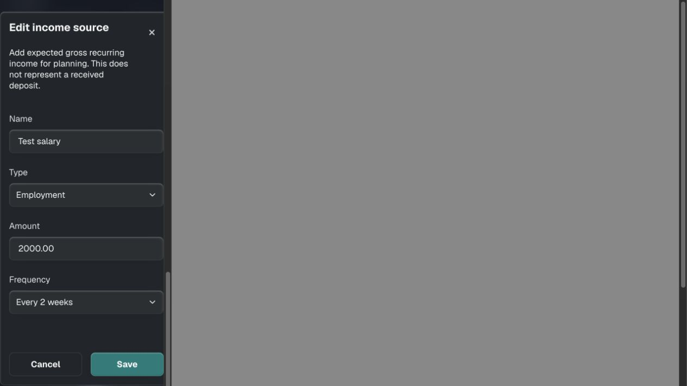
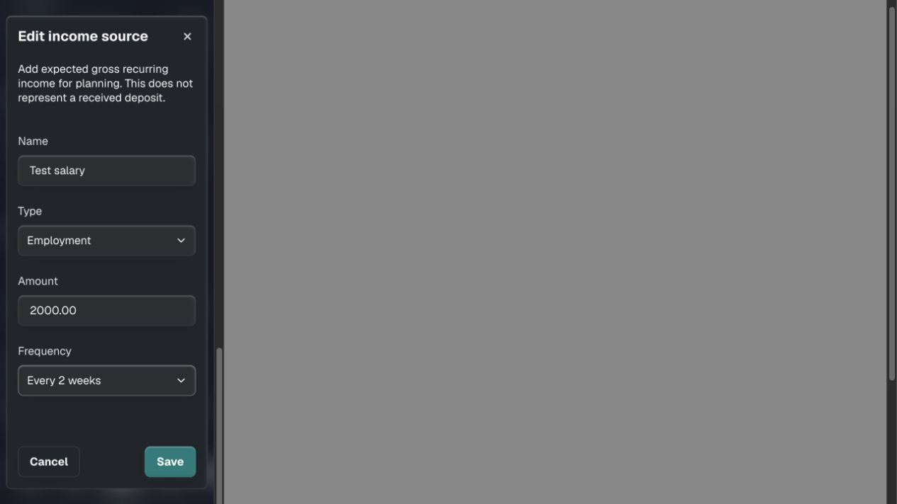
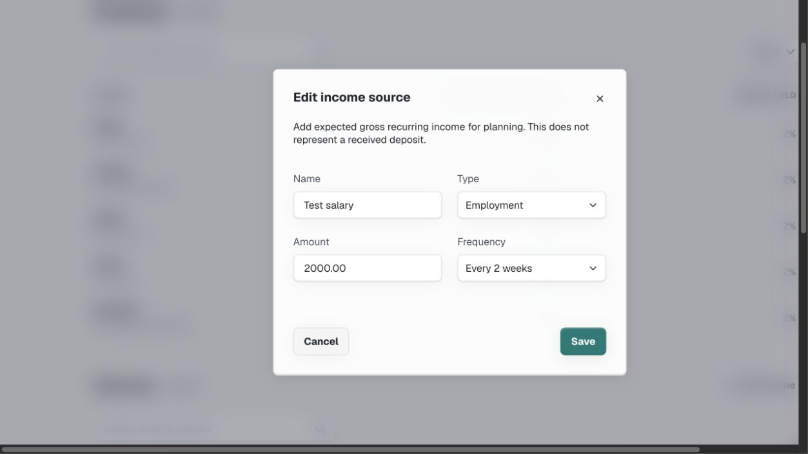
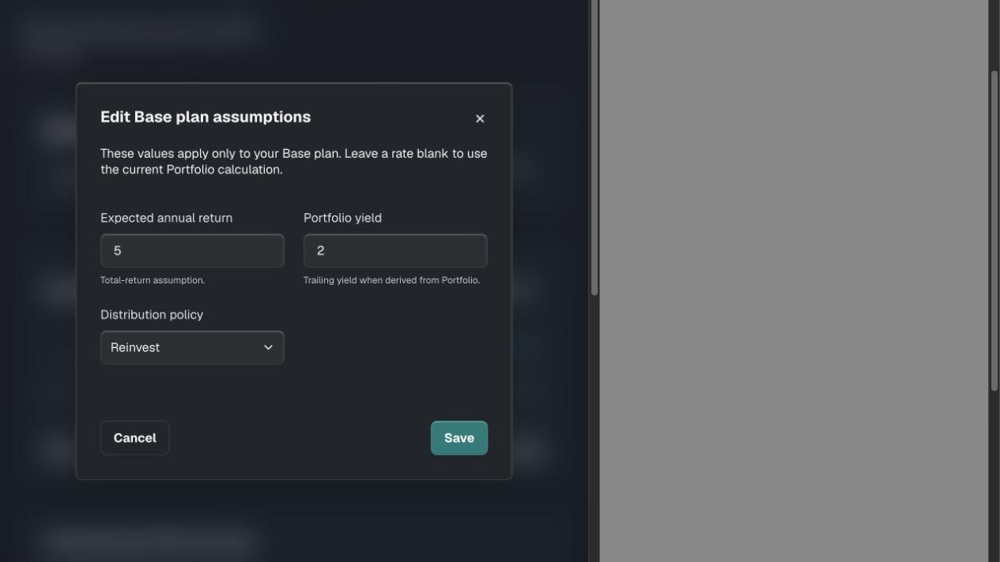
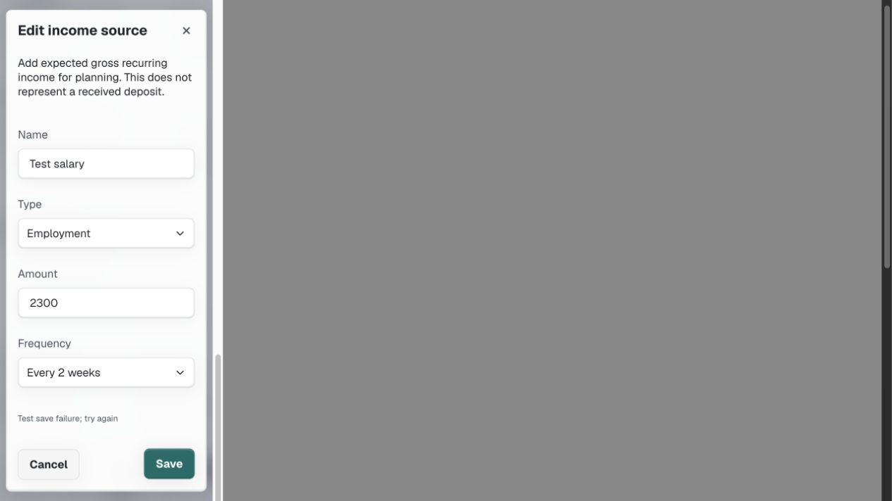
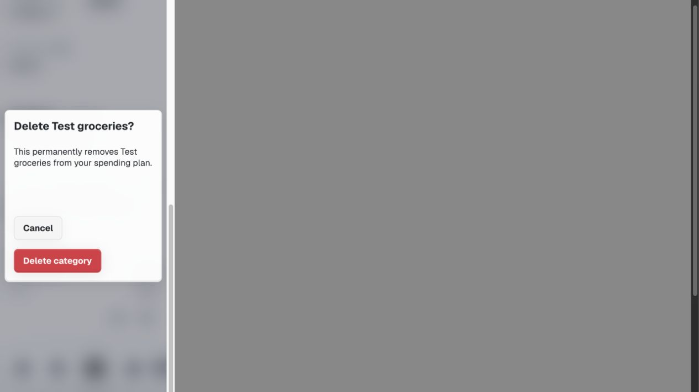
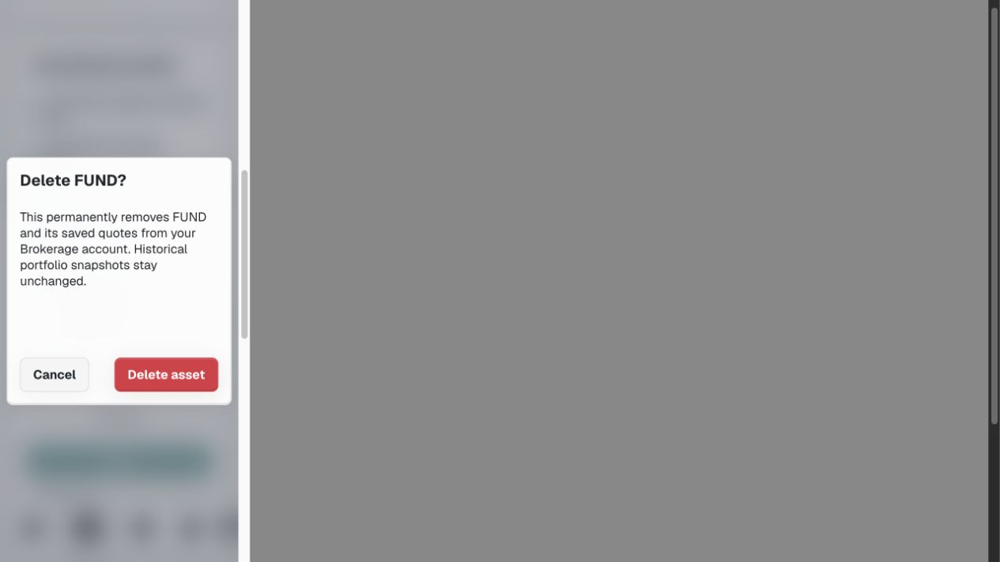

# Mercury dialog refinement — 2026-09-06 UTC

## Outcome

Resolved the remaining form-dialog phone containment issue identified by current research. Income rendered 322px wide in a 320px viewport, with its right edge clipped. Income, Plan, asset deletion and income-source deletion now reuse Acadia's compact form modal, already used by Add asset, Budget and Property. No new product flows, stylesheet rules, data operations or controller changes.

All nine form dialogs map Acadia's compact target token to its existing 44px touch token. Acadia Cluster makes action rows wrap when long labels would crowd their padding. This is composition and token reuse, not a new component or an Acadia source change. The existing asset-deletion markup assertion follows the adopted modifier; no additional implementation-mirroring test was introduced.

## Current-run evidence

Current main was fetched and fast-forward checked before editing; baseline `744281b`. The local review served current code with an explicitly labelled, disposable in-memory account adapter. No owner records, secrets, remote configuration or schema were used or changed.

| Step | Result | Evidence |
| --- | --- | --- |
| 1. Income editor at 320px | Fixed: 322px wide before, 288px after; no horizontal overflow; all text/select controls and buttons 44px high | Before/after screenshots below |
| 2. Income draft recovery | Healthy: change 2000 to 2200, Cancel, Keep editing retains 2200; Save updates the row and restores Edit focus | Browser interaction and DOM |
| 3. Income failed save | Healthy: entered 2300 survives failure, readable error and enabled Save remain; unsaved dismissal confirmation still works | Failure screenshot below |
| 4. Plan editing | Healthy: 288px wide on 320px phone, 560px wide on 768px tablet; changed 5% to 6%, saved, observed assumption and projection updates | Tablet screenshot and browser interaction |
| 5. Budget | Healthy: monthly amount 500 to 600 saves and restores Edit focus; long deletion action wraps inside content padding | Budget confirmation screenshot |
| 6. Asset deletion | Healthy: 288px wide at 320px; Cancel initially focused; historical-snapshot explanation preserved | Asset confirmation screenshot; no deletion performed |
| 7. Income deletion | Healthy: 288px wide at 320px; both actions 44px; cancelled without deleting | Current browser capture in temporary evidence folder |
| 8. Existing Add asset and Property forms | Contained at 320px; long content scrolls; Property footer reachable with keyboard navigation and cancellation | Current browser screenshots in temporary evidence folder; creation not repeated |

Responsive review used measured same-origin iframe viewports: 320×740, 390×844, 768×1024 and 1440×1000. Income is 358px wide at 390px, and 560px wide at desktop. Page scrollWidth equals clientWidth at these widths. Desktop and tablet retain two-column fields; phones stack. Light and dark were inspected. These are desktop-browser responsive CSS checks, not physical-device or software-keyboard acceptance. The grey area and outer scrollbar in captures belong to the review harness.

### Before and after: Income at 320px

### Desktop and tablet

### Recovery and confirmation

## Validation and remaining work

`npm run check`: 129 passing tests. `git diff --check`: passed. Existing controller coverage includes pending/failed modal writes, duplicate prevention, unsaved navigation and focus behaviour.

Remote authenticated CRUD, real session-expiry recovery, second-user RLS, email delivery and scheduled snapshot acceptance were not exercised in this composition pass. Physical devices, software keyboards and full VoiceOver remain separate gates. Next design priorities remain session-expiry recovery, partial Add persistence reconciliation and keyboard-obscured long forms.

Publication is recorded in the automation memory and completion response after push.
