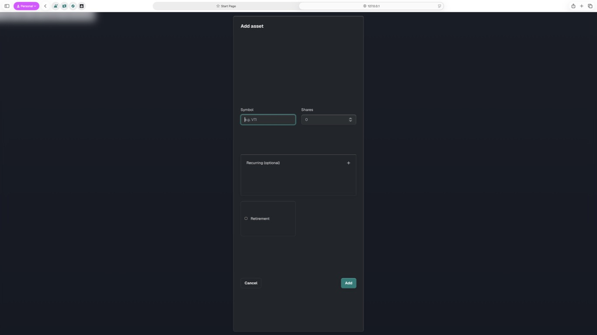
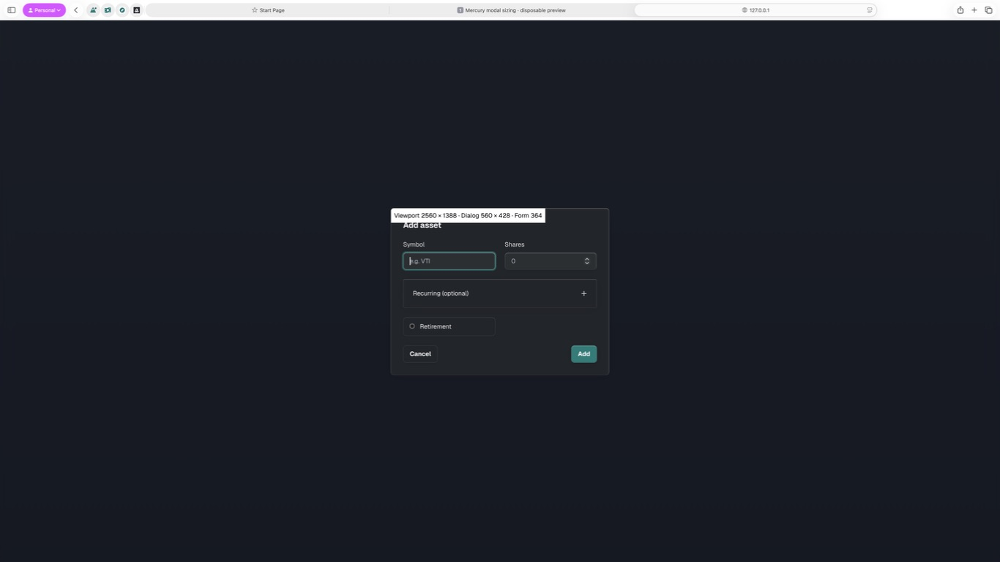

# Add asset content sizing repair

The supplied Safari screenshot showed a viewport-height dialog with stretched empty space between its header, fields, Recurring disclosure, Retirement control and actions. Reproduced this with Mercury's exact modal markup and styles in native Safari before changing the code.

## Fix

Keep the canonical Acadia component intact. A narrow Mercury positioning adapter removes the opposing vertical insets, sets auto height and centres Add asset using a 50% top anchor and -50% translation. Acadia still owns all width, padding, spacing, controls, colour, max-height and scrolling. Updated the stylesheet URL version so the changed adapter is fetched after release. No controller, valuation, persistence or schema changes.

## Verification

- Native Safari, 2560 × 1388 viewport: collapsed dialog 560 × 428px; Recurring expanded 560 × 528px. Both now hug content and remain centred. Original stretching reproduced before the fix.
- In-app desktop browser, 1280 × 720: same 560 × 428 / 528px sizes.
- 768 × 1024 embedded tablet: 560 × 428px collapsed.
- 320 × 740 embedded phone: 288 × 498px collapsed. Expanded Recurring plus manual recovery caps the dialog at 288 × 708px; its taller form scrolls internally to visible Cancel/Add actions. Cancel closes the native dialog fully.
- `npm run check`: 151 pass. `git diff --check`: pass. Existing tests remain unchanged for this CSS-only repair.
- A read of an unrelated signed-in Safari page was rejected during verification. Opened an isolated Mercury preview instead; final native Safari evidence above is from that preview. No private production data was changed. Physical-phone software keyboard testing is separate.

