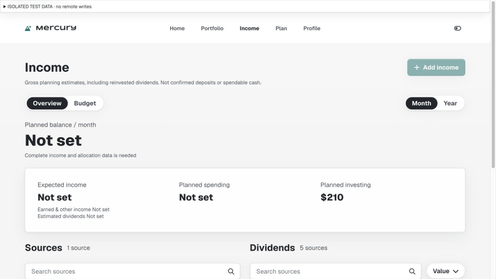
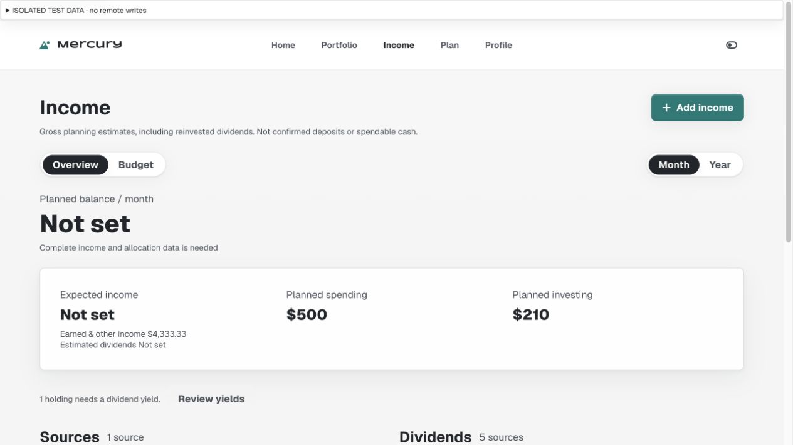
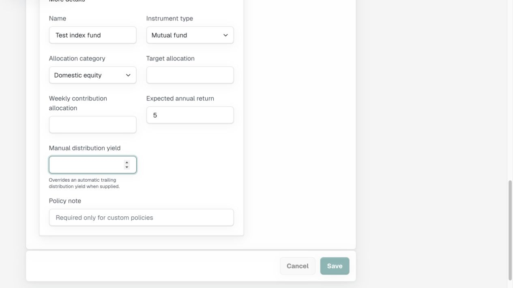
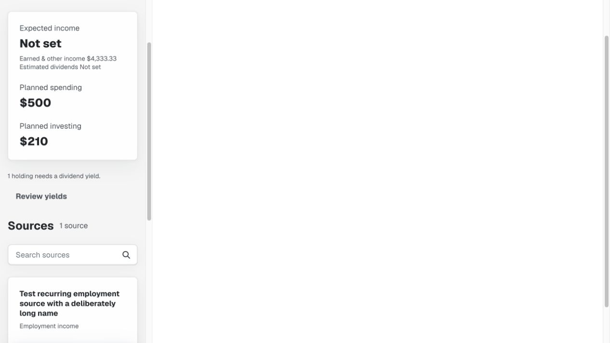
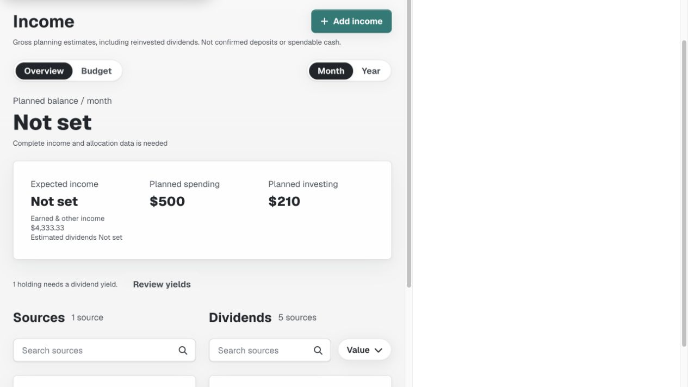
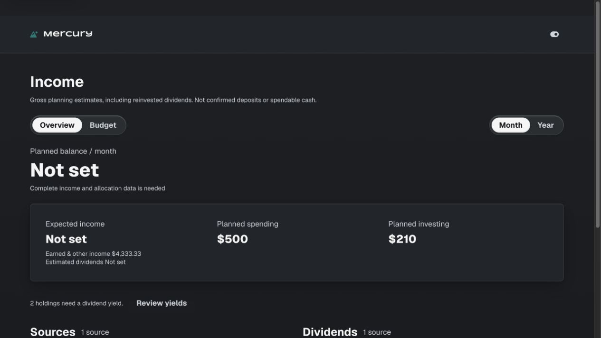
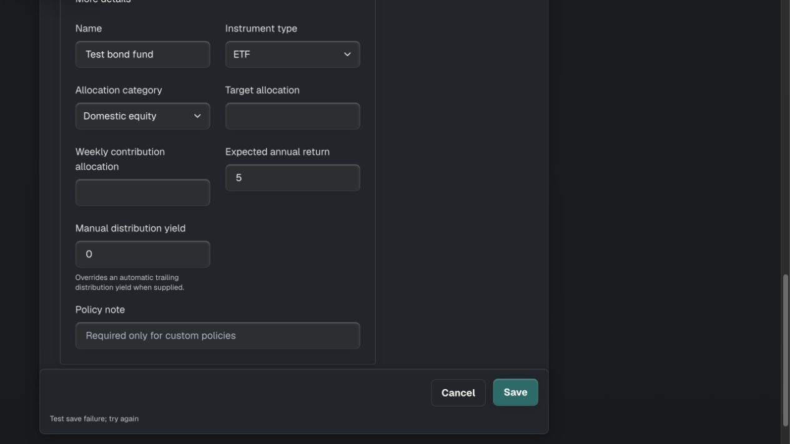

# Mercury / Design — Income yield recovery

Reviewed 2026-09-07 against fetched, clean main `2d6894b`. The previous automation and current research guided scope; evidence below was captured in this run using disposable local data. No owner records were read or written.

## Finding and outcome

P2 fixed: Income reported incomplete totals and Yield not set on an affected holding, but neither led to the field needed to resolve it. Added one quiet summary recovery line plus contextual Set yield actions. Reused canonical Acadia Cluster, quiet Button, Read Only and Accordion. No CSS, financial-domain, database or provider changes.

## Walkthrough

1. **Incomplete Income — improved.** The before summary provided only a generic explanation. The new summary counts missing yields across the portfolio, including holdings hidden by search, and offers Review yields. Each affected row offers a named Set yield action. Complete and zero estimates, crypto, and still-loading metrics do not receive this prompt.
2. **Open the missing input — healthy locally.** Summary and filtered BOND row actions opened the correct asset, expanded More details and focused Manual distribution yield. Phone entry/return centre the control in view; an initial focus position near the dock was corrected during this pass.
3. **Save or recover — healthy locally.** Saved the disposable FUND yield as 2%; Back retained Year and restored calculated Income totals while hiding the recovery prompt. A deliberately failed BOND 0% save retained the draft. Back offered Keep editing; retry then saved the explicit zero.
4. **Return to the task — healthy locally.** BOND search survived return; the repaired row showed $0 / 0% while the summary still counted the other missing holding. Focus fell back to dividend search after its Set yield action disappeared. Unit coverage also checks Budget return, unchanged search/year state and avoiding background focus theft.

## Responsive and visual evidence

Desktop light/dark rendered in the 1265px in-app browser window. Embedded 320/390/768px frames measured content scroll/client widths of 305/305, 375/375 and 753/753 respectively, with 15px scrollbars. The measured phone Review yields target is 44px. Narrow-phone recovery wraps inside its available width. These frames establish responsive CSS and desktop-browser interaction only, not physical-phone keyboard acceptance. Screenshots may show a scrolled portion of the embedded document; the blank right side belongs to the test wrapper.

## Validation and boundaries

- `npm run check`: 142 passing tests, including two new behavioural recovery/focus tests. Existing financial calculations and pending/unsaved safeguards pass unchanged.
- `git diff --check`: passed.
- Browser save, retry, zero, filtering, multiple missing rows, navigation and focus checks described above passed. Browser instrumentation emitted MutationObserver errors during some read-only DOM inspections; no such observer exists in the changed application files. No claim of an entirely error-free browser console is made.
- Missing valuation and unavailable source/category recovery are outside this focused yield pass. Real session-expiry, magic-link redemption, authenticated production CRUD, physical-phone keyboard and VoiceOver acceptance remain open.
- Ten canonical flows remain unchanged. DESIGN-README, FLOW-REGISTRY and DESIGN-STATUS now describe the recovery contract and current evidence.

Scoped changes are ready for the authorised main commit/push; final SHA and remote verification are recorded in the automation result and memory.
