# Mercury flow audit — saved outcomes and recovery

Reviewed 2026-09-07 against clean, fetched main `9c3441b`, then the scoped changes below. Prior research guided prioritisation; current screenshots, interactions and tests are the evidence. All financial browser data is disposable local fixture data. No owner records, schema, credentials or provider configuration were changed.

## Outcome and prioritised findings

- **P1 fixed — partial Add reported as unsaved.** Enter QA / 2 shares, obtain the isolated quote, then fail quote storage after the holding succeeds. Add stayed open with a generic save error (02); Cancel claimed the changes had not been saved (03). Add now closes once the holding is acknowledged and opens the saved asset with explicit missing-price recovery (04). A failed account reload retains acknowledged values and explains the sync failure separately. Failed holding writes still preserve their draft and reuse identity.
- **P1 fixed — successful deletion led to Asset unavailable.** A reload rendered the Portfolio hash while the deletion dialog was still marked pending; the navigation guard restored the deleted asset route. The acknowledged deletion now updates local holdings/quotes and navigates directly to Portfolio (15), restoring Add asset focus. Historical snapshots are untouched.
- **P2 fixed — misleading first-price refresh errors and duplicate retries.** A failure used to claim a last successful quote remained even when none existed. Missing-price recovery now offers Retry price/manual valuation, reports the actual automatic-price state, rejects duplicate refreshes and keeps late messages on the correct asset. A saved quote remains available if the following account reload fails. Successful retry restores heading focus; typed drafts remain intact.
- **P2 fixed — Property started on Close.** The first focused control was Close property form. Entry now focuses Property name, matching other forms.
- **P2 retained — incomplete Income repair is indirect.** Adding a holding without a yield makes dependent income totals Not set; the dividend list identifies the missing yield, but the summary does not lead directly to its asset. Values are honest; consider a focused repair path in the next design pass.

## Canonical-flow coverage

| Step | Flow and current health | Current evidence and limits |
| --- | --- | --- |
| 1 | Sign in — local gating and failure recovery healthy; remote completion open | Browser fixture hides private workspaces, retains the entered email and restores Send magic link after failure (16). Controller route/send tests pass. Live deployment redirects to Vercel login (10); actual email delivery/redemption/expiry and session recovery were not accepted. |
| 2 | Understand current position — local read path healthy | Home (01) shows explicitly recorded five-day history, investment allocation and separate property equity. Domain checks cover distinct-date gates and incomplete totals. |
| 3 | Manage Portfolio — local browsing/recovery healthy | Search produced No matching assets while the investment total stayed unchanged (06); Clear filters restored records; Table opened; revisiting reset to Cards. Corrected deletion yielded five assets and restored Add asset focus (15). |
| 4 | Add a holding — partial persistence repaired | Current browser reproduced the misleading save/discard states (02/03), then verified the saved-record destination (04). Controller tests cover thrown quote errors, failed holding writes, identity reuse and failed reload after acknowledged writes. |
| 5 | Retrieve/refresh quote — local recovery healthy; live provider open | Failed retry retains the saved asset. Enabling only fixture quote storage then retrying restores the automatic price (12), hides recovery and focuses the asset heading. Controller tests cover duplicate requests, late responses, retained drafts and read failure after quote commit. No live Twelve Data result claimed. |
| 6 | Edit/delete asset — manual repair and deletion return repaired | Manual price 25 × 2 shares saved as 50 and removed the warning (05). Deletion confirmation focuses Cancel and names its consequences (14); disposable deletion returns to updated Portfolio (15). Existing pending/failure/unsaved-draft tests pass. |
| 7 | Plan expected income — local editing healthy | Income exposes an honest incomplete-dividend state (07). Changed the isolated biweekly source from 2000 to 2200; saved cadence retained, monthly earned/other income became 4766.67 and focus returned to Edit. No bank-confirmed income claim. |
| 8 | Set spending totals — local editing healthy | Budget category changed from 500 to 600; monthly total/share updated and Edit focus returned (08). Existing duplicate-name and pending/error tests pass. |
| 9 | Review trajectory — local navigation/editing healthy | 5Y updates pressed state, chart summaries and endpoints (09); saving a 6% illustrative return updated the outlook. Existing missing-valuation/assumption tests pass. This is fixture arithmetic, not financial guidance. |
| 10 | Build daily history — automated coverage; live schedule open | Snapshot date, market-close and idempotency tests pass. Home shows 5 of 30 days; no production cron run newly verified. |
| Supporting | Property — local creation healthy; focus improved | Disposable property 1000 value / 0 debt saved, equity increased by 1000 and Add property regained focus (11). Reopened the final form and verified Property name has initial focus. |
| Deferred | Private export — unchanged boundary | No exposed export UI was added. Owner-only export and second-user RLS require authenticated acceptance. |

## Research applied

- [W3C form notifications](https://www.w3.org/WAI/tutorials/forms/notifications/) recommends clear success/error feedback with useful recovery instructions. Applied to distinguish the saved holding from the failed quote and to place recovery beside the saved record.
- [W3C success feedback technique G199](https://www.w3.org/WAI/WCAG21/Techniques/general/G199) supports explicitly confirming successful submission. Mercury now acknowledges successful writes even if a later dependent operation fails.
- [YNAB editing guidance](https://support.ynab.com/en_us/how-to-edit-and-delete-transactions-BJG4oS1s) retains explicit Save when editing. This supports preserving Mercury's deliberate Save/Cancel model. Competitive reference only; no transaction/autosave features introduced.

## Current screenshots and layout evidence

The screenshots below were captured and inspected during this run. The broad workspace views use a 1280px browser viewport. The viewport override again had no measurable effect, so the phone checks use 390px and 320px embedded documents. Both report equal document scroll/client widths (390/390 and 320/320), with 44px Retry price buttons. This is responsive CSS evidence, not physical-device or software-keyboard acceptance. Acadia status, button and focus styles remain canonical; no stylesheet overrides or purple accent introduced.

### 1. Home — clear recorded-data state

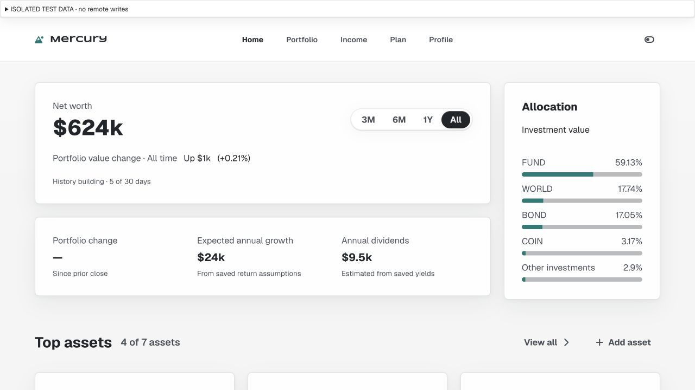

### 2. Before — generic failure after holding commit

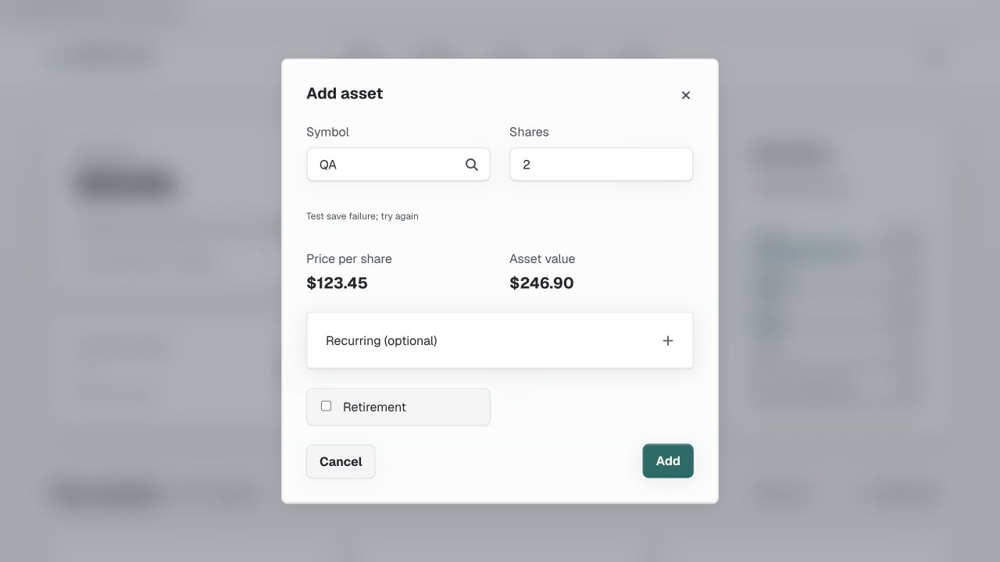

### 3. Before — inaccurate unsaved confirmation

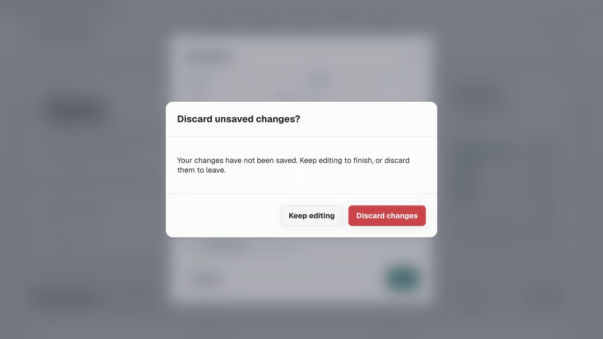

### 4. After — saved holding with price recovery

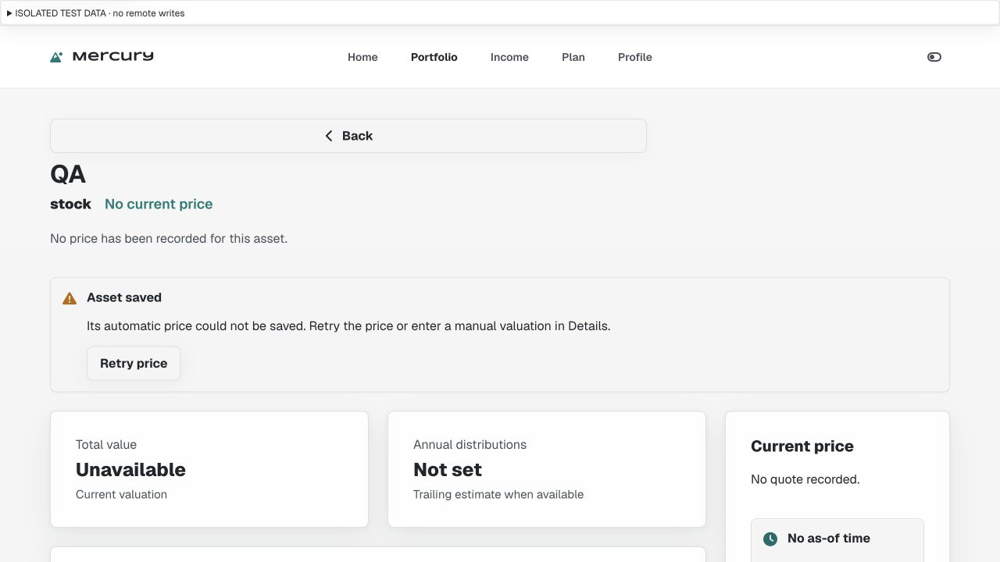

### 5. Manual repair — saved valuation restored

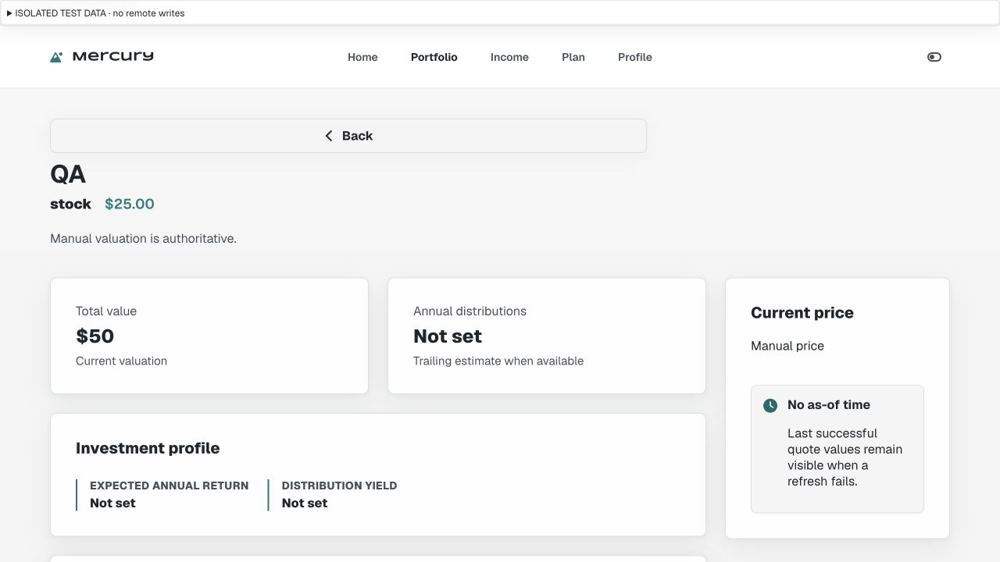

### 6. Portfolio — clear filter recovery

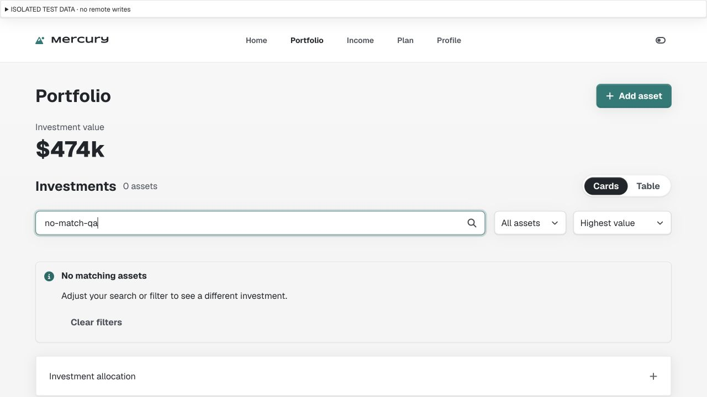

### 7. Income — honest incomplete coverage

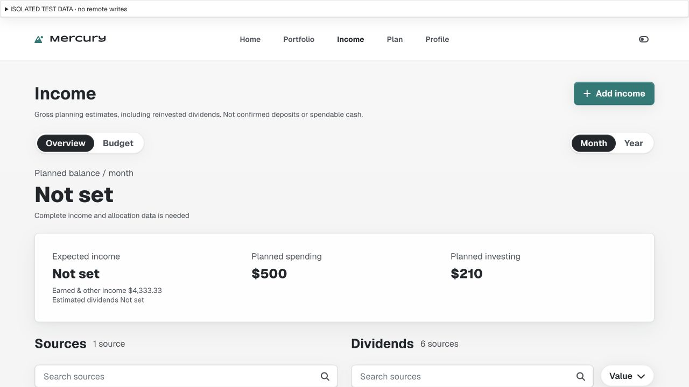

### 8. Budget — saved category update

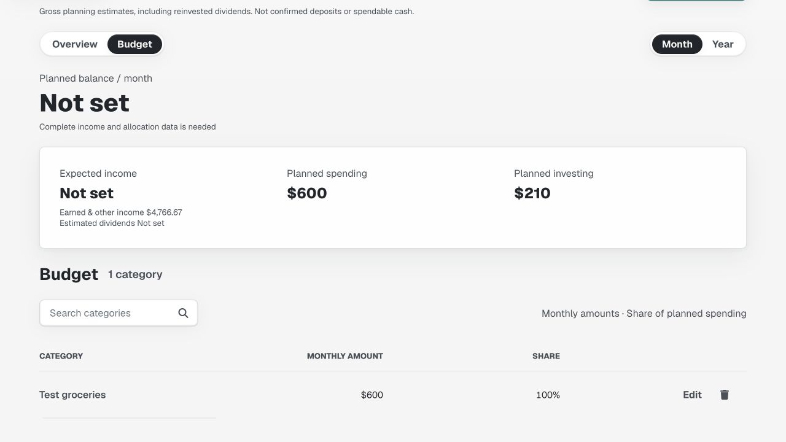

### 9. Plan — selected horizon updates outlook

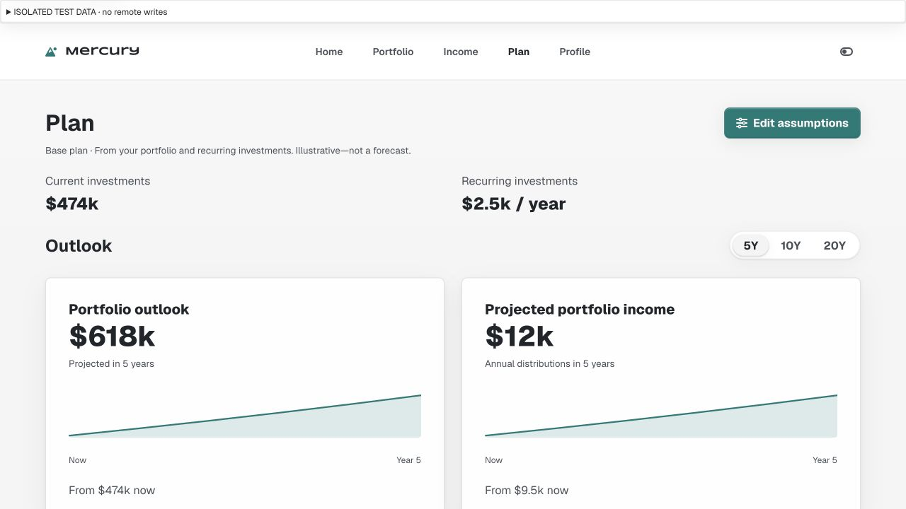

### 10. Production — Vercel authentication boundary

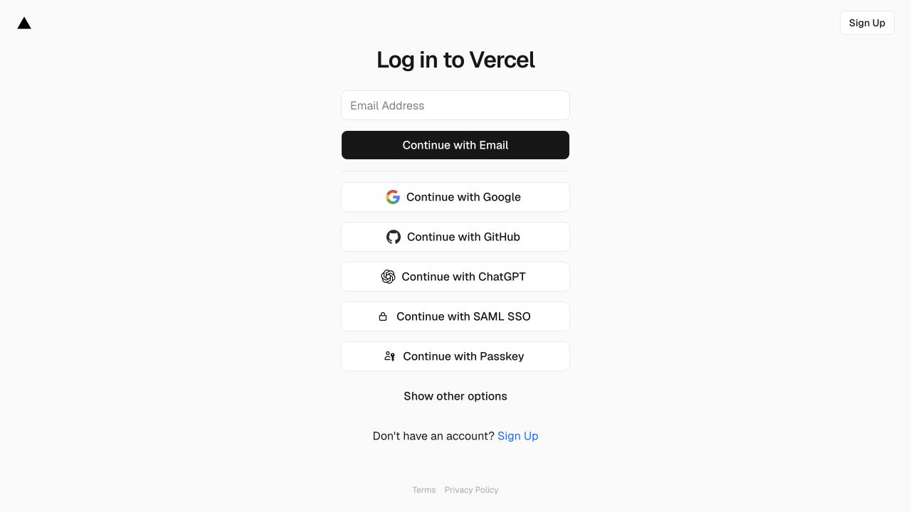

### 11. Property — disposable creation reflected in equity

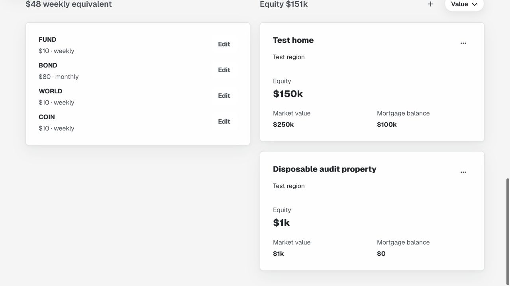

### 12. Retry — automatic price restored

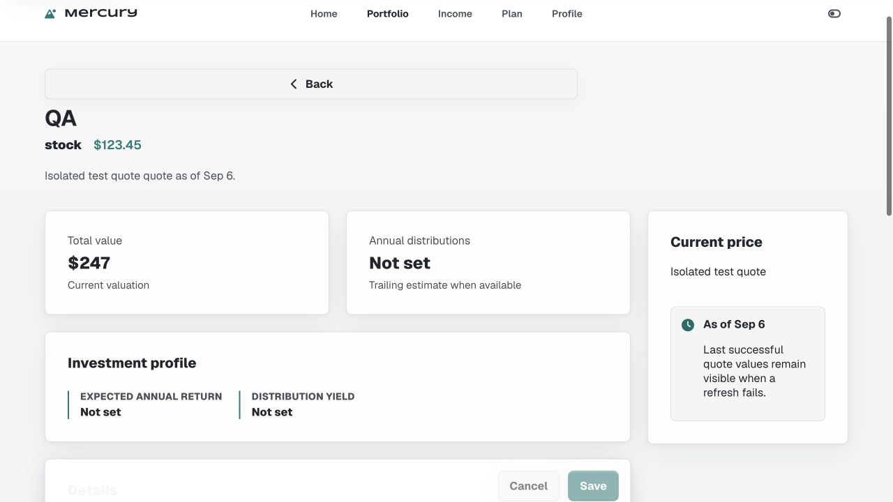

### 13. Phone widths — contained recovery

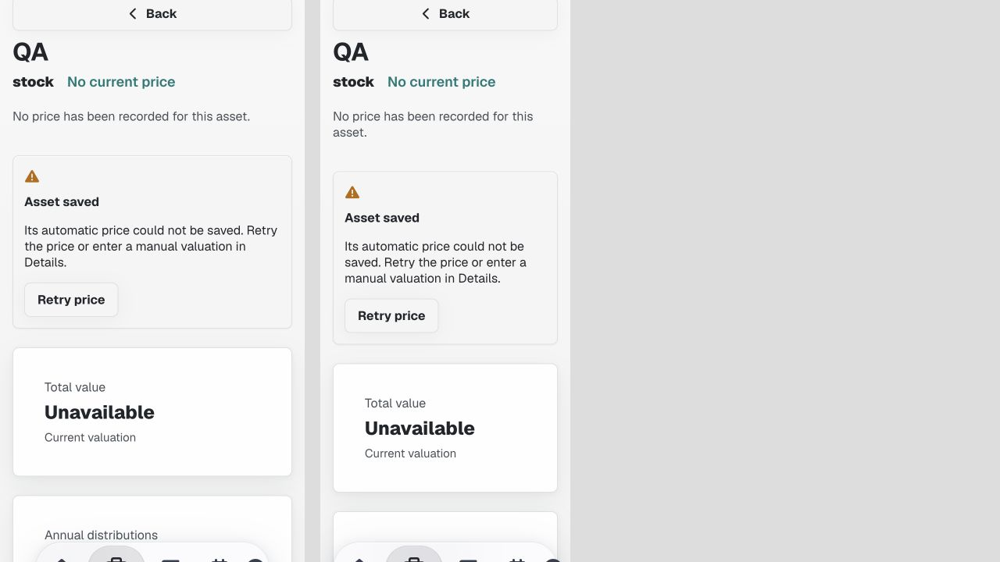

### 14. Delete — safe initial focus and clear consequence

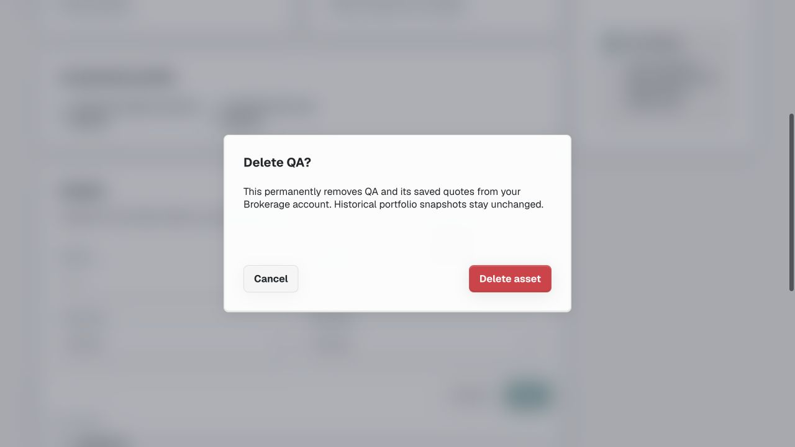

### 15. After deletion — updated Portfolio

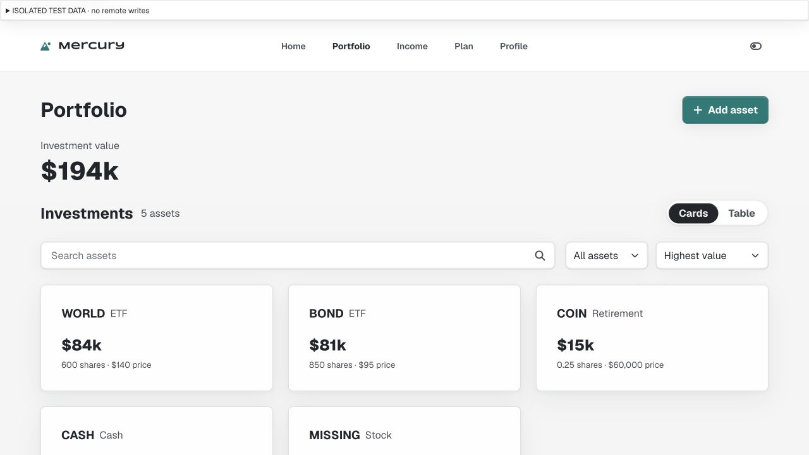

### 16. Sign in — failure retains email and retry

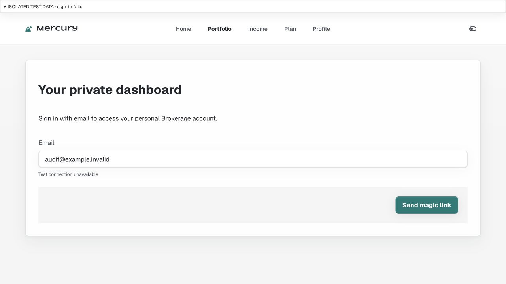

## Validation, publication and remaining boundaries

`npm run check`: **140 passing tests**. Nine new behavioural tests replace one obsolete partial-Add expectation, for a net eight tests beyond the prior 132. `git diff --check` passes. Local browser verification covers the named steps above; runtime fixtures and responsive scaffolding are excluded from publication.

All 10 canonical flows were reviewed through current source/tests; accessible local flows were walked in the browser. This is not a complete authenticated production acceptance pass. The current production deployment for `9c3441b` reports success in GitHub, but its browser URL redirects to Vercel login. Live magic links/session expiry, owner CRUD, provider quote results, second-user RLS, export isolation, scheduled snapshots, VoiceOver and physical-phone keyboard behaviour remain unverified. No new Supabase changes were needed.

The scoped implementation, flow/design documentation and this evidence record are ready for the authorised main-branch commit/push. Final commit and remote verification are recorded in the automation result and memory after publication.
