# Mercury flow audit — continuity follow-through

Reviewed 2026-09-05 against main `7d04404`, followed by the changes in this report. The prior run guided prioritisation; all evidence below comes from this run. No owner records, schema or credentials were modified. Browser data is explicitly labelled disposable local test data.

## Outcome

The most consequential reproduced issue was silent draft loss: change asset shares, press Back, reopen the asset, and the saved shares replace the draft. Income forms likewise dismissed changed values immediately with Escape. Pending modal writes only disabled the submit button, allowing dismissal, field changes or another submission while the original request was unresolved.

Implemented one shared protection pattern across the existing flows:

- Asset Back, workspace navigation, external navigation and sign-out protect unsaved work. Changed forms offer **Keep editing** or **Discard changes**. Pristine forms leave immediately.
- Add asset, Income, Budget, Plan and Property protect Close, Cancel and Escape when changed. Keep editing returns to the existing fields.
- All nine entry/edit/delete dialogs prevent duplicate submission, lock inputs and dismissal while saving, expose `aria-busy`, then restore the draft and controls on failure. A dialog cannot reopen while its prior request is still settling.
- Quick Add keeps its submitted values available during asynchronous quote lookup, even while controls are disabled.
- Reload/close uses the browser's native unsaved-work warning where supported. No financial drafts are written to local/session storage.
- Skip to content focuses the existing main region without triggering the hash router.
- The new confirmation uses the existing Acadia standard dialog. Its footer wraps at narrow widths; no stylesheet or financial-calculation changes.

## Canonical flow coverage

| Step | Flow and current health | Evidence and limits |
| --- | --- | --- |
| 1 | Sign in — local gating/send recovery covered; remote acceptance open | Existing controller checks rerun. Current production deployment redirects this browser to Vercel sign-in. Real magic-link delivery, redemption and expired-session recovery not completed. |
| 2 | Understand position — local read path healthy | Current Home screenshot, explicit history-building state, investment allocation, property equity and honest missing metrics. Domain/history suite passes. |
| 3 | Portfolio — local navigation healthy | Current Cards/summary/allocation/property read path captured; asset entry verified. Existing filter/sort/view tests pass; not every combination repeated in this browser. |
| 4 | Add a holding — manual recovery and completion verified | Unsupported provider exposes fallback immediately. Entered 3 shares and a $25 manual price; saved asset shows $75 and correct source semantics. Deferred lookup test checks locked fields preserve input values. |
| 5 | Refresh an automatic quote — regression coverage passes; live provider acceptance open | Provider-failure/manual-fallback browser path and adapter tests. No successful current-run Twelve Data call or production timestamp-refresh acceptance. |
| 6 | Edit/delete an asset — navigation and pending-write protections improved | Reproduced loss, then verified page Back, Keep editing, retained values and discard. Browser Back, repeated Back after Keep editing, and Discard to Portfolio were verified after fixing a queued native close-event race. Asset save failure and all four deletion-dialog duplicate/pending/error states have controller tests. No owner deletion performed. |
| 7 | Expected income — save/dismissal/failure flow verified locally | Changed 2000 to 2200, saved, observed updated planning values and focus on invoking Edit. Changed again to 2300 with delayed failure: Escape did not dismiss; error restored Save and retained 2300. Keep editing after Escape restored field focus. |
| 8 | Budget — local save flow verified | Changed monthly category from 500 to 600; saved row, planned balance and Edit focus updated. Deferred failure/duplicate guard covered by controller tests. |
| 9 | Base plan — local save flow verified | Changed the illustrative return assumption from 5% to 6%; saved assumption and projections updated. Pending/failure handling covered by controller tests. |
| 10 | Daily history — automated coverage; remote schedule acceptance open | Market-close/date/idempotency/history tests pass; Home shows honest zero-date history. No scheduled production execution verified. |
| Boundary | Private export — deferred, unchanged | No visible export surface added. Owner isolation/export contents require authenticated RLS acceptance. |
| Supporting flow | Property — controller coverage strengthened | Portfolio property entry/read path captured. Update payload, pending duplicate prevention and failure restoration tested. Creation/deletion browser paths were not repeated this run. |

## Research informing the changes

- [W3C: Let users go back](https://www.w3.org/WAI/WCAG2/supplemental/patterns/o4p02-back-undo/) explains why back navigation should preserve entered work. Mercury retains the current draft and asks only when leaving would lose it.
- [W3C form notifications](https://www.w3.org/WAI/tutorials/forms/notifications/) recommends concise, understandable feedback for pending work, errors and success. Existing visible errors and save labels remain associated with the form.
- [W3C modal dialog pattern](https://www.w3.org/WAI/ARIA/apg/patterns/dialog-modal/) informed a labelled native dialog, focus on the safe action and return to the originating field. Keyboard and focus observations are limited checks, not accessibility certification.
- [YNAB editing patterns](https://support.ynab.com/en_us/how-to-edit-and-delete-transactions-BJG4oS1s) retain an explicit Save action. This supports preserving Mercury's existing Save/Cancel model; no transaction features or autosave were introduced.

## Current-run screenshots

All screenshots were captured from the current browser and inspected. Older intermediate confirmation styling is not release evidence. The phone captures use a 390px/320px iframe because the browser viewport override did not change the measured main-tab width. This is responsive CSS evidence, not physical-device verification.

1. **Home — healthy read path.**

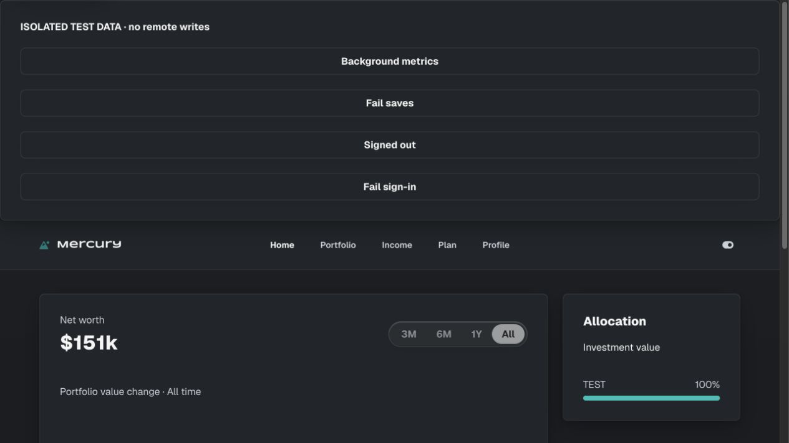

2. **Income — clear planning context and explicit editing.**

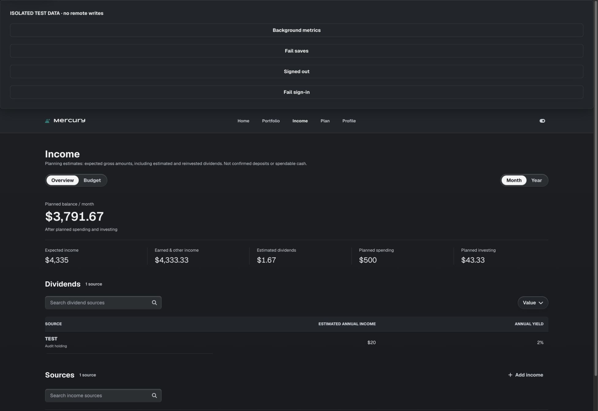

3. **Pending save — dismissal and fields locked.**

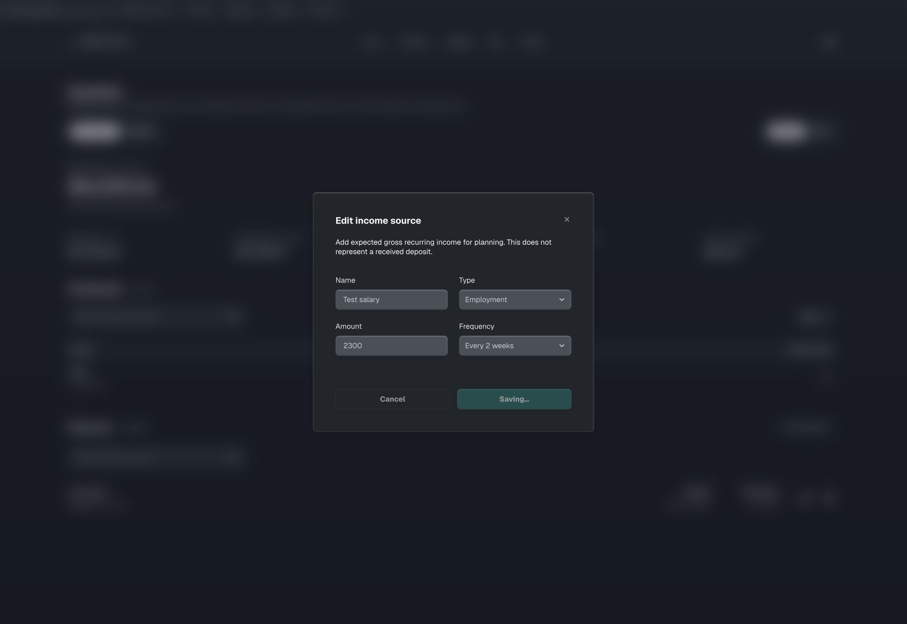

4. **Save failure — entered value retained and retry available.**

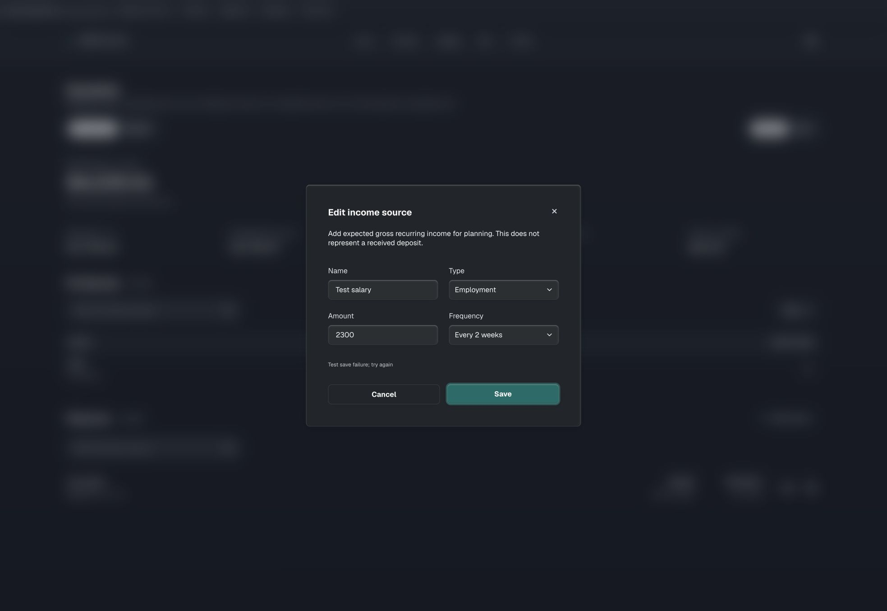

5. **Budget and Plan — successful local save paths; source-backed calculations unchanged.**

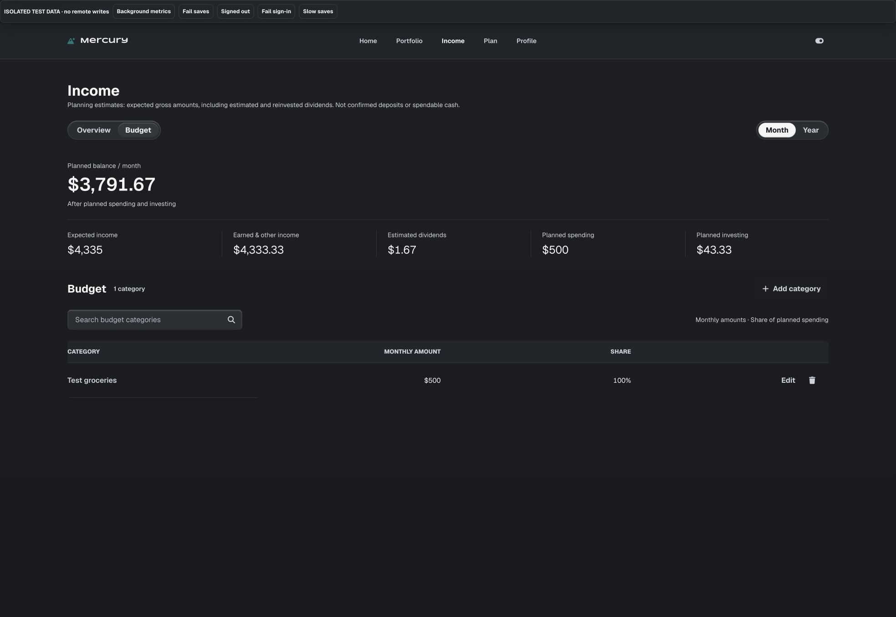

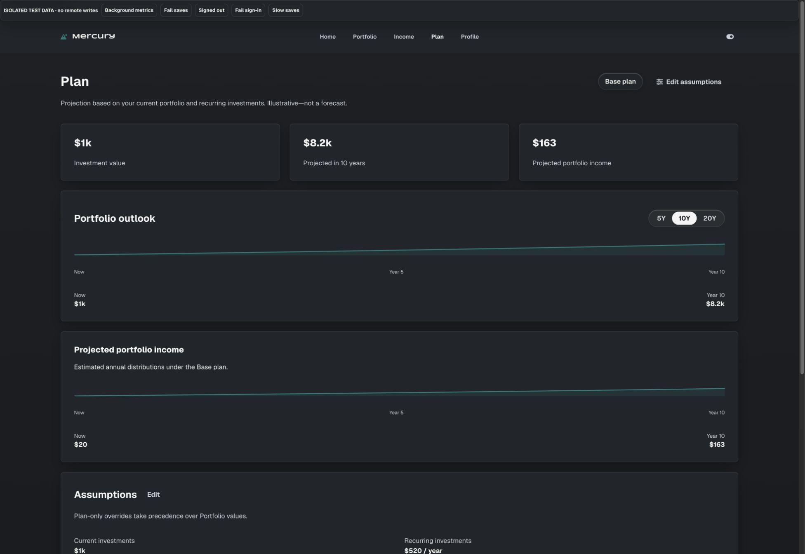

6. **Portfolio and Add — existing organisation retained; manual asset completed.**

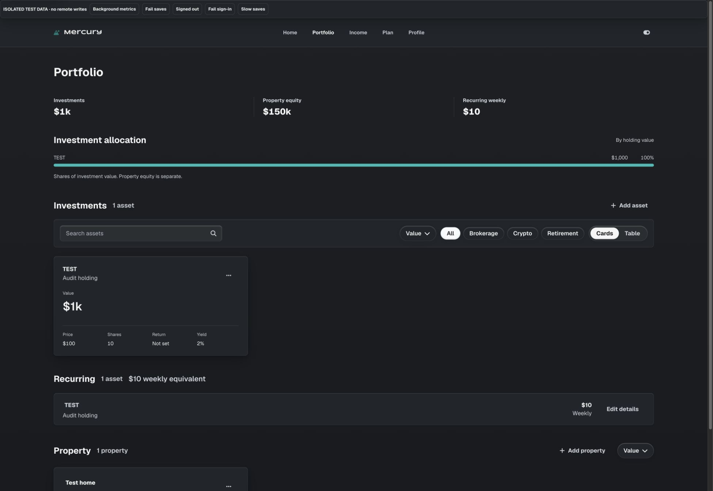

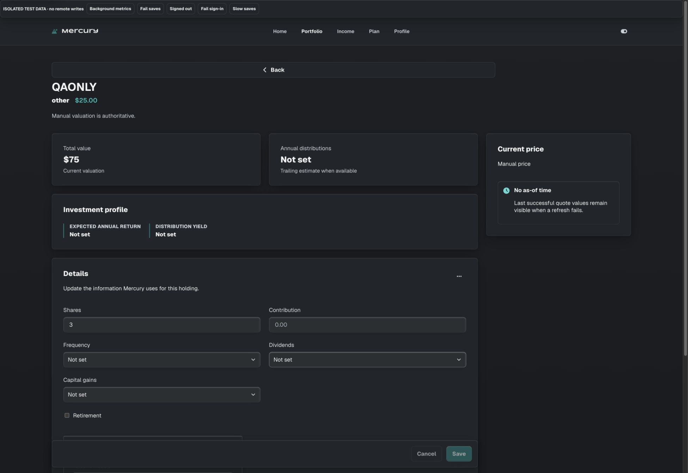

7. **Navigation confirmation — safe initial focus, full actions at narrow widths.**

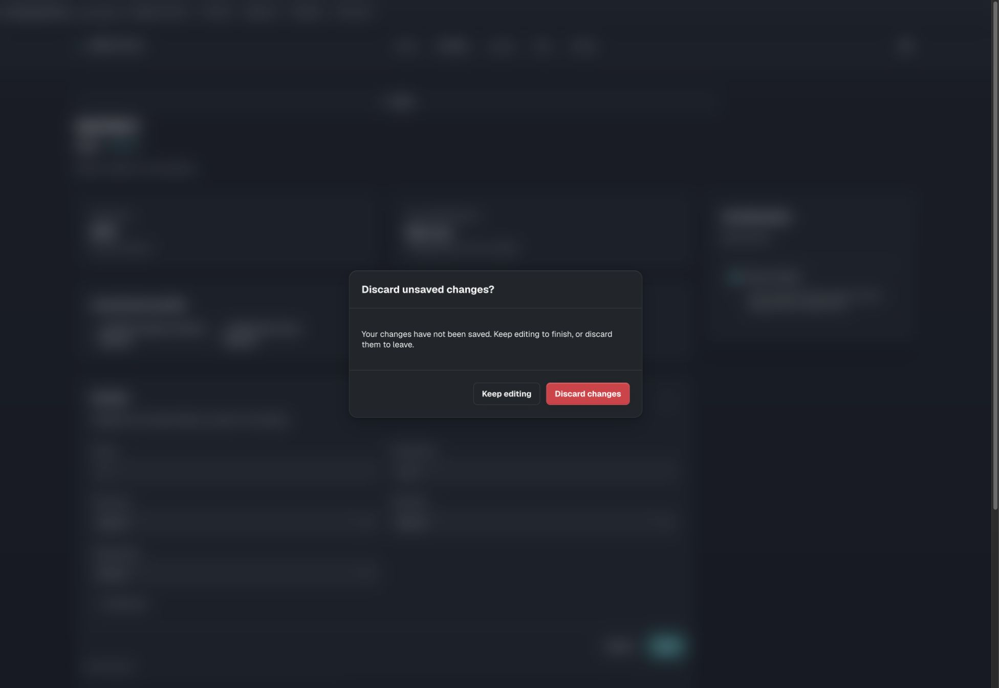

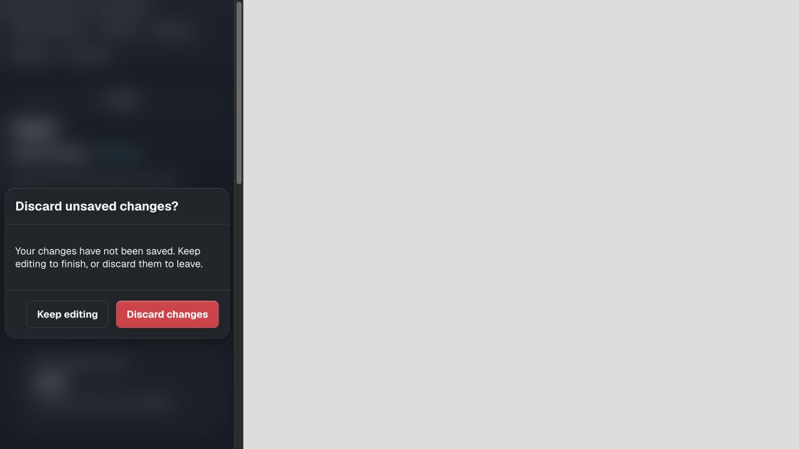

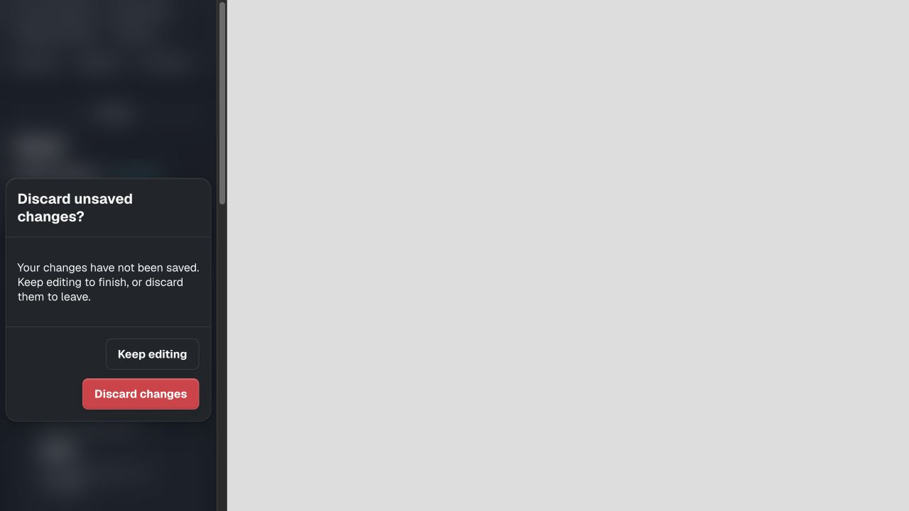

At 320px the inner content width was 305px including the desktop scrollbar allowance; dialog bounds were 7.5–297.5px, and both buttons were 44px high. No confirmation overflow. The standard Acadia teal focus treatment and red destructive action remain intact.

## Remaining findings and acceptance limits

- **High priority: real auth recovery and private persistence.** Vercel login prevents authenticated production flow acceptance in this browser. The connector returned no projects and could not resolve the deployment; GitHub deployment records remain available. Real email redemption/expiry, second-user isolation, authenticated CRUD and scheduled snapshots need independent evidence.
- **Partial Add persistence remains a boundary.** Holding and quote writes are separate. Same-dialog retry reuses identity; a quote-storage failure followed by cancellation still needs deliberate reconciliation. This pass prevents cancellation while requests are pending, not rollback of an already successful write.
- **Existing form-dialog mobile sizing needs follow-through.** The non-compact shared form composition includes padding outside its width. A confirmation built with that modifier exceeded the 320px viewport, so the new confirmation uses Acadia's standard dialog. Existing form compositions should receive focused shared-system review.
- Browser-history behaviour outside the tested in-app browser, full VoiceOver, physical-device keyboard/safe-area behaviour and forced mobile process termination remain unverified. `beforeunload` is best effort and does not guarantee recovery after a forced exit.

## Validation and publication

`npm run check`: **124 tests pass**, including eight new behavioural regressions for navigation/unload, asset saves, modal drafts, modal writes, deferred Quick Add, deletion concurrency Skip to content and queued confirmation-close events. `git diff --check` passes. Publication status is recorded after push below.

**Published — 2026-09-05 19:37 UTC.** The founder directly approved publication and instructed agents to always commit and push completed work. Implementation `99a9033`, the historical blocker record `19b0b55`, and standing agent instructions `b392dac` were pushed successfully to `origin/main`. The earlier automatic approval rejection was resolved by direct user confirmation; no alternative publication mechanism was used. Root `AGENTS.md` and `AGENT-README.md` now make the completion requirement explicit for ordinary tasks and automation runs. Git publication does not establish authenticated production acceptance; the limits above remain applicable.
