# Portfolio refinement — 5 September 2026

Reviewed against `1654460` and the founder's supplied Portfolio screenshot. The reference showed the allocation chart before asset management, repeated summaries and dense cards. This pass makes Investments the primary task, using existing Acadia components and the same preview-card anatomy as Home.

All screenshots below show **disposable local test data**, not owner records. They were captured and inspected in the current in-app browser. The test adapter stays outside the repository and performs no remote writes.

## Changes and flow evidence

| Step | Result | Verification |
| --- | --- | --- |
| 1. Read Portfolio | Investment value leads; primary Add asset; compact identity/value cards. Property equity and weekly-equivalent investing remain beside their sections. | Desktop dark/light, tablet and phone captures; complete, empty and incomplete valuations. |
| 2. Find and compare | Native All assets/Crypto/Retirement filter removes the duplicate Brokerage option. Native sorting remains available in Cards and Table, including phones. | Retirement includes the test crypto holding; Name order persists across keyboard view switching. Recently updated and Highest value selections work. No matches → Clear filters restores all six records and search focus, retaining sort. |
| 3. Open or repair an asset | Cards are keyboard destinations. Unvalued holdings remain reachable instead of disappearing; Needs valuation never becomes a zero amount. | Enter opens details; Back returns to Cards. Missing price was repaired to $50 × 25 shares = $1,250; successful save restored the aggregate. Regression checks also cover authoritative total-value repair and retaining available provider quotes. |
| 4. Inspect allocation | Native Acadia Accordion moves optional concentration detail below investments. Canonical plus/minus assets now ship with the stylesheet. | Enter/Space toggle it. The same five allocation rows, amounts and shares remain after filtering to Crypto; property stays excluded. |
| 5. Add assets and manage property | Existing Add asset flow retained. Property add/edit and delete confirmations use Acadia's existing compact form variant. | Add asset opens with Symbol focused. At 320px, property form bounds are 8.5–296.5px within a 305px content viewport; delete confirmation uses the same horizontal bounds. Added a test property with $100,000 market value / $25,000 debt → $75,000 equity; aggregate property equity updated to $225,000. Delete confirmation was inspected and cancelled. |

The investment total and allocation arithmetic are unchanged. A missing valuation keeps the total unavailable and explains why. Four additional controller regressions cover unvalued records/filter overlap, view/sort continuity, incomplete-total messaging and manual recovery. Existing draft-loss and pending-write protections remain covered.

## Responsive and accessibility checks

- Actual browser viewports: 1920, 1440, 1024, 768, 390 and 320px. At every width, document `scrollWidth` equals `clientWidth` (the browser reserves 15px for its scrollbar).
- Acadia Device Grid adapts naturally: five columns at 1920, three at 1440/1024, two at 768 and one at 390/320. Long names wrap without page overflow.
- Tablet Table keeps its wider comparison inside the table's horizontal scroll container. Phones use the existing labelled Acadia object rows. Sorting is available in both presentations.
- Phone search, filter, sort and Cards/Table targets are all 44px high. Keyboard card entry, tab arrows/End, disclosure Enter/Space and search-focus recovery were exercised.
- Light/dark appearance inspected; dark brand token resolves to Tiffany `#00bdb6`. The canonical stylesheet is unchanged. Most previous Portfolio overrides were removed; only the existing table/object layout adapter remains.
- `npm run check`: **128 passing tests**. `git diff --check`: passes.

These are local browser and controller results. They do not certify VoiceOver, physical-device safe areas, real magic-link recovery, authenticated production CRUD, provider availability or cross-user isolation. No credentials, owner data, financial calculations or database schema were changed.

## Research applied

The prior flow research prioritised preserving work, obvious recovery and phone dialog containment. [W3C back/undo guidance](https://www.w3.org/WAI/WCAG2/supplemental/patterns/o4p02-back-undo/) supports retaining entered work and prior choices; this pass preserves the existing guards and filter/sort state. [W3C disclosure guidance](https://www.w3.org/WAI/ARIA/apg/patterns/disclosure/) informed the labelled native allocation disclosure and keyboard checks. Portfolio's property-dialog overflow is resolved; session-expiry recovery and remaining Income/Budget/Plan dialog containment remain separate follow-through.

## Captures

1. Desktop, assets first.

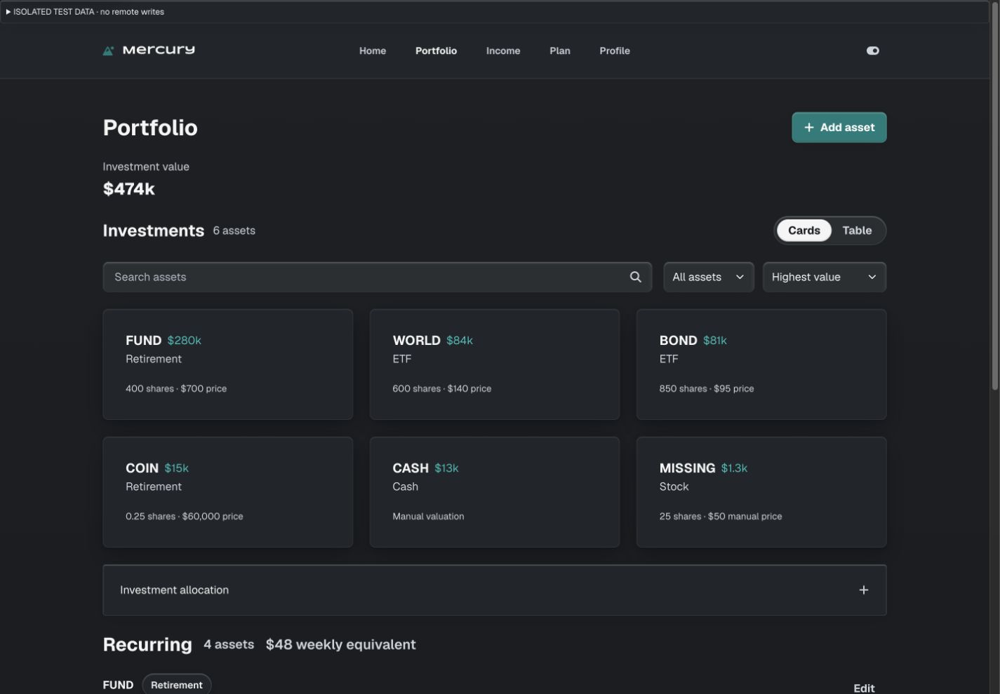

2. Tablet Cards and comparison Table.

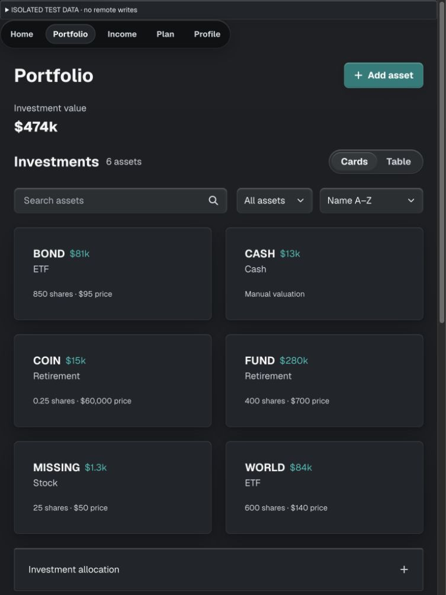
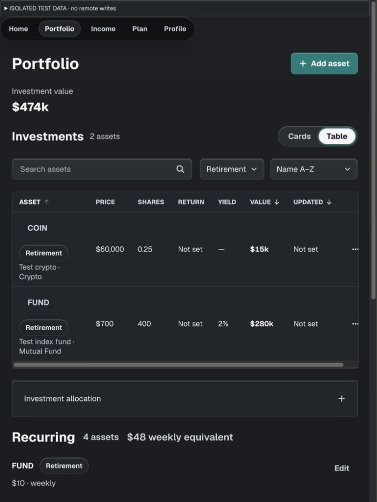

3. Phone Cards and Table.

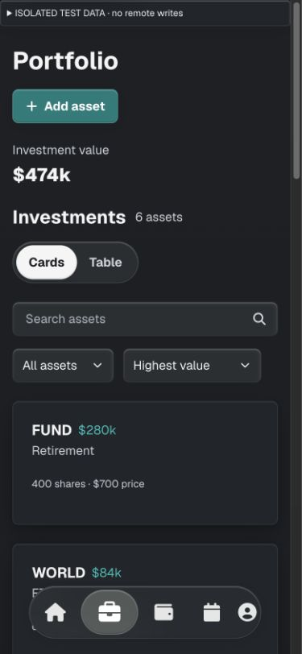
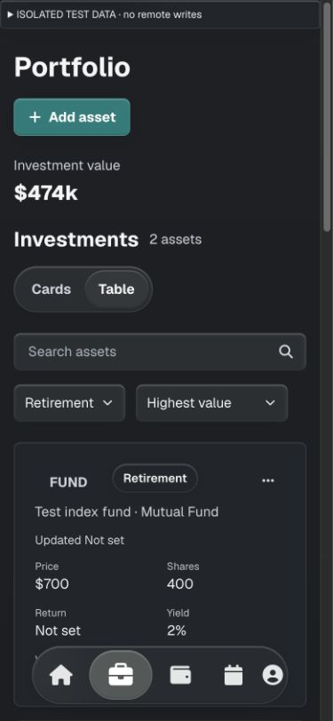

4. No-results recovery and missing valuation.

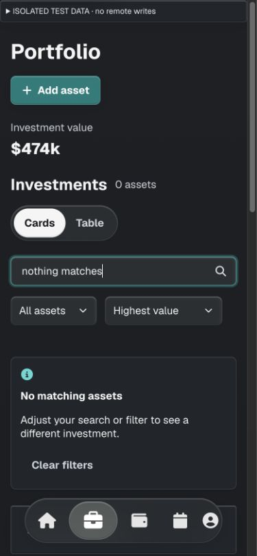
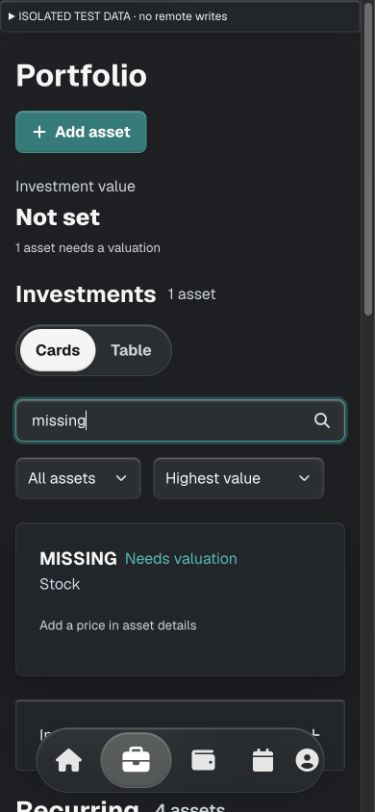

5. Expanded allocation.

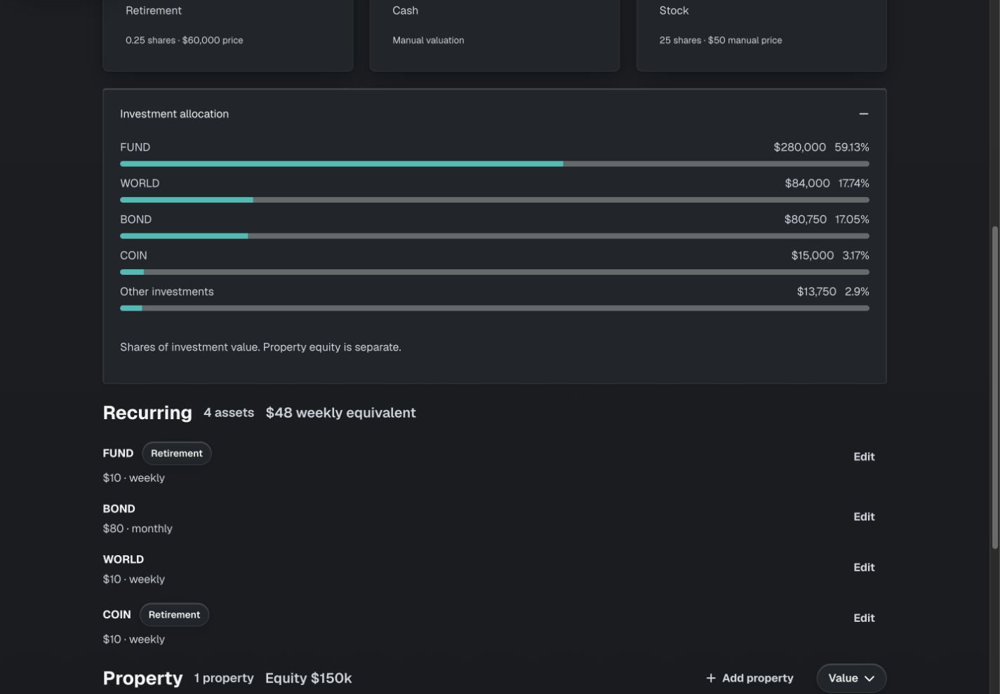

6. Add asset and contained property form.

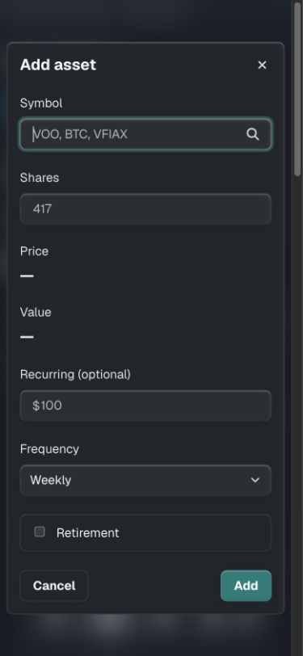
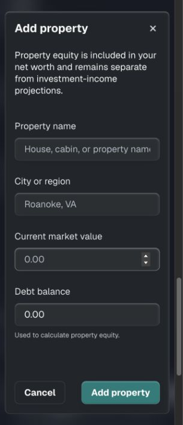

7. Light appearance with long-name coverage.

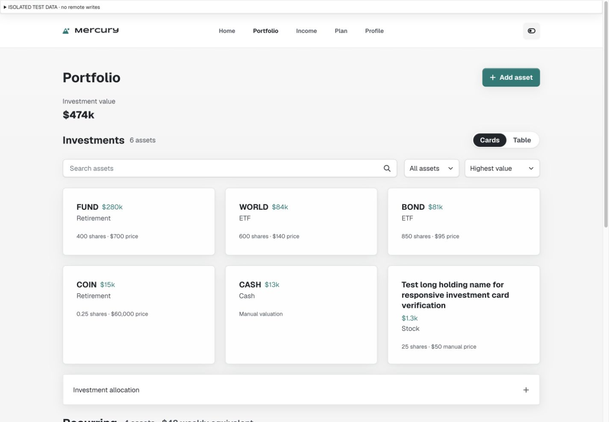
