# Mercury flow and reliability review — 8 September 2026

This run started on clean, fetched `main` at `73ff1a7`, after the earlier Income recovery and Portfolio refinement. It reviews all 10 implemented canonical flows through current source and tests, with fresh browser walkthroughs of the main surfaces and the changed quote recovery. The private export boundary remains deferred. No new product flow, stylesheet, schema, data model or financial calculation was introduced.

## Resolved

- **P1 — Indefinite quote waits:** Twelve Data/Yahoo fetches and response bodies lacked deadlines. A stalled price request could leave Add asset waiting, while background metrics could remain pending. Every provider request now has a four-second abort deadline, with a shared ten-second budget across sources and symbol fallbacks. The browser separately aborts after 25 seconds including session/authentication waits. It returns to the existing manual/retry state, preserves drafts and ignores late results. A late session result cannot start another provider call after timeout.
- **P2 — Safe partial data:** optional dividend/history failures preserve a usable price; exhausted lookup budgets skip further network fallbacks. Failed requests are not cached as successes. Transport/JSON errors return controlled messages rather than potentially credential-bearing diagnostics.
- **P2 — Publication gate:** `vercel.json` now runs `npm run check` as the build command, so the existing Git-triggered release must pass syntax and regression checks before publishing. This does not introduce a second deployment pipeline or claim branch protection.

## Fresh browser steps

All financial records below are clearly labelled disposable local fixtures. The browser loads the current controller and Acadia files with an isolated in-memory persistence adapter. These are not owner balances, remote persistence evidence or live provider results.

1. **Home — healthy in the inspected state.** Net worth, history-building and allocation provide clear entry to holdings; incomplete prior-close coverage stays unavailable. `01-home.png`.
2. **Portfolio — healthy in the inspected state.** Precise group total, Cards/Table controls, search, classifications and recurring/property context remain coherent. `02-portfolio.png`.
3. **Add asset / quote timeout — fixed.** Enter TIMEOUT and two shares with a deliberately non-settling fetch. The real 25-second browser deadline releases Looking up price into manual valuation. Symbol, Shares and focus remain. `03-timeout-recovery.png`.
4. **Manual save / Asset / Back — healthy locally.** Enter a $125 manual price, save exactly one holding, see the authoritative $250 value, then Back returns to Portfolio and focuses that asset. `04-saved-asset.png`. Failed-save and deletion outcomes have current automated coverage; they were not all repeated in this browser pass.
5. **Income Overview — healthy partial coverage.** The new holding has no yield, so dependent totals remain Not set and Review yields is offered; no zero estimate is fabricated. `05-income.png`.
6. **Budget — healthy navigation.** Switching from Overview preserves the monthly planning context and exposes Add category plus the saved category table. `06-budget.png`.
7. **Plan — healthy with explicit overrides.** Current inputs, labelled illustrative outlooks, saved override provenance and separate property equity render. `07-plan.png`.
8. **Responsive recovery — contained.** Existing Acadia manual recovery tested at 390, 320 and 768px viewport widths; Add retains a 44px height. Screenshots `08-recovery-*.png`. These are desktop-browser viewport checks, not physical-device or software-keyboard acceptance.

| Viewport width | Document scroll / client width | Dialog scroll / client width | Add height |
| --- | --- | --- | --- |
| 390 | 375 / 375 | 356 / 356 | 44 |
| 320 | 305 / 305 | 286 / 286 | 44 |
| 768 | 753 / 753 | 558 / 558 | 44 |

Scrollbar gutters account for the 15px document difference. Focus remained on Shares when recovery appeared; save focused the Asset heading and Back focused its Portfolio card. No screenshot establishes VoiceOver or full accessibility compliance.

9. **Production entry — blocked before Mercury authentication.** Fresh browser access to the current GitHub-reported production deployment redirects to Vercel login (`09-production-gate.png`). Mercury test credentials were not submitted to that unrelated gate. Magic-link completion, owner CRUD, live providers and second-user acceptance remain unverified.

## Remaining priorities and evidence boundaries

- **P1 — Migration reconciliation:** current read-only Supabase query confirms only `20260903004833`, `20260903202800` and `20260907133000` are tracked remotely; local files still duplicate the `20260901` and `20260902` prefixes. No blanket replay or history repair was attempted. Before the next schema feature, reconcile a schema-verified unique baseline and prove a clean rebuild. Local Docker/Postgres binaries were not available in the inspected tool paths.
- **P2 — Collection growth:** current browser and snapshot collection reads still lack pagination/latest-per-holding queries. Test beyond the server row cap before calling larger portfolios/history reliable.
- **P2 — Initial workspace recovery:** unavailable initial account/property reads and account changes during general background loads need the same bounded, account-scoped recovery discipline as Income. Full sign-in/session-expiry, cross-account writes and authenticated remote CRUD are separate acceptance gates.
- **P2 — Operations:** provider caches remain unbounded; durable scheduled-failure monitoring, live quote coverage and scheduled daily execution are not newly accepted. Existing endpoint/domain tests cover cron auth, incomplete valuations, idempotent dates and owner scoping. No remote financial data was changed.
- **Deferred:** export remains a protected unexposed boundary; this review adds no backup/import features.

## Research applied

Apple recommends integrated status feedback and a clear response to actions. The existing inline Acadia recovery is sufficient here; another modal would add a step without improving recovery. [Apple feedback guidance](https://developer.apple.com/design/human-interface-guidelines/feedback).

Fetch abortion applies to response-body consumption as well as the initial request. Provider deadlines therefore remain attached through `response.json()`, and regression fixtures cover a stalled body. [MDN AbortSignal](https://developer.mozilla.org/en-US/docs/Web/API/AbortSignal).

Vercel's repository `buildCommand` overrides the project build command. Running the existing checks in that stage ties validation to publication without adding another workflow. [Vercel configuration](https://vercel.com/docs/project-configuration/vercel-json).

Migration tracking compares local versions with `supabase_migrations.schema_migrations`; history repair is not proof of matching schema. [Supabase migrations](https://supabase.com/docs/guides/deployment/database-migrations).

## Verification

- `npm run check`: **171 passing tests**, including nine new deadline/fallback regressions.
- New tests cover stalled transport, stalled JSON, shared budget exhaustion, optional-source fallback, successful retry after timeout, sanitised transport diagnostics, stalled browser session, late completion and superseded symbols.
- Current automated coverage spans all 10 canonical flows at varying depths. Browser and remote evidence are deliberately reported separately above.
- `git diff --check` passes. Final commit, remote SHA and deployment status are recorded in the automation completion.
- The first hosted build ran all 171 checks successfully, then failed because enabling a build command made Vercel expect a `public` directory. The release configuration now explicitly keeps the existing static output at `.`. This was a publication-configuration failure, not a test failure; final redeployment is verified separately.

## Captured evidence

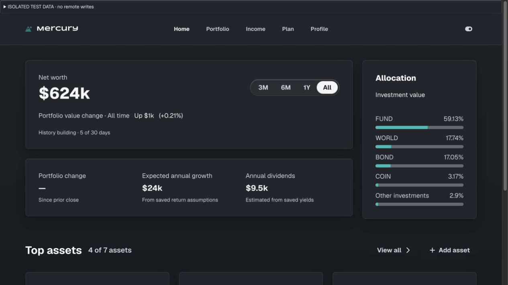

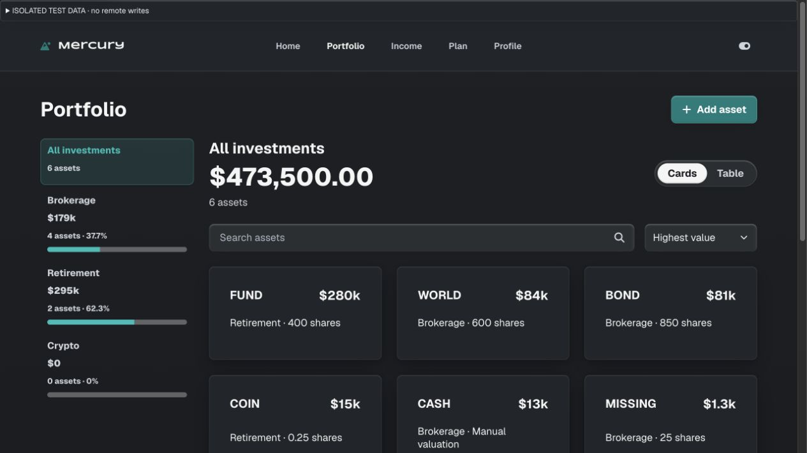

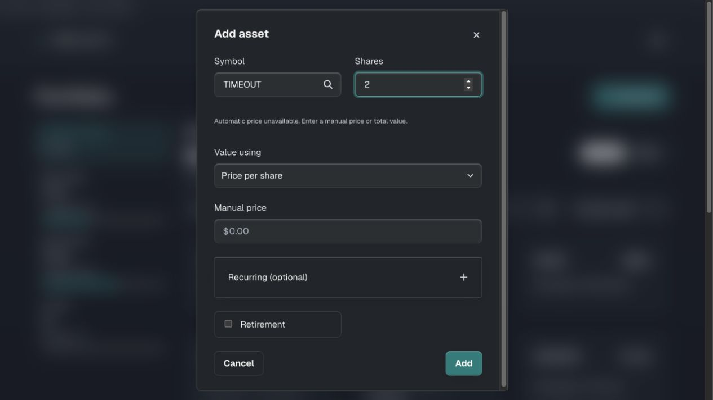

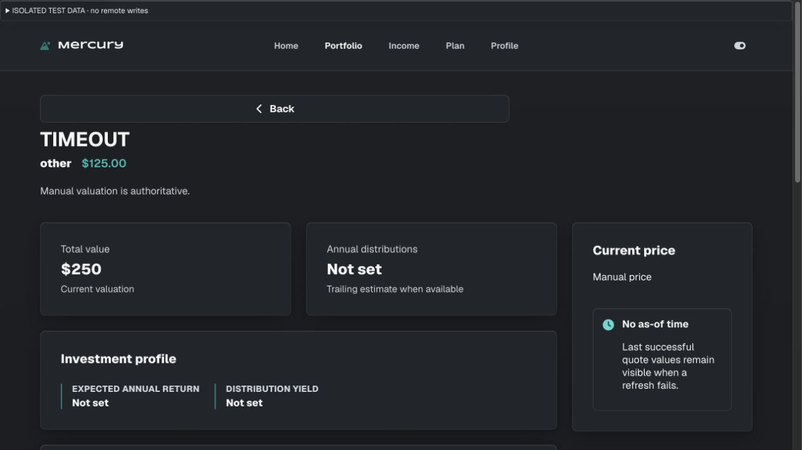

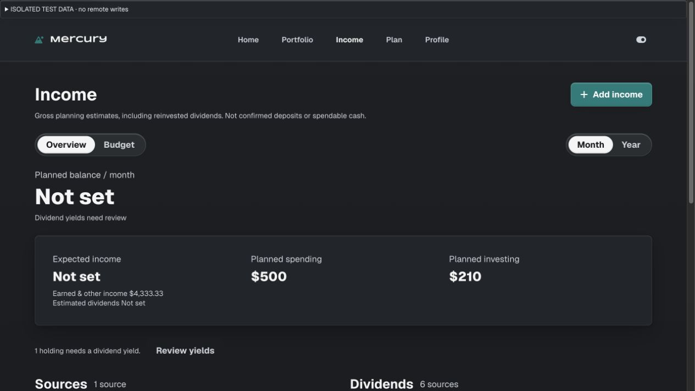

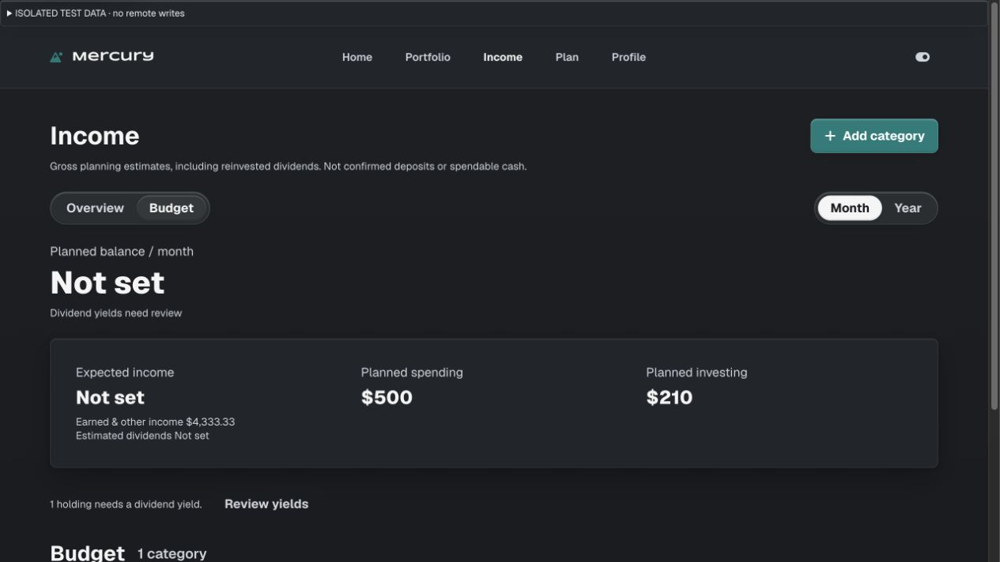

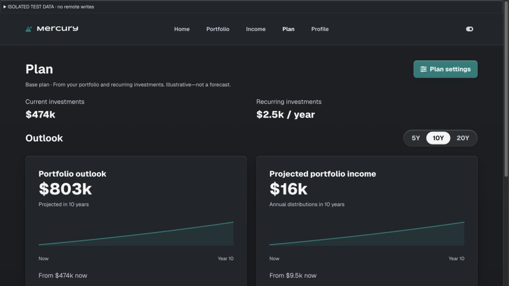

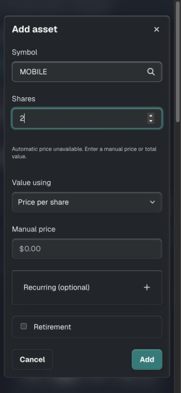

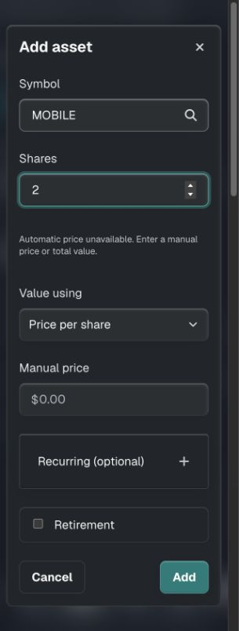

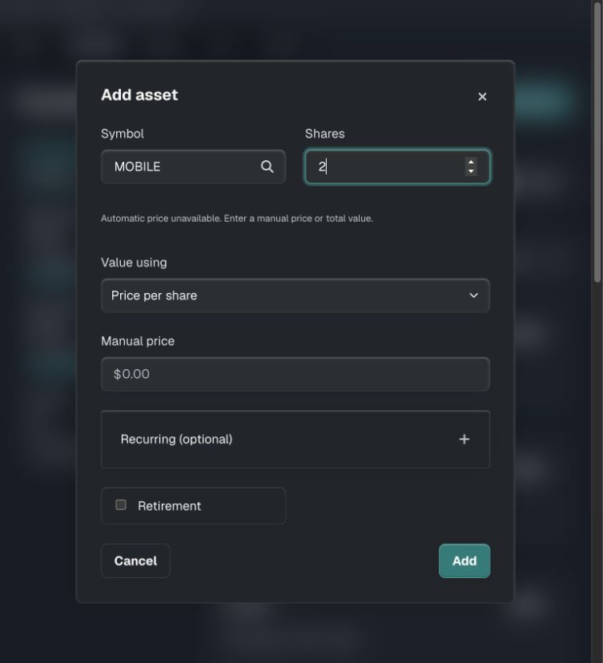

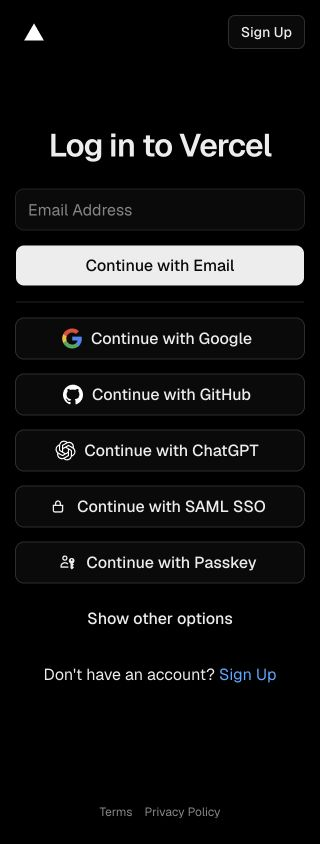
