# Mercury product and release review — 2026-09-08

Reviewed fetched, clean main `88ae63f`, then the scoped Income recovery change. The automation memory file was absent; repository review records guided prioritisation. Current screenshots and tests are the evidence. All financial values shown in browser captures are disposable local fixture data.

## Outcome

- **P2 fixed: unavailable Income reads had no in-page retry.** Overview and Budget now identify missing sources/categories beside Planned balance and offer Retry data. Retry requests only failed collections for the current account, keeps successful partial results and preserves route, period, searches and unrelated holdings/drafts. Duplicate requests are blocked; ten-second UI deadlines release stalled retries and ignore late results. Account/session identity checks prevent responses from crossing account boundaries.
- **P2 fixed: missing holding valuations had no direct Income repair.** A missing-valuation count and Review valuations action open the affected asset's existing Manual price field. Save/Back returns to the same Income subview and restores a sensible keyboard target. Missing yield and loading provider data remain distinct causes.
- Existing Acadia Cluster, Button, Read Only and status semantics supply the UI. No CSS, colour, financial arithmetic, schema or provider changes.

## Current flow coverage

All 10 implemented canonical flows and the deferred export boundary received a registry/source/test coverage review. Browser verification is selective, as specified below; this is not full authenticated production acceptance.

| Step | Flow and health | Current evidence and limits |
| --- | --- | --- |
| 1 | Sign-in: local regression coverage; production blocked | Signed-out route gating and send failure/duplicate-submit tests pass. Verified production deployment redirects to Vercel login before Mercury authentication. Supplied Mercury test credentials cannot resolve this separate Vercel gate; no credentials entered into Vercel. Magic-link redemption and expiry remain open. |
| 2 | Home: local entry healthy | Current screenshot 09 shows private fixture net worth, five-day history building and allocation. History/domain regressions pass; actual scheduled history is separate. |
| 3 | Portfolio: local entry healthy | Screenshot 10 confirms Cards, search/filter/sort, recurring and Property actions in the accessibility tree. Existing filter/return-focus regressions pass. Property mutations and all sort permutations were not repeated in this browser pass. |
| 4 | Add holding: local entry/cancel healthy | Screenshot 11 shows compact form, initial Symbol focus and optional Recurring. Cancel returns focus to Add asset. Existing quote/manual/save/retry tests pass; fresh remote creation remains open. |
| 5 | Retrieve quote: automated coverage healthy, remote open | Adapter/controller tests cover invalid provider data, unsupported/failure/manual recovery, partial saves and late responses. No live provider request accepted this run. |
| 6 | Asset edit/delete: valuation repair healthy locally | Screenshot 05 shows the focused Manual price field reached from Income. Saving a disposable 50-dollar price restores the local aggregate; Back returns to Income and focuses dividend search. Deletion and dirty/pending guards pass controller tests; remote deletion was not repeated. |
| 7 | Expected Income: recovery fixed locally | Screenshots 01–04 show unavailable reads, actionable retry failure and recovered totals. Browser confirms disabled Retrying, repeat failure, eventual recovery and keyboard focus on Retry after failure / summary after success. Tests prove one successful collection survives failure of the other and only the failed collection is retried. |
| 8 | Budget: recovery fixed locally | The same summary action remains available on Budget; the category empty state points to it. Browser Budget switching and preserved calculations pass; source/category domain and deferred-save tests pass. |
| 9 | Plan: local entry healthy | Screenshot 12 confirms automatic rate sources and paired outlooks. Current Plan domain and recovery tests pass. No forecast or investment recommendation is implied by fixture values. |
| 10 | Daily history: automated coverage healthy, operational gate open | Current snapshot endpoint tests cover owner scope, configured cron authentication, close-time/date gating and no-write incomplete valuations. No new scheduled execution, database isolation or export acceptance claimed. |
| 11 | Export: deferred boundary | No exposed Home export action. Owner-only export and second-user remote acceptance remain separate requirements. |

## Responsive and accessibility evidence

- Current Income recovery renders in the desktop in-app browser and embedded 320/390/768px viewports. Inner client/scroll widths match at 305/305, 375/375 and 753/753px (15px desktop scrollbar); no horizontal overflow. Retry measures 44px high.
- Screenshots 06–08 are embedded responsive captures, with unused browser area visible. They are not physical-device screenshots. The viewport override did not affect the in-app window and was reset; measured embedded widths are the evidence.
- Status reasons use a polite status region. Keyboard Enter retries; failure restores Retry focus, success focuses the summary. Valuation entry opens the disclosure and focuses Manual price; return after repair focuses the relevant Income fallback.
- Full screen-reader/VoiceOver, software-keyboard and physical-phone acceptance remain open. Screenshots alone do not establish accessibility compliance.

## Research applied

- [Apple progress indicators](https://developer.apple.com/design/human-interface-guidelines/progress-indicators?changes=_7): explain stalled work and the available next action. Applied to visible Retrying and repeatable failure recovery.
- [W3C status messages](https://www.w3.org/WAI/WCAG21/Understanding/status-messages): communicate changing status without requiring users to find or focus new content. Applied to the Income summary status region.
- Competitive feature expansion would not materially help these specific recovery failures; the existing explicit Save/Cancel model remains appropriate.

## Technical priorities retained

1. **P1 — Migration reproducibility:** repeated date prefixes and the consolidated remote-baseline history still require a verified clean rebuild and reconciliation before the next schema change. Files were reviewed; remote schema was not revalidated this run.
2. **P2 — Read coverage:** core `loadData()` and snapshot collections remain unpaginated. Introduce owner-scoped latest-quote retrieval and over-limit fixtures before growth can silently truncate data. New Income retry follows the existing collection contract; it does not resolve pagination.
3. **P2 — Provider deadlines and release gate:** upstream fetches in `api/lib/twelve-data.js` remain unbounded; no repository `.github` check workflow is present. Add bounded provider requests and CI separately with provider/cache behaviour tests.
4. **P2 — Authentication continuity:** cross-tab sign-out/session expiry and real magic-link completion still need authenticated browser evidence and task-preserving recovery design.

## Validation and publication boundary

`npm run check`: **159 passed**, zero failures. Four new behavioural tests cover missing-valuation navigation, partial/duplicate retry, thrown/API failure and late sign-out response, and deadline/late-result behaviour. `git diff --check` passes. No fixture code, credentials, owner records or remote schema changes are published. Commit/push and GitHub production deployment status are reported in the automation result; Vercel-protected browser acceptance is separate.

## Current screenshots

### 01-income-before

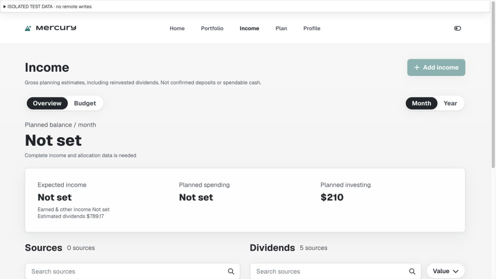

### 02-valuation-before

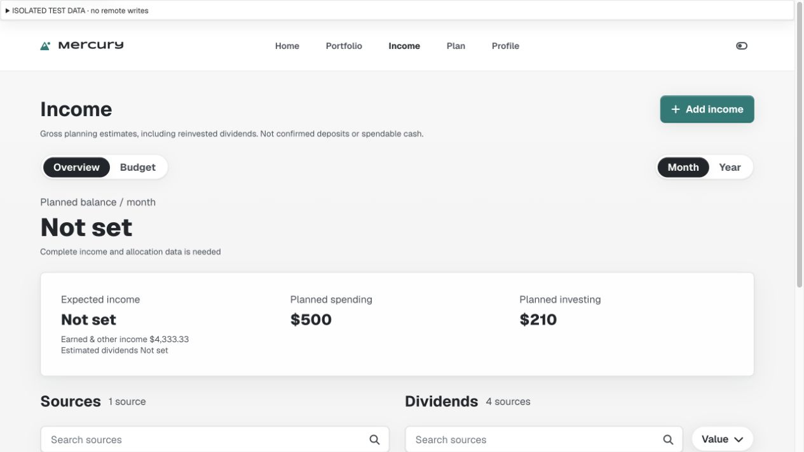

### 03-income-retry-failure

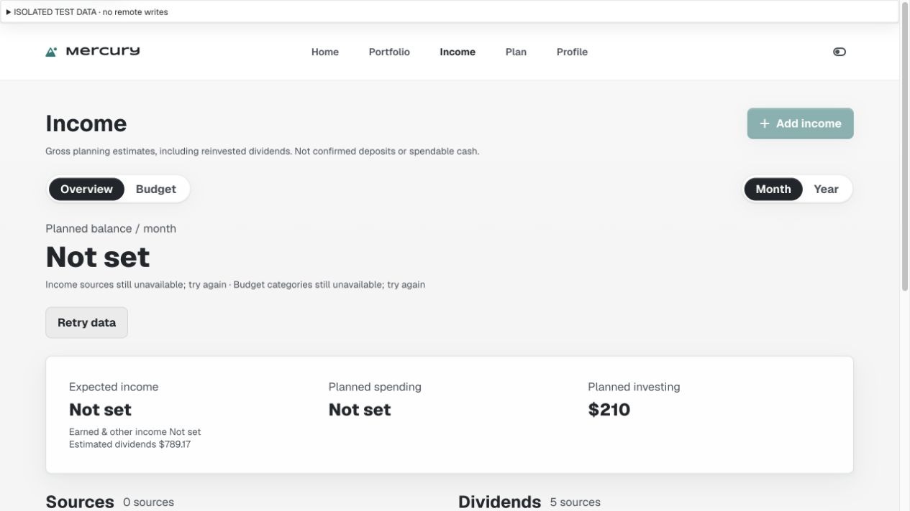

### 04-income-recovered

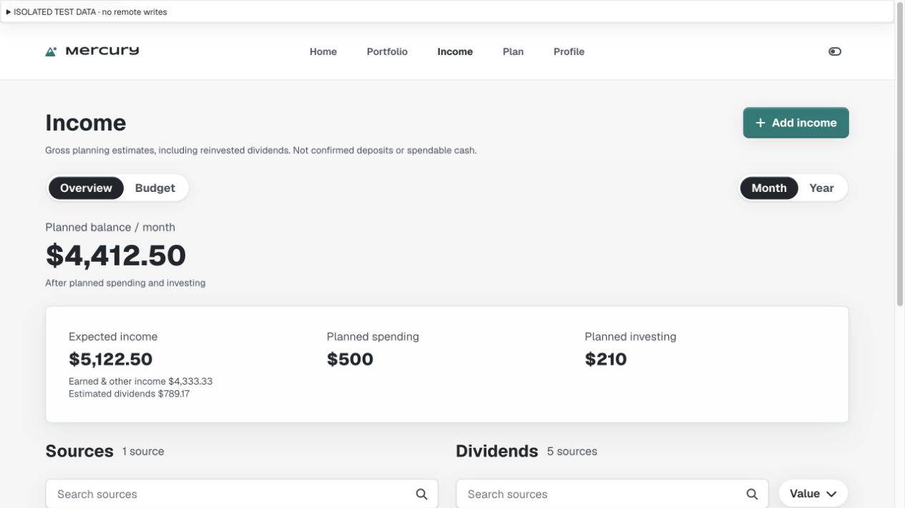

### 05-valuation-repair

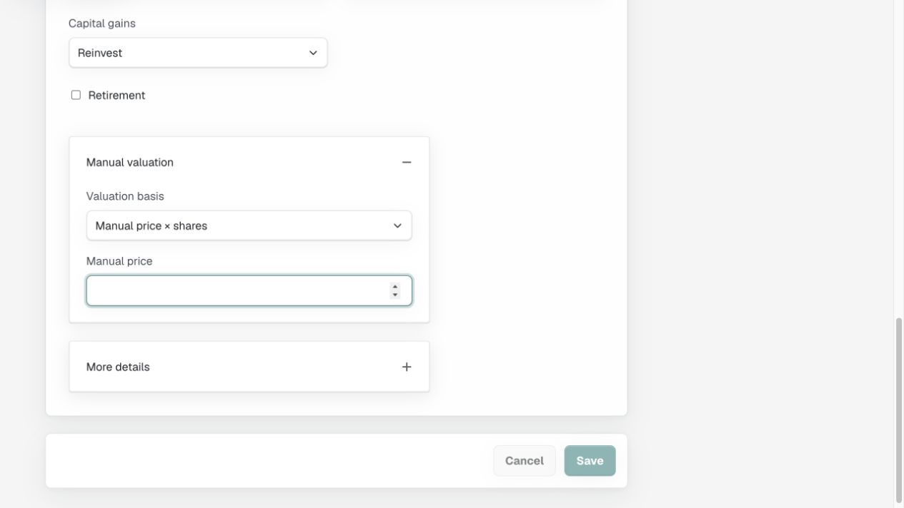

### 06-income-320

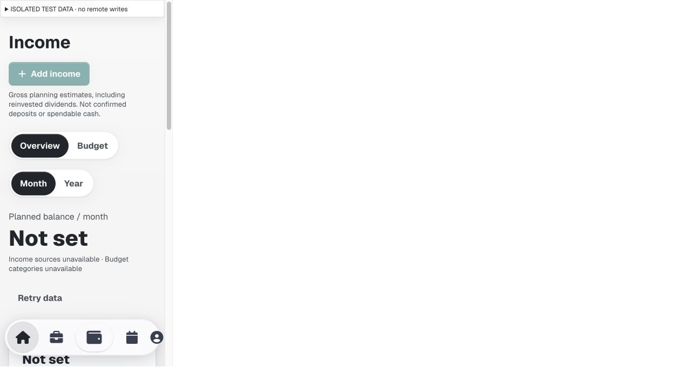

### 07-income-390

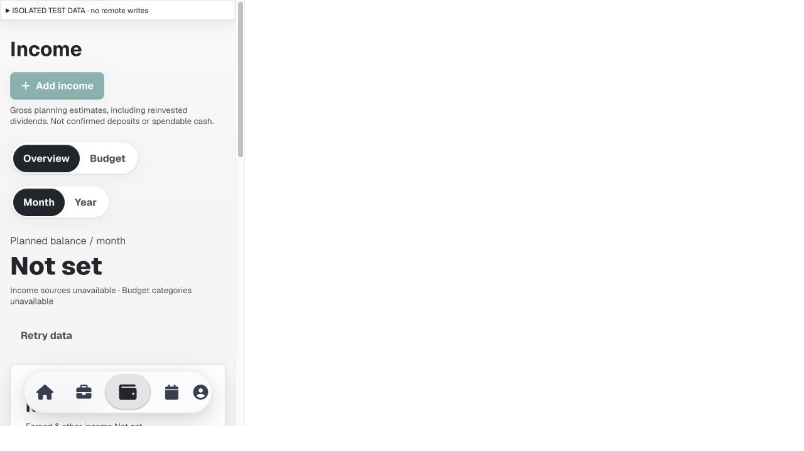

### 08-income-768

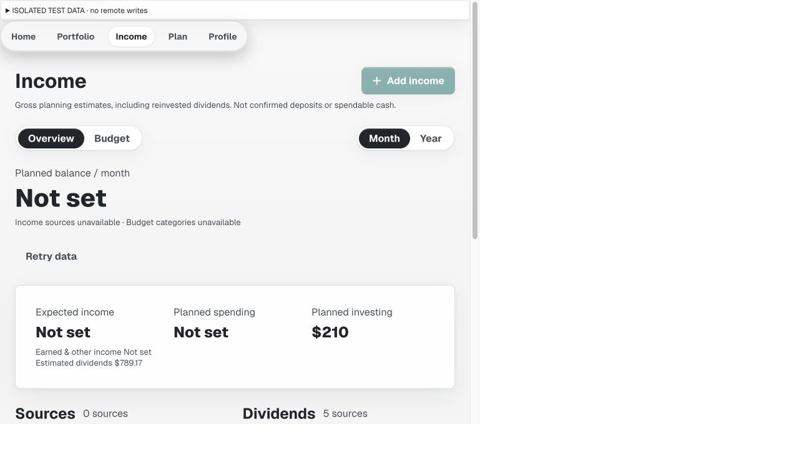

### 09-home-smoke

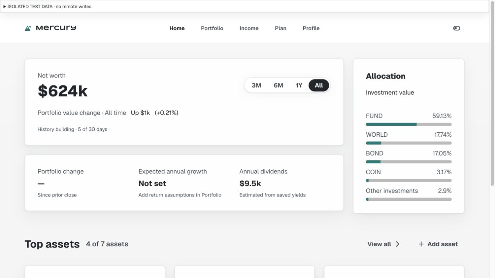

### 10-portfolio-smoke

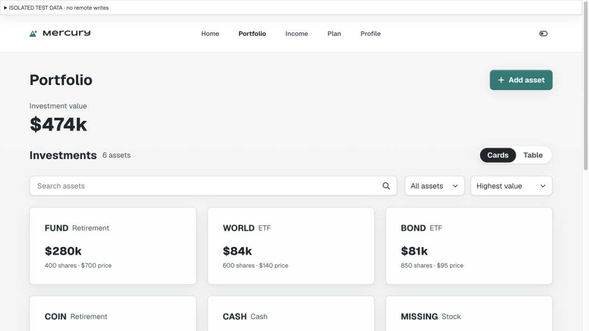

### 11-add-asset-smoke

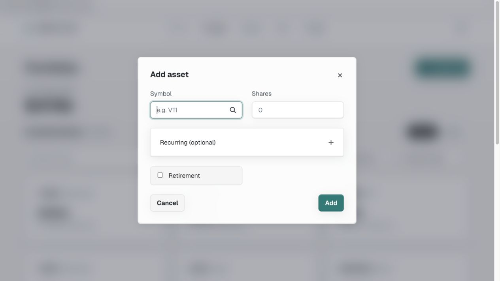

### 12-plan-smoke

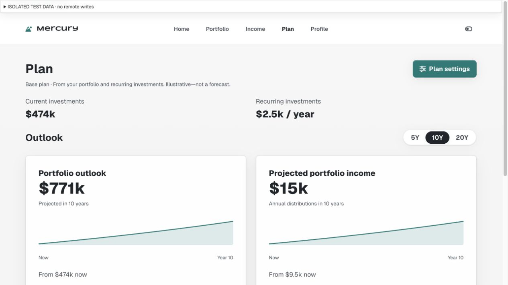

