# Mercury recovery and release review — 13 September 2026

Mercury now distinguishes a failed initial read from an empty account, offers an in-page retry, and keeps Property failures inside their own section. Acadia 0.3.1 is adopted from verified published revision `ebe4b47a582c8295fde5de1fe56bcce7181bd0a1`. Version 0.0.1 establishes patch versioning for the previously unversioned product. This is not a 1.0 acceptance claim.

## Scope and evidence

Reviewed all ten implemented canonical flows against current source, the 190-check suite and the flow registry. Browser evidence below uses current local code with an isolated in-memory Supabase adapter and explicitly synthetic holdings/property records. These are not owner balances, remote persistence tests or live provider responses. The individual deployment URL for `3a1252c` redirected to Vercel authentication. After release, the verified canonical alias https://mercury-psi-six.vercel.app was reachable and displayed Mercury’s own sign-in screen. Use this canonical alias for future production checks. No authenticated owner browser session or magic-link redemption was established; Mercury credentials were not entered into Vercel.

### Canonical flow coverage

| Step | Flow | Current result and limits |
| --- | --- | --- |
| 1 | Sign in | Signed-out Budget deep link displays authentication at 390px; temporary initial-read failure now recovers without losing the requested route. The canonical production sign-in screen is verified. Actual email delivery/redemption and expiry remain unverified. |
| 2 | Add a holding | 320px Add entry, labels, native dialog, Cancel and return focus checked; existing save/manual recovery regressions pass. Fresh remote create not accepted. |
| 3 | Retrieve/refresh a quote | Deadline, fallback, sanitisation and stale-result tests pass. Provider batch completion now respects in-memory account context and the latest batch. Live provider coverage remains unverified. |
| 4 | Edit/delete an asset | Synthetic manual valuation changed from 12,500 to 12,600, Changes saved shown, and Back returned to the updated Portfolio value and original card focus. Pending/failed writes and deletion regressions pass; remote deletion was not attempted. |
| 5 | Understand current position | Successful account retry restores synthetic net worth, holdings and truthful unavailable/empty metric states. Failed account reads no longer show No assets yet. |
| 6 | Manage Portfolio | Desktop and phone layouts checked. Property failure withholds its count and equity; only properties are retried, the saved fixture reappears, and focus returns to Property. Cards/search/table logic remains covered by regression tests. |
| 7 | Build daily history | Source and endpoint/domain checks cover New York dates, valuation rejection and upserts. No new scheduled production execution or live history acceptance claimed. |
| 8 | Plan expected income | Tablet Overview checked with synthetic empty sources and zero-yield holding; existing source save/retry/delete and period calculations pass. Remote Income persistence remains unverified. |
| 9 | Set category spending totals | Tablet Budget entry and honest empty-state/Add action checked; existing category calculations, save/delete/recovery and responsive Table contracts pass. Remote Budget persistence remains unverified. |
| 10 | Review current trajectory | Tablet Base plan checked with synthetic saved rates and separate property equity. Initial default creation now ignores conflicting settings and reads the winner instead of overwriting it. Remote multi-client acceptance remains open. |

Export remains deferred and is not counted as an implemented flow.

## Findings and changes

- **P1 fixed — Failed account read looked like an empty portfolio.** The old fallback marked configuration unavailable, rendered empty holdings and hid the cause in screen-reader-only text. A Content Card now shows loading, missing configuration or temporary failure explicitly, with Try again. Private content and creation stay unavailable until loading succeeds. Retry preserves the route, rejects duplicate attempts and returns focus without scrolling away from the current position.
- **P1 fixed — Initial/general reads could wait indefinitely or overwrite newer state.** Configuration bodies, session recovery, account setup and each collection have ten-second deadlines. Fetch/PostgREST transport is aborted where supported; a non-abortable session result cannot resume a failed attempt. Optional collection failures do not discard successful investment reads. Account loads use a generation plus client/user/account identity; metrics use a generation and verify the holding identity before applying results. These guards do not replace a complete cross-tab authentication lifecycle.
- **P2 fixed — Property failure implied a migration problem.** Generic read failures now explain the affected content, withhold the count and offer Retry properties. Successful recovery restores focus to the Property heading and updates dependent values. No product-specific visual styling was added.
- **P2 fixed — Initial Plan default could overwrite a concurrent choice.** Default insertion ignores a conflicting account row and reads the saved settings. This does not add optimistic concurrency to ordinary editor saves.
- **P2 follow-up — Migration history.** Local `20260901` and `20260902` prefixes are duplicated and the documented remote baseline is consolidated. README setup now points to reconciliation guidance instead of indiscriminately applying every file. No migration/schema/data changes were made this run; remote history was not re-queried.
- **P2 follow-up — Collection growth and caches.** Browser reads and the scheduled snapshot implementation still need pagination/latest-quote coverage beyond backend row caps. Provider maps have expiry checks but no size cap. These require targeted regression fixtures before changing query/storage behaviour.
- **P2 follow-up — Authentication and Plan recovery.** Real cross-tab session expiry and concurrent editor writes remain unverified. Failed optional Plan-settings reads still lack a local retry. These are the next product reliability priorities.

## Research and Acadia decisions

Apple recommends clear progress feedback and an actionable explanation when work stalls; that supports a compact, in-context retry rather than an empty dashboard. [Apple progress indicators](https://developer.apple.com/design/human-interface-guidelines/progress-indicators), [Apple feedback](https://developer.apple.com/design/human-interface-guidelines/feedback).

W3C status-message guidance supports programmatically announced updates without unnecessary focus changes. Recovery uses polite statuses outside a busy region; deliberate retry completion returns focus when the user has not moved elsewhere. This is implementation evidence, not a full accessibility certification. [W3C status messages](https://www.w3.org/WAI/WCAG21/Understanding/status-messages).

The persistence implementation follows the SDK's supported request cancellation and conflict options. [Supabase AbortSignal](https://supabase.com/docs/reference/javascript/using-modifiers-abortsignal), [Supabase upsert](https://supabase.com/docs/reference/javascript/upsert).

Reviewed current Acadia Foundations/States guidance and changes since Mercury's previous pin. The complete stylesheet is copied unchanged, with integrity hashes refreshed. Intervening Footer, Lookup and Connection styles are not new Mercury features. React Menu/Tabs fixes are not imported into the static controller; Mercury retains native disclosures and its existing focus/dismissal behaviour. The form-width border-box correction remains necessary; the new upstream box-sizing fix belongs to Connection. No new adapter classes, theme palette or components were invented. Competitive copying would not improve this narrowly defined recovery problem.

## Validation

- `npm run check`: **190 passed**, 0 failed; baseline 180. Ten new actual-controller regressions cover initial failure/retry, genuine 503 unconfigured response, stalled config bodies, duplicate attempts, stale loads, account changes, abort/late completion, optional failures, property recovery and concurrent Plan defaults.
- Vendored stylesheet integrity and active Acadia selector checks pass. `git diff --check` passes.
- Desktop 1440px, tablet 768px and phone 320/390px inspected. Measured recovery controls are 44px high. Document widths equal 320/390/768px at measured states. At 320px Add's form client/scroll widths both equal 262px; its dialog is 288px wide.
- Keyboard Retry properties returns focus to Property; account retry returns focus to content; Add Cancel returns to its trigger; Asset Back returns to the updated card. Light/dark states were inspected.
- Current security-header, endpoint authentication, snapshot validation, theme/storage and domain tests pass. No dependency installation, secret change, schema change or remote financial write was needed.
- Not verified: email delivery, authenticated remote CRUD/reload/device persistence, second-user RLS, live providers, current cron execution, clean database rebuild, physical-device software keyboards, enlarged text or VoiceOver. No 1.0 promotion.

## Captured steps

Screenshots were saved and reopened before acceptance. Viewport captures intentionally show the current visible portion of longer pages. One incomplete recovered-Home capture from an invalid synthetic fixture was rejected and replaced; only accepted evidence is retained below.

1. **Before: initial failure — poor.** Empty portfolio copy conceals the failure.

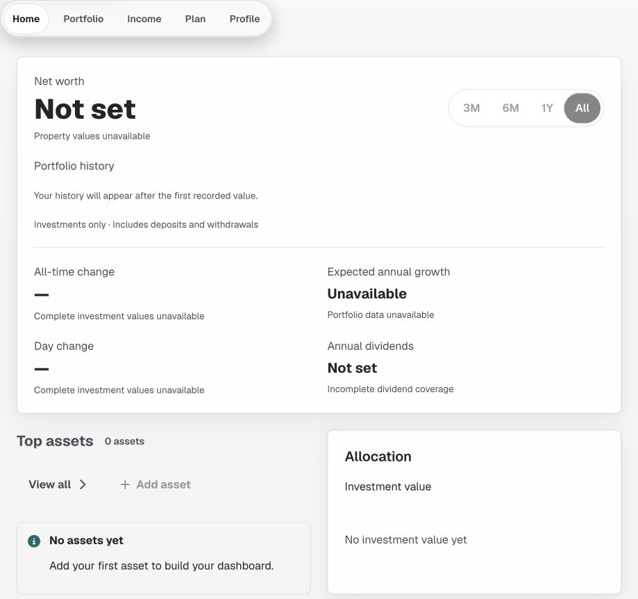

2. **After: initial failure — recoverable.** Visible cause and Try again.

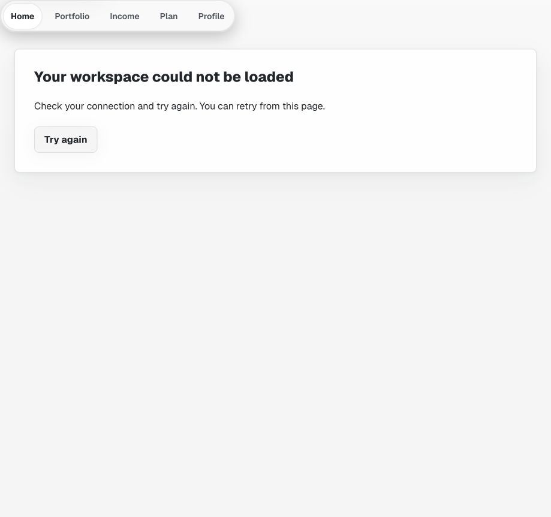

3. **Recovered Home — usable.** Synthetic saved records return; missing history/metrics remain honest.

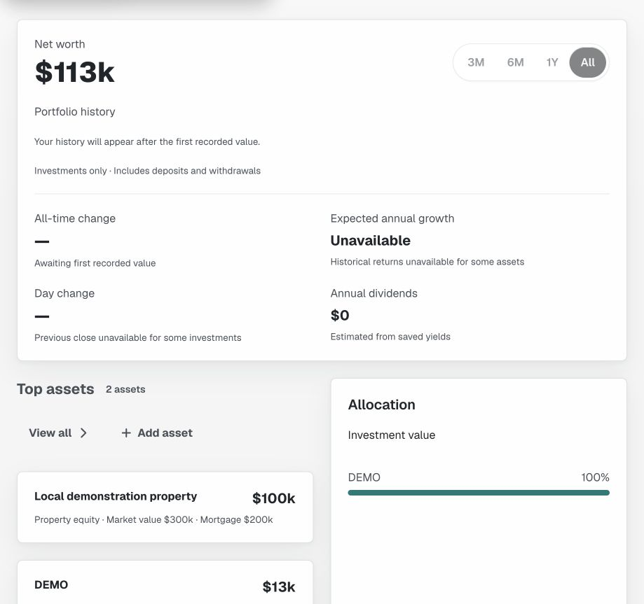

4. **Property failure — recoverable.** Investments stay usable; Property has local recovery.

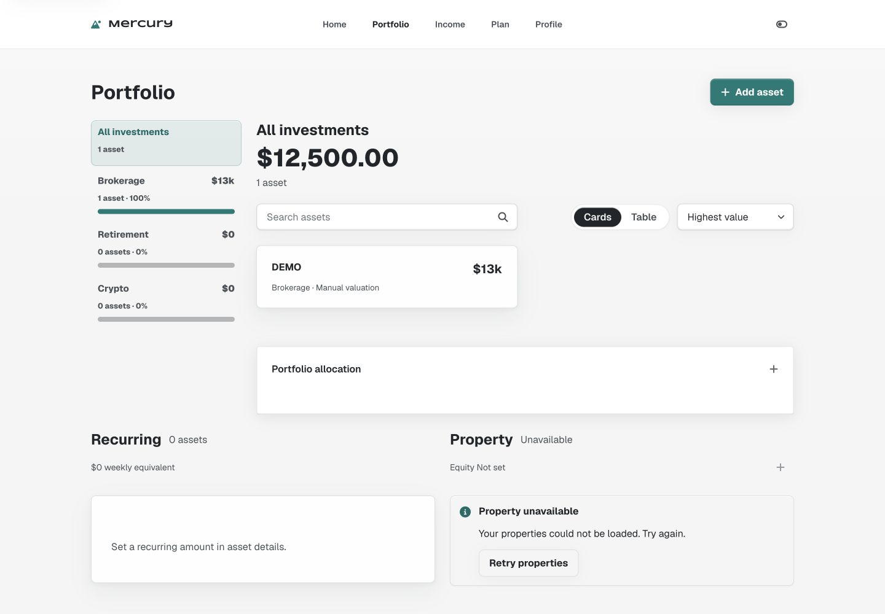

5. **Property recovered — usable.** Record and equity return; dark appearance remains cohesive.

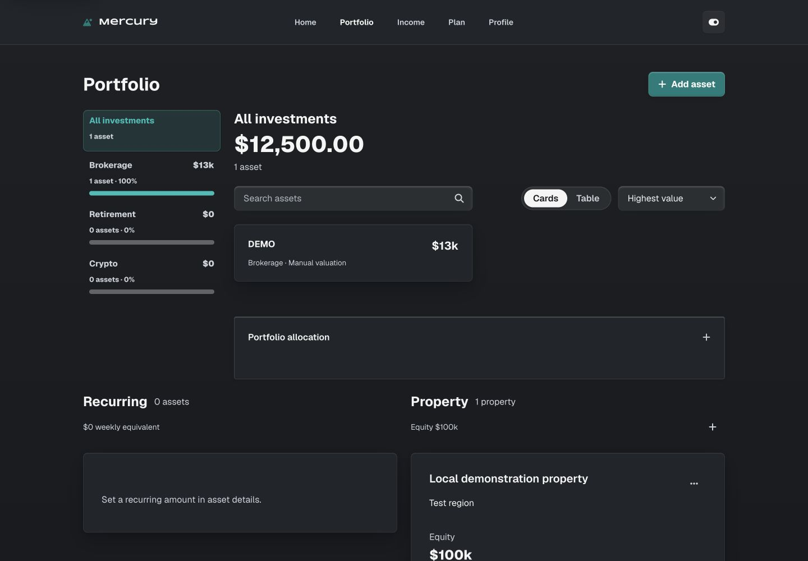

6. **320px account retry — contained.** Copy wraps and the action remains 44px high.

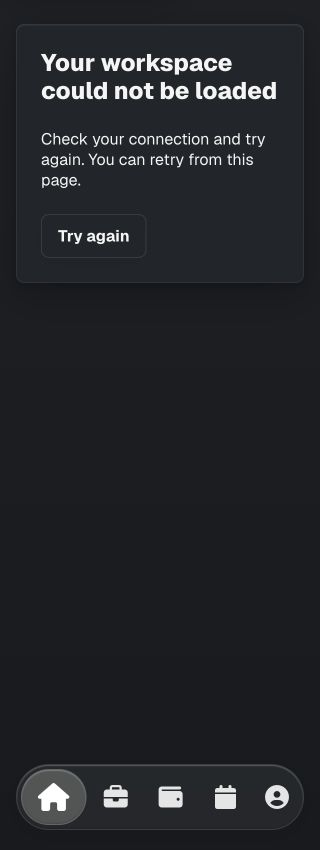

7. **320px Add — contained.** Existing form, controls and actions fit.

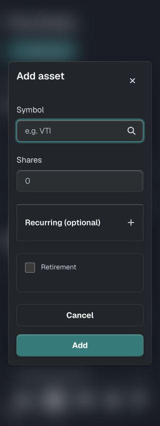

8. **320px saved edit — usable.** Synthetic updated total and Changes saved are visible.

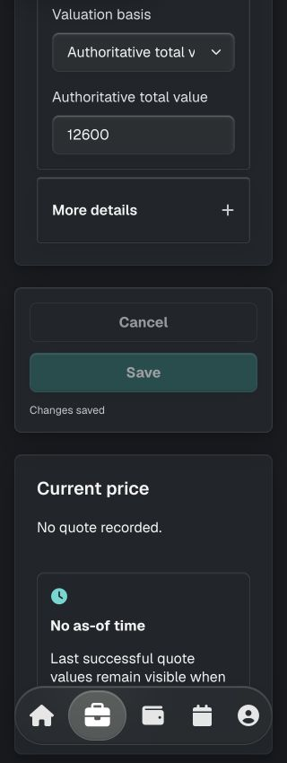

9. **Tablet Income — usable.** Empty sources and zero-yield estimates remain distinct.

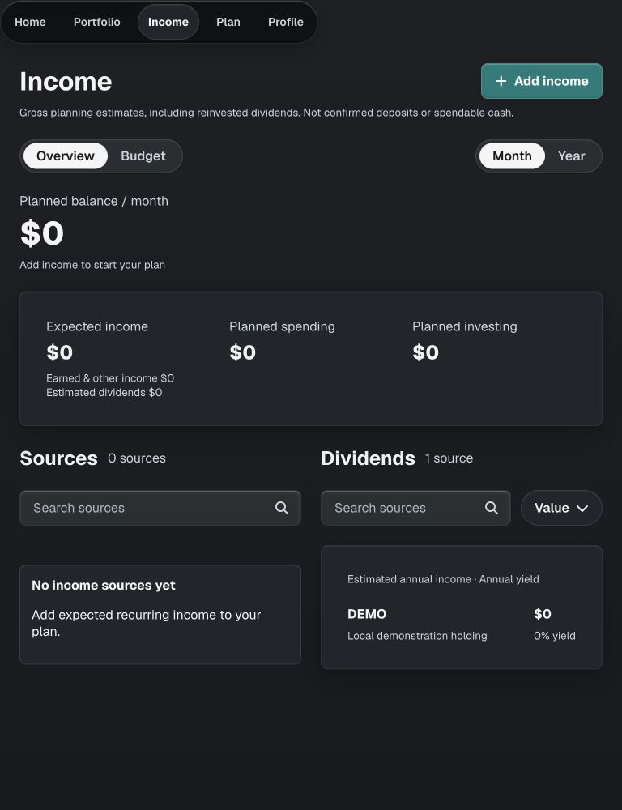

10. **Tablet Budget — usable.** Clear empty state and Add category entry.

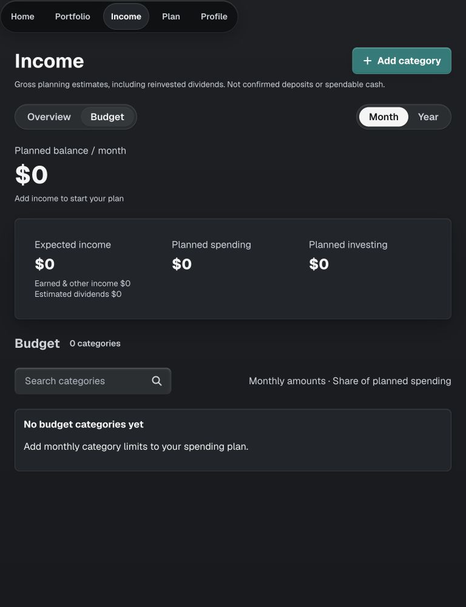

11. **Tablet Plan — usable.** Illustrative outlook retains its scope and inputs.

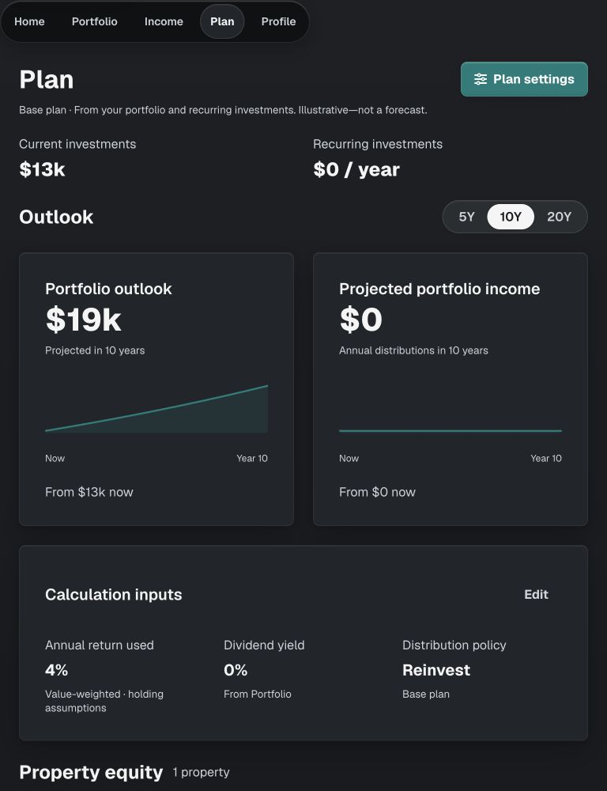

12. **Signed-out private route — correctly gated.** Only sign-in is displayed.

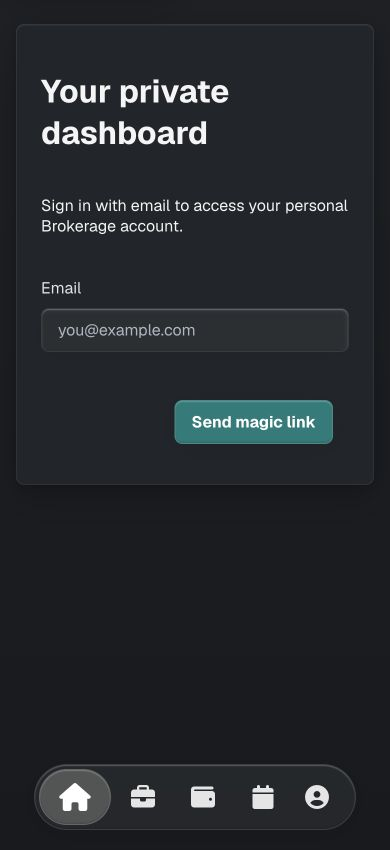

13. **Canonical production sign-in — reachable.** This is the real product entry, not the Vercel login shown on individual deployment URLs.

## Publication

Implementation commit `a7f9ab743d816c96c66635cab3855878a8e46462` was pushed and verified on origin/main. Production deployment `dpl_DkrJHK2FXFTbBwY6eYNEwbUz4uTi` reached READY; all 190 hosted checks passed, with the build completing in 3 seconds. The immediate deployment-scoped error scan returned no records; that is not sustained traffic or cron monitoring. Drains were not inspected. The canonical production alias is https://mercury-psi-six.vercel.app. A documentation-only follow-up records this corrected access evidence; final commit/deployment details are saved in the automation memory and task response.
