# Mercury 0.0.2 audit and release review

Run: 2026-09-14. Baseline: clean `main` at `9ce1184`, refreshed from GitHub. Scope: all ten canonical flows, current Acadia usage and technical release risks. Browser evidence uses current code and disposable local fixtures unless explicitly marked production. This is a bounded product audit, not full authenticated/device acceptance.

## Completed

- **P1: Plan stale writes.** Previously, opening settings in two clients allowed the later upsert to replace the first client's settings silently. Saves now match account, record ID and the revision captured when the editor opened. A background read cannot rebase an open draft. A conflict keeps the draft, reads the current record and requires closing/reopening to review it; repeated Save cannot overwrite it. First creation uses insert and treats uniqueness conflicts the same way. No schema change.
- **P2: Plan read recovery and misleading defaults.** Previously, unavailable settings required a full reload while Calculation inputs still showed inferred rates and Reinvest. The existing Status Row now offers Retry settings. Unknown saved assumptions are withheld. Recovery reads only Plan, retains the horizon and unrelated content, prevents duplicate requests, bounds transport waits and restores keyboard focus. A failed default-creation attempt leaves investments usable.
- **P2: Unconfirmed Plan saves.** Reads/writes have ten-second deadlines. A stalled save releases the pending state and retains the draft with explicit unconfirmed-save guidance. A late response cannot report success after timeout. Retrying still compares the original revision.
- **P2: Portfolio toolbar.** At 768px, the search label stretched to the adjacent two-row tools; the absolute icon sat below the input. A canonical Acadia Field wrapper now keeps the search container at its natural height. Measured input and icon vertical centres both equal 303.5px, with a 44px input. No custom style.
- **Acadia:** adopted published 0.3.2, revision `c3547c1c841f2b15598ed393ea1c849fdcb3aff6`, verified against remote main. Vendored CSS is unchanged from upstream. The five added CSS declarations cover form shrinking, wrapping range captions and dense mobile section insets. Assets and Card Trend utility are unchanged and integrity-checked. The existing two documented product exceptions remain necessary.
- **Version:** patch 0.0.2 for corrections to existing flows. No new financial feature or change to financial arithmetic. 1.0 remains unjustified while the gates below are open.
- Removed contradictory setup advice to apply every migration: reconcile the consolidated baseline before replaying schema files in any interface.

## Current flow matrix

| Step | Flow | Current health and evidence | Remaining acceptance |
| --- | --- | --- | --- |
| 1 | Sign in and open private account | Production shows Mercury's magic-link form; supplied test credentials successfully authenticate through Supabase. Existing initial-load/retry and signed-out route tests pass. Screenshot 01. | Email delivery/redemption and cross-tab session expiry not browser-accepted. |
| 2 | Understand current position | Home shows recorded history and explicit missing previous-close/history metrics. Current synthetic light-mode screenshot 13; domain and controller arithmetic pass. | Actual owner/provider freshness and physical-device review. |
| 3 | Add a holding | Add opens with Symbol focus and Cancel returns correctly; responsive shared form inspected in screenshot 08. Quote/manual recovery, duplicate submission and partial-save tests pass. | No new live holding write or browser quote-provider acceptance this run. |
| 4 | Edit holding and contribution | Local authoritative value Save updates Portfolio and Back restores the source card; screenshot 10 shows the detail layout. Retained-draft/pending-write tests pass. | Other-editor stale writes remain unguarded; live cross-client persistence not accepted. |
| 5 | Remove a holding | Current source and deletion/pending/failure regression tests pass. | Browser deletion was not rerun; no new screenshot or live deletion acceptance. |
| 6 | Manage Portfolio and property | Cards/Table transition and tablet wrapping inspected. Search icon fixed; screenshots 07 and 09. Property read recovery and CRUD tests pass. | Property browser CRUD and other-record revision protection remain separate. |
| 7 | Build daily history | Local dated graph in screenshot 13; snapshot auth, incomplete valuation, close-time and idempotency tests pass. | Scheduler execution/freshness not newly accepted; unpaginated reads remain a growth risk. |
| 8 | Plan expected income | Overview renders explicit gross planning semantics and source/dividend coverage; screenshot 11. Cadence, partial coverage and form-recovery tests pass. | Live income writes and revision-aware editing. |
| 9 | Set category spending | Local Add category saves a $100 monthly fixture and updates the balance/category table; screenshot 12. Focus returns to Add category. | Remote category persistence and revision-aware editing. |
| 10 | Review current trajectory | Plan failure/retry, withheld assumptions, 20Y selection, conflict draft, repeated-save rejection, discard/reopen/latest review and successful save exercised. Screenshots 03–06 and 14. Live backend revision tests also pass. | Fully signed-in browser multi-client run and physical accessibility remain open. |

Export remains a deferred private recovery boundary, not a current user-facing action. No import, connection, advisory or new scenario feature was added.

## Research applied

- [Apple feedback guidance](https://developer.apple.com/design/human-interface-guidelines/feedback): keep recovery and outcome feedback attached to the affected surface. Applied through the existing Plan status region and dialog.
- [W3C form notifications](https://www.w3.org/WAI/tutorials/forms/notifications/) and [status messages](https://www.w3.org/WAI/WCAG21/Understanding/status-messages.html): describe failures and next actions in text; expose updates without moving focus unnecessarily. Retry success restores focus only when the invoking control retained focus or disappeared. Conflict keeps the active draft.
- [Supabase update](https://supabase.com/docs/reference/javascript/update) and [filters](https://supabase.com/docs/reference/javascript/using-filters): compose the revision condition into the update and return the actual affected record. The database trigger, atomic filter and unique constraint were tested live; no client-side pre-read/check/write race was introduced.
- [Supabase authentication events](https://supabase.com/docs/reference/javascript/auth-onauthstatechange): informs the next auth lifecycle work. No listener has been introduced in this patch; it must handle private drafts and pending writes as one lifecycle without async auth callback deadlocks.

Competitive feature copying would not improve these failure paths; the established platform/shared-system patterns were sufficient.

## Validation

- `npm run check`: **197 passing**, zero failures (190 baseline plus seven outcome/race regressions).
- Suite covers domain calculations, quote adapters, endpoint authentication/snapshots, schema contracts, rendering, themes and actual browser-controller behaviours. DOM stubs are not native-browser accessibility proof.
- Desktop 1440px, tablet 768px and phone 390/320px inspected. Measured document widths equal viewport widths at 1440/768/390/320. At 320px the conflict dialog is 286px internally, form scroll width 262px, and Save is 44px tall. At 390px Retry settings is 44px tall. Light/dark are both represented.
- Keyboard Enter on Retry settings restores focus to Plan settings and reveals the outlook. Conflict preserves the selected draft value and keeps the dialog open. Cancel leads to the existing discard confirmation; reopening shows the newer remote setting, and a deliberate new save succeeds.
- Local fixture values are synthetic. Fixture state is recreated on a full page load; these walkthroughs do not prove durable financial persistence.
- Live Supabase: supplied test login verified; initially zero account/settings rows. Created one disposable account and settings row. Current revision update succeeded and advanced `updated_at`; stale update returned zero rows; subsequent read retained the winning setting; a competing first insert returned 409. Deleted the created account (cascading settings) and verified both tables were empty for that test identity again. No owner records, schema, policies, secrets or authentication settings were changed.
- The initial full-page Plan capture had an invalid scale and was rejected. Replacement captures use viewport screenshots, each saved and inspected. An incomplete historical-data fixture was corrected with account-scoped snapshot IDs before accepting screenshot 13.

## Remaining priorities

1. **P1 — Authentication lifecycle.** `brokerage.js` reads the session at startup and reloads after its own sign-out; it has no auth-event subscriber. Existing tabs can retain private content/drafts after another tab signs out. Implement a coordinated identity transition, pending-write handling, draft policy and race tests, then exercise two signed-in browser contexts. Test login now works, so this is implementation/acceptance work rather than an authentication-access blocker.
2. **P1 — Other editor concurrency.** Holding, income, category and property updates still lack an opening-revision condition. Extend the proven Plan contract to them with appropriate deleted-record handling and live isolation tests. Do not claim this patch makes every editor conflict-safe.
3. **P1 — Migration reproducibility.** Duplicate historical version prefixes and a consolidated remote baseline remain unreconciled. Setup copy is corrected; no schema history repair or clean rebuild is claimed. The live Plan check proves its existing trigger/constraint only.
4. **P2 — Data growth and provider health.** Browser/snapshot collection reads remain unpaginated; quote/history row caps can omit needed values. Provider caches have no size cap. Preserve last-good values while adding bounded reads/cache retention and measured freshness.
5. **P2 — Release acceptance.** Magic-link redemption, scheduled snapshot freshness, second-user write isolation, CDN supply integrity, sustained runtime monitoring, VoiceOver, enlarged text, software keyboard and physical phone acceptance remain separate gates. No full WCAG or production-maturity claim.

## Screenshot walkthrough

1. Production entry: Mercury's own sign-in surface.

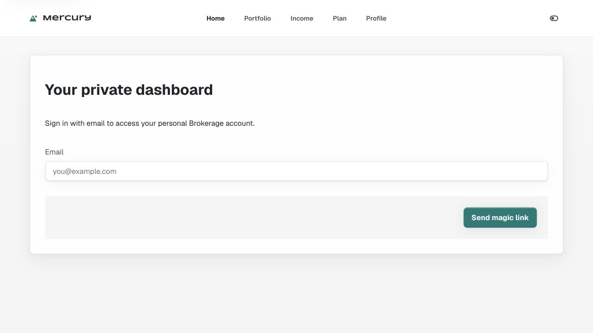

2. Plan read recovery: clear unavailable state, Retry settings and withheld saved assumptions.

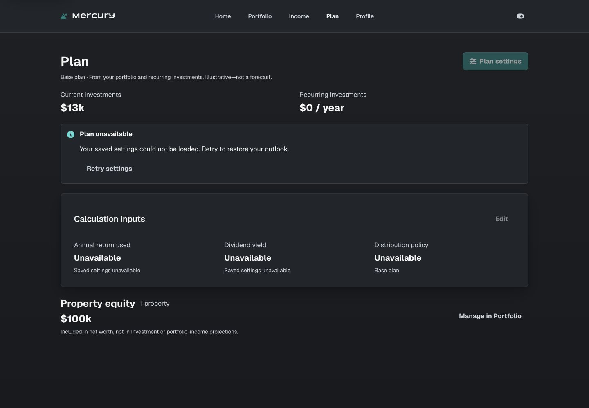

3. Recovered tablet Plan: retained horizon controls and explicit calculation sources.

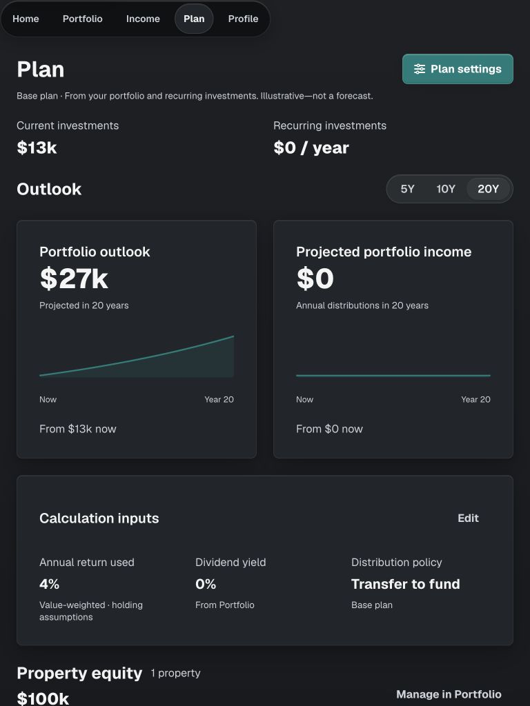

4. Conflicting settings: current saved value remains intact behind a retained draft.

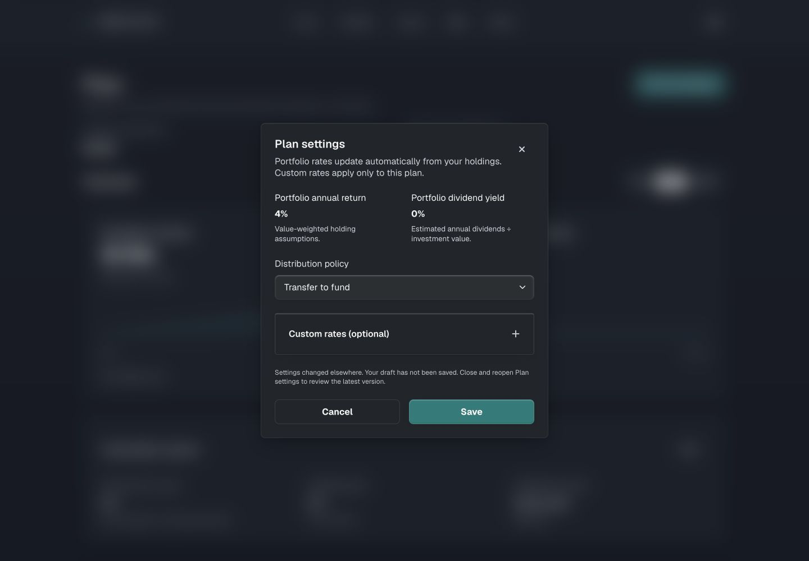
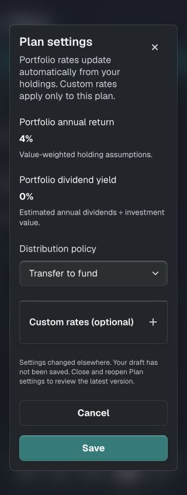

5. Portfolio: before/after the stretched search icon, with current Cards/Table composition.

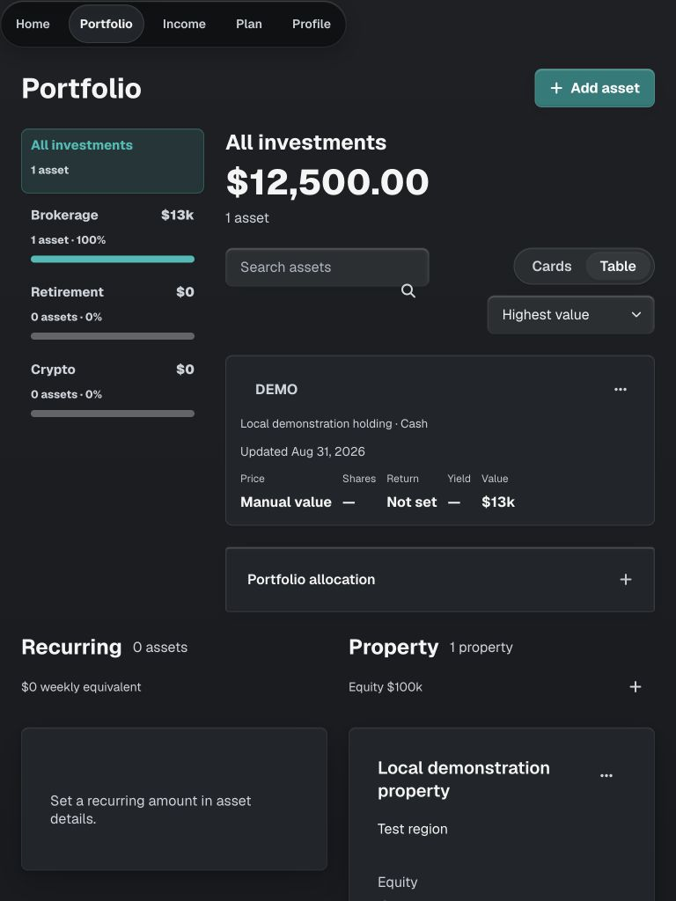
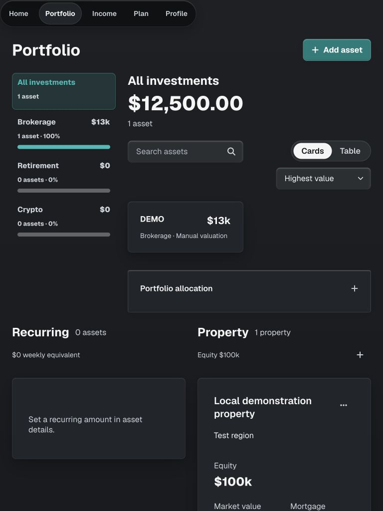

6. Add and edit: shared form controls, object detail and return navigation.

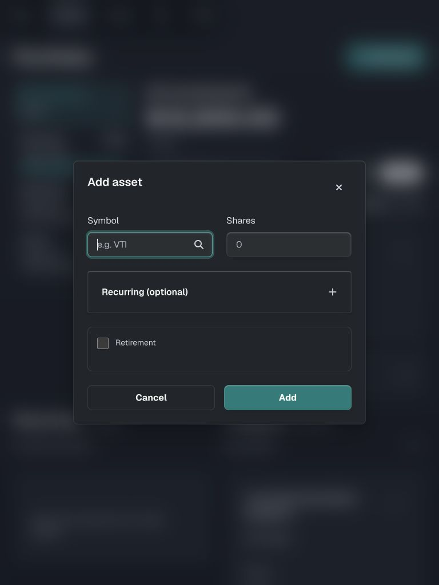
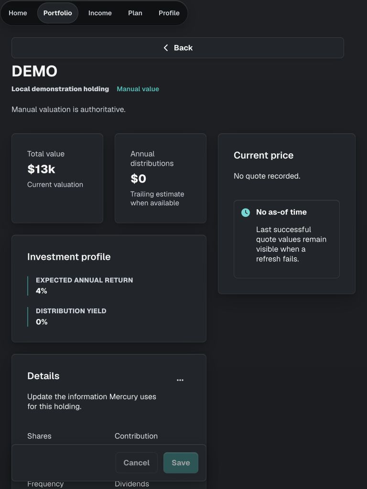

7. Income and Budget: coverage/empty state, then a saved disposable category.

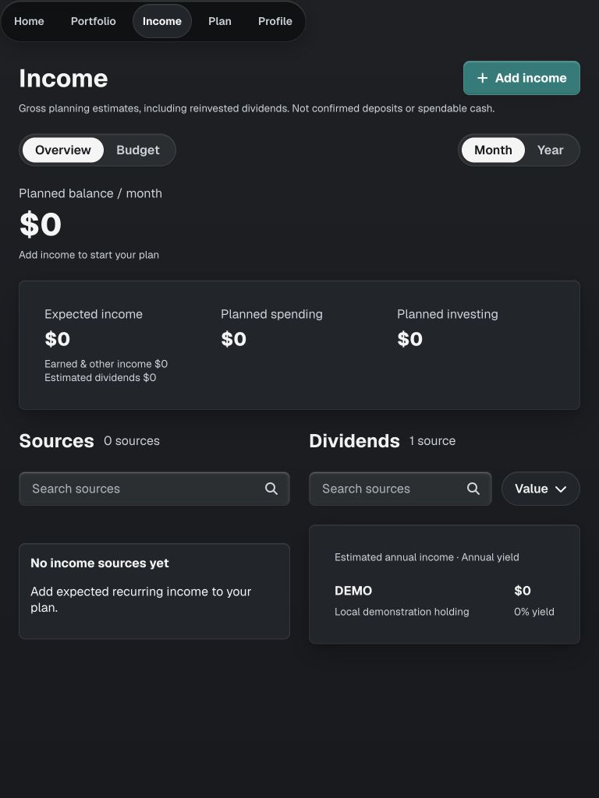
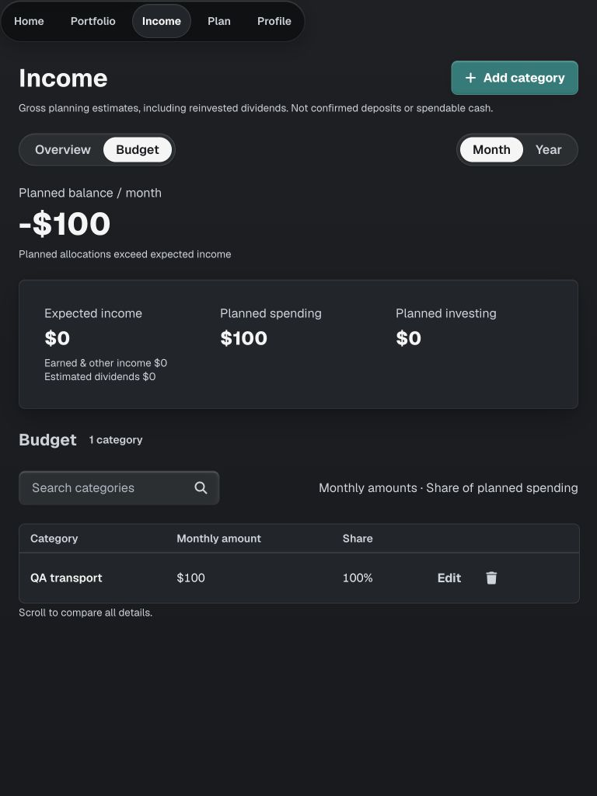

8. Home: real chart rendering from synthetic dated snapshots; unavailable provider coverage stays explicit.

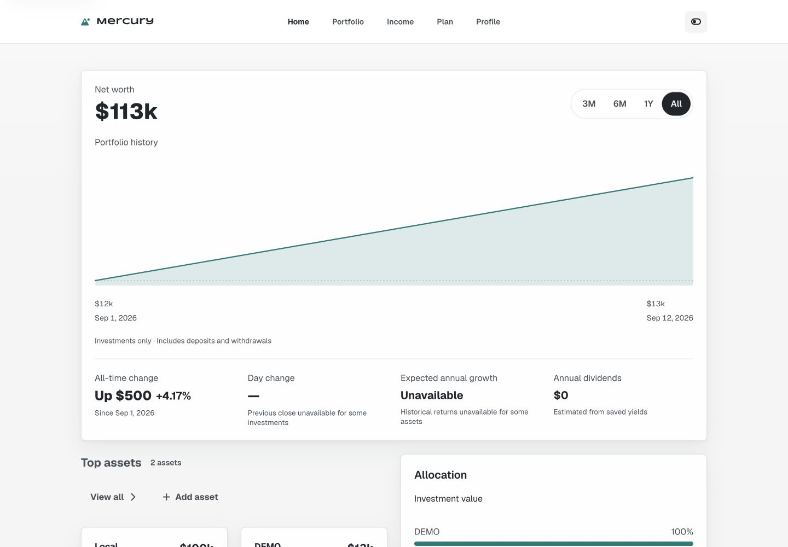

9. Phone recovery: 44px action and wrapping copy in light mode.

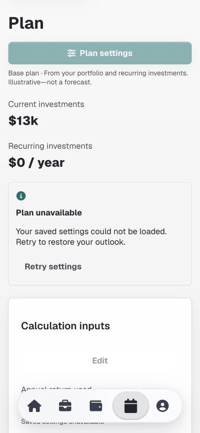

## Publication

Implementation and review are ready for the required direct-to-main commit and Git-triggered deployment. Final commit, hosted checks and canonical asset verification will be recorded after publication.
