# Mercury 0.2.5 — editor integrity and Acadia review

Reviewed 2026-09-18 UTC (17 September evening, America/New_York). Starting main: `7e4cee0`; clean and fast-forwarded against origin before changes. Prior automation receipts were used for scope only; findings below use current source, tests and captures.

## Outcome

Fixed a P1 data-integrity issue across asset details, income-source details, categories and properties: an editor could overwrite a newer saved record, and some zero-row updates could be treated as success. All four now capture the opening `updated_at`, account and client; filter updates by revision plus record/account identity; and require a returned row. A conflicting draft and its original revision remain intact through repeated Save. A scoped read refreshes saved values for deliberate review. Asset Cancel resets to that record; modal close/reopen reviews it. Failed conflict reads and deleted records remain explicit rather than authorising an overwrite.

Successful writes adopt the returned record without a full account reload. This avoids turning a confirmed save into a failure because an unrelated collection cannot reload. A ten-second deadline releases controls and reports an unconfirmed outcome; abort is not transaction cancellation. New source/category/property dialogs keep one generated ID across retries. Existing pending locks, discard confirmation, exact-cent values, source-linked calculations and account replacement guards remain. Property reads and retries now include the existing revision column. No migration, new data model or financial calculation change.

The complete unchanged Acadia published main snapshot `2b80572f46651f1b2f34a155381c481f201eb671` is adopted. Remote main was verified directly. Review included the changelog, foundations/operating model, Navbar contract and CSS diff from `346c874`. Current text/status roles, named dark surfaces, phone Navbar geometry and canonical bundled Home vector are inherited; fonts and Card Trend remain byte-identical. The manifest records all copied files. No Acadia source was changed and no shared primitive was forked. This is Acadia 0.3.3 plus its published-main follow-through, not a newly invented package version.

## Current walkthrough

The production sign-in capture is unauthenticated. All populated browser screens use disposable in-memory records through a local Supabase-shaped adapter; they reset on navigation/reload. They are not owner data or proof of durable browser persistence. Authenticated database checks are separately recorded below.

| Step | Task and current health | Evidence and observed result |
| --- | --- | --- |
| 1 | Sign in — entry healthy; email redemption unverified | Production sign-in loads, native email field and explicit magic-link action. No email sent. [Capture 01](screenshots/01-sign-in.png). |
| 2 | Home/history — usable with honest missing coverage | Saved history, current net worth, incomplete previous-close/history metrics and four groups remain distinct. Phone dock inherits the canonical Home silhouette. [Capture 14](screenshots/14-home-phone.png). |
| 3 | Portfolio review — usable Cards/Table | Current manual valuations withhold basket market change because shares are unknown. Table and cards retain values and entry controls. [Capture 08](screenshots/08-portfolio-table.png), [phone light 15](screenshots/15-portfolio-phone-light.png). |
| 4 | Add/edit asset — manual recovery and confirmed save pass | Quote failure exposes manual valuation; two shares at $100 creates a $200 synthetic holding. Existing VXUS authoritative value changed from $100,000 to $101,000, returns Changes saved, and Table shows $101k. [Capture 09](screenshots/09-add-manual-recovery.png), [saved editor 07](screenshots/07-asset-saved.png). |
| 5 | Delete asset — confirmation and return pass | Confirmation names the record and explains historical snapshots remain. An initial mock-adapter bug returned no deleted row; Mercury correctly retained the dialog with an error. Corrected the adapter, then deleting disposable VXUS returned to Portfolio, two remaining assets, $200k and focus on Portfolio actions. No product deletion change was needed. [Capture 10](screenshots/10-delete-confirmation.png). |
| 6 | Income source — stale-save defect fixed | Before the patch, a concurrent revision did not prevent a $1,200 save. Afterwards the editor retained $1,200 with conflict status; a repeated Save remained blocked. Cancel/Discard restored menu focus; reopen and deliberate Save updated the card and annual total. [Before 03](screenshots/03-income-before.png), [editor 04](screenshots/04-source-editor-before.png), [conflict 05](screenshots/05-source-conflict.png). |
| 7 | Expenses — save and conflict recovery pass | $4,300 changed to $4,000 with summary reconciliation and Edit focus restored. At 320px/200% text, a stale $4,000 draft stayed in the dialog; native keyboard focus brought Cancel/Save into view, and dismissal required explicit discard. The unnecessary desktop scroll hint remains a P2. [Saved 06](screenshots/06-expenses-saved.png), [conflict 12](screenshots/12-category-conflict-320-large.png), [actions 13](screenshots/13-category-actions-320-large.png). |
| 8 | Property — save and phone containment pass | Entered purchase price $250,000.25, confirmed card retained that exact title while using compact presentation. Light-mode phone editor exposes geography, values and assumption provenance; internal vertical scrolling keeps actions reachable. [Capture 16](screenshots/16-property-phone.png). |
| 9 | Plan — source-linked editing remains usable | Weekly expenses $992 → $900 produced a live projection, explicit draft and Save Plan; save returned Plan saved and a $3,900/month override. Missing property appreciation remains visible. Tablet editing and desktop light hierarchy inspected. [Tablet 11](screenshots/11-plan-tablet.png), [desktop 17](screenshots/17-plan-desktop-light.png). |
| 10 | Daily snapshot/private export — source/tests only | Existing protected endpoint and calculation tests pass. Scheduled execution and owner-only exported contents were not exercised this run. Export remains an unexposed/deferred boundary. |

Ten implemented canonical flows remain; supporting Property, responsive navigation and appearance were also reviewed. Steps group related registry flows rather than inventing new ones.

## Responsive and accessibility evidence

- Current Home, Portfolio, Income and Plan each measured at 320, 390, 768 and 1280px with no page horizontal overflow. Raw results: [responsive.json](screenshots/responsive.json).
- Light and dark appearances inspected. Canonical Home mask resolves to the newly vendored vector. At 320px with 200% text, all five phone destinations have at least 44px width; the selected Income target is approximately 62px, peers approximately 49px, Profile 44px.
- Enlarged category dialog client/scroll widths both 258px. Native Shift+Tab reaches Cancel and exposes both actions; text wraps at words. Normal 390px Property client/scroll widths both 341px.
- Error feedback reuses existing status regions; no colour-only conflict signal or new modal is introduced. Source menu and category Edit focus restoration verified after dismissal/success.
- Browser-native input, dialog and keyboard checks are not VoiceOver, physical touch, safe-area/keyboard-device or full WCAG acceptance. Desktop/tablet/phone screenshots cover selected scroll positions, not every pixel/state. A malformed full-page capture was rejected and removed.

## Research applied

[W3C form notifications](https://www.w3.org/WAI/tutorials/forms/notifications/) supports concise, actionable feedback associated with the form. [W3C success feedback](https://www.w3.org/WAI/WCAG21/Techniques/general/G199) supports explicitly confirming completed submissions. The implementation therefore preserves drafts, names conflict/uncertainty, and confirms only acknowledged writes. [PostgREST filtering and updates](https://docs.postgrest.org/en/v14/references/api/tables_views.html) and [return representation](https://postgrest.org/en/latest/references/api/preferences.html) provide the existing conditional-update/returned-row mechanism. The UX decision to require deliberate review after a conflict is Mercury's application of those mechanisms. Competitive features would not improve this integrity problem, so none were added.

## Technical verification

- Baseline: 269 passing checks. Release: **277 passing checks** via `npm run check`; syntax checks included.
- Eight new controller regressions exercise each actual editor's stale/repeated/background-refresh conflict; deliberate reopen/current-revision success; missing revision; deleted record; failed conflict read; stable creation identity; timeout/abort with late acknowledgement; account replacement. Existing pending, focus/draft, precision, provider, endpoint, domain, RLS-schema and Acadia checks remain green. Existing mocks were updated to return revisions/rows as the real database does.
- Authenticated Supabase REST checks used only the supplied test account after verifying its account collection was empty. Created one disposable account and one record in each of `holdings`, `income_sources`, `budget_categories`, `home_properties`. Each trigger advanced `updated_at`; fresh conditional updates returned one row; stale and repeated updates returned zero; reviewed revisions saved; updates after deletion returned zero. Removed every created row/account and verified all four collections and accounts empty. Credentials/tokens were neither logged nor committed. No schema, policies, owner data or secrets changed.
- Technical review retained existing auth invalidation, scoped writes, deadlines, provider failure retention, CSP/security headers and Git build gate. No runtime dependencies added. Current Acadia files pass hash/selector checks.

## Remaining priorities

- P1 release acceptance: reconcile historical migration prefixes/baseline and prove a clean rebuild; verify a second authenticated user's isolation; complete real magic-link/session, provider, export and scheduler acceptance. These are not newly accepted by unit tests or synthetic screenshots.
- P2 product: conflict review can be reduced from close/reopen in a later bounded interaction design; desktop Expenses still says Scroll when all columns fit; tablet Asset detail still has an underused side column.
- P2 technical: pagination/latest-quote read bounds, public market-cache bounds, CDN integrity and sustained production observability remain candidates for separately validated work. Avoid a broad rewrite of the controller.
- Physical-device/VoiceOver acceptance remains open. No reason to declare 1.0.0.

## Publication

Implementation and documentation commit, remote-main verification and hosted-byte receipt are recorded after the authorised Git-triggered release.

## Captures

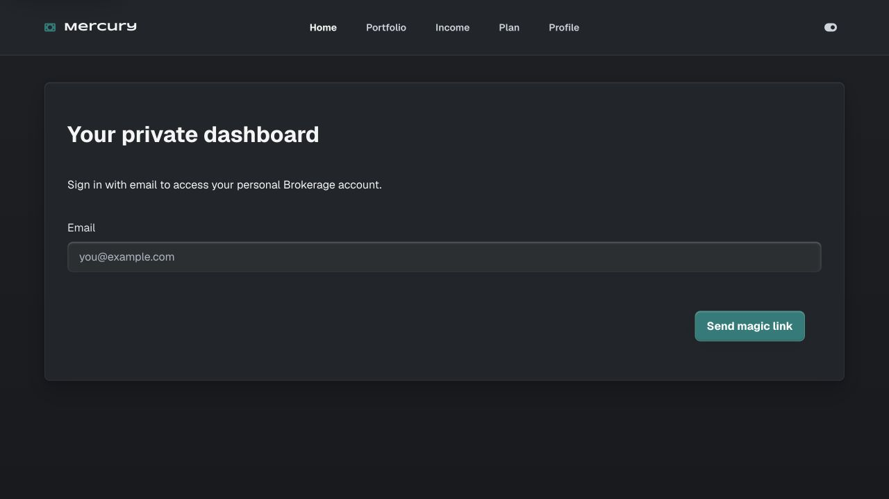

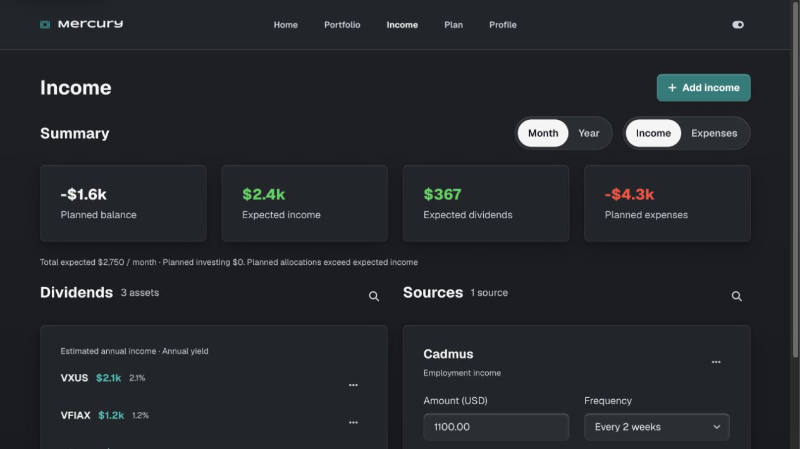

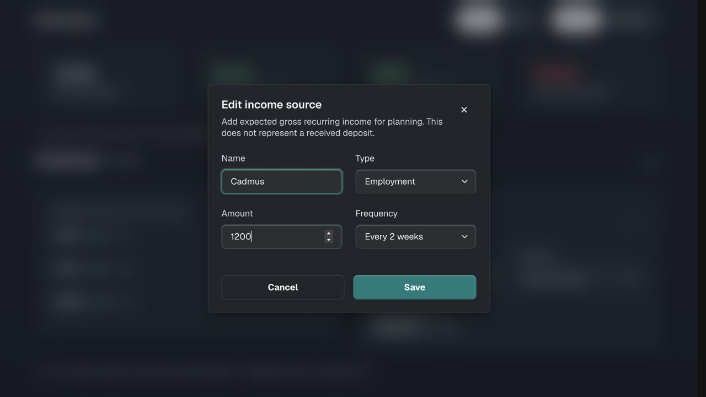

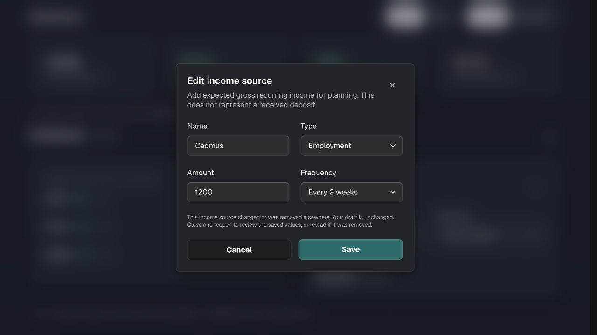

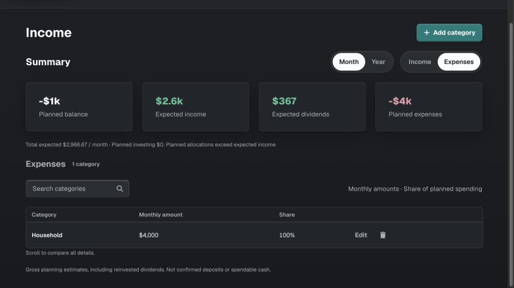

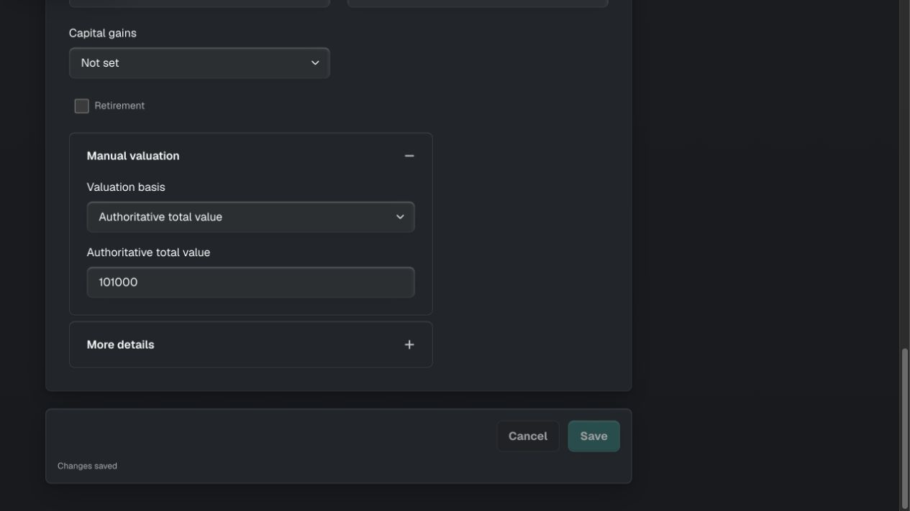

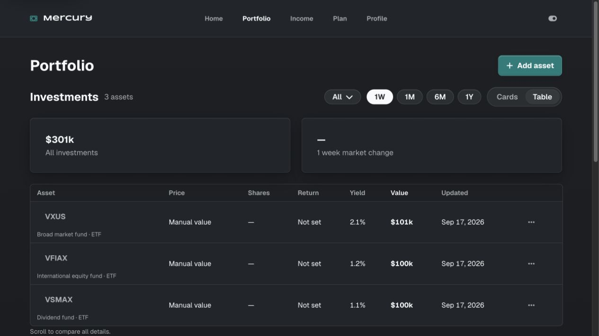

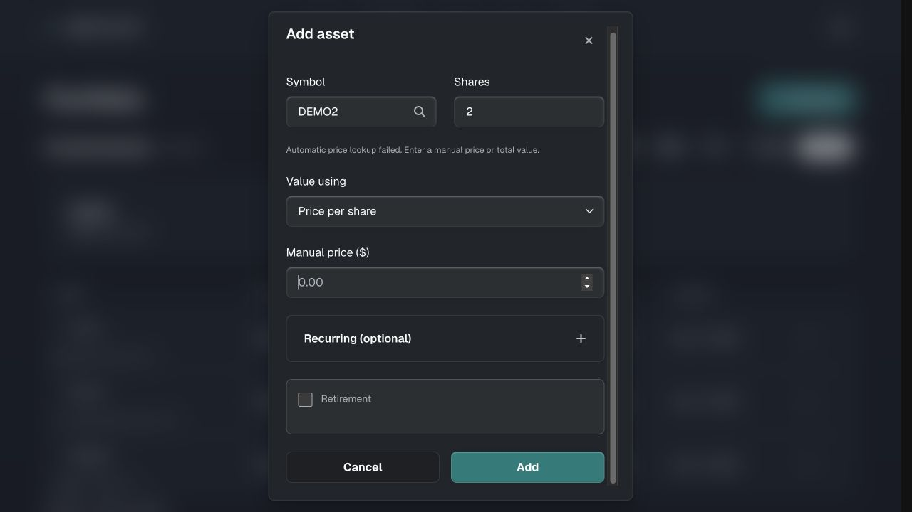

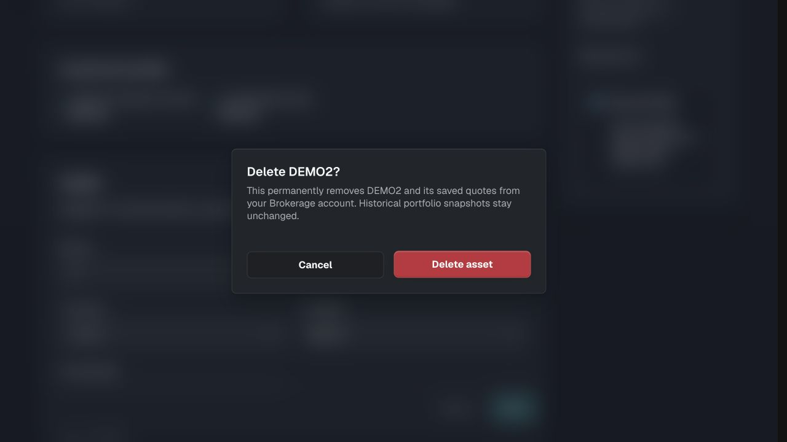

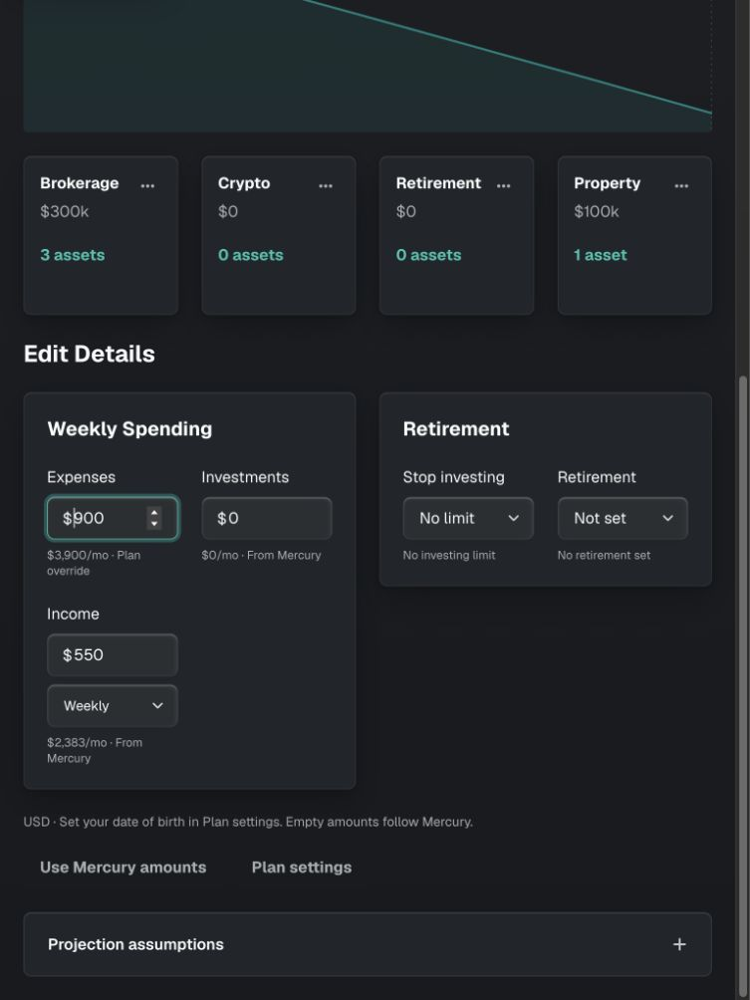

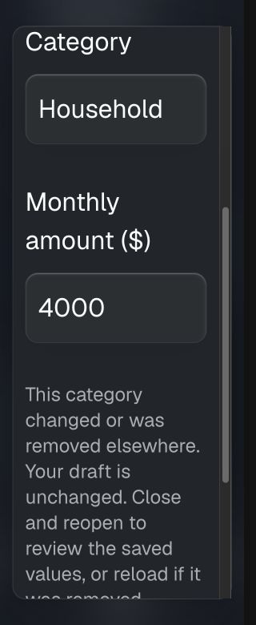

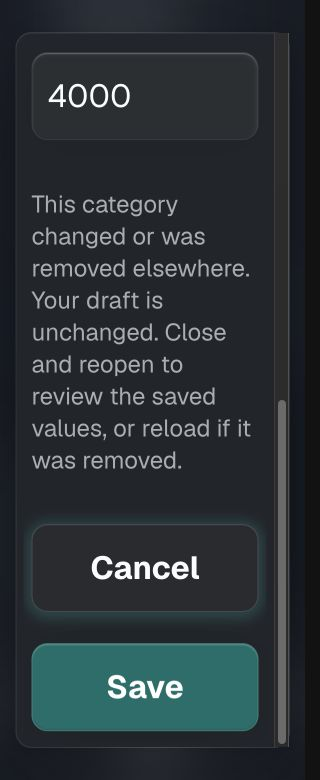

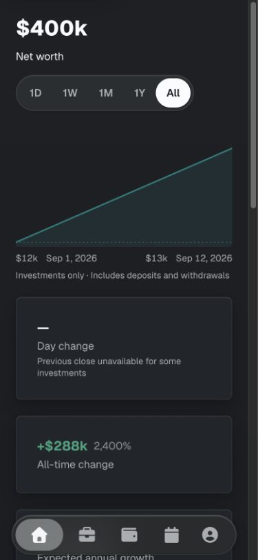

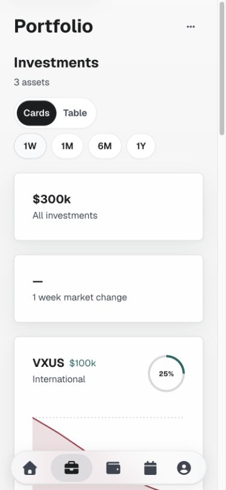

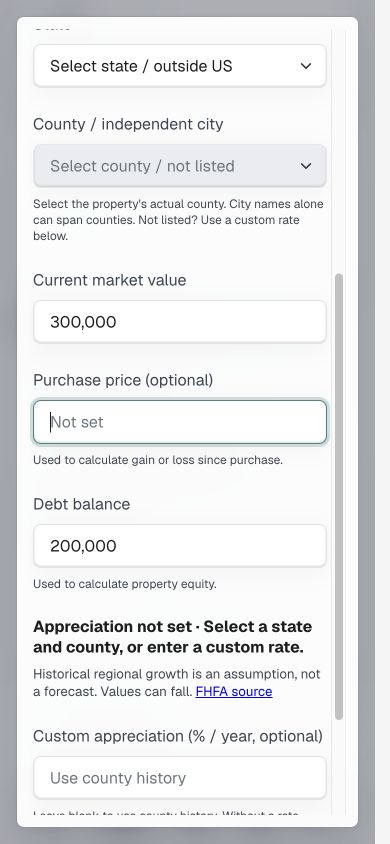

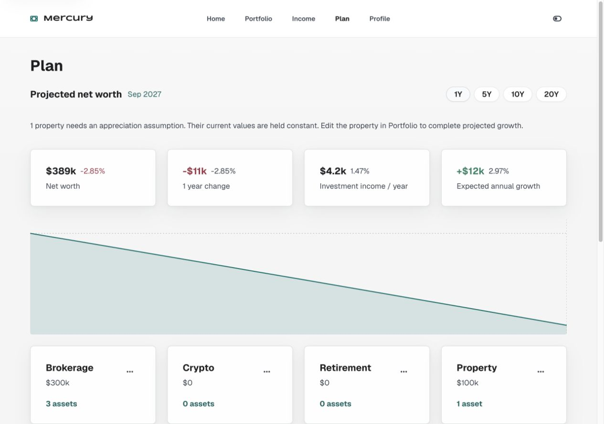

