# Mercury 0.2.6 — complete reads and recovery clarity

Reviewed 2026-09-21 UTC. Started on clean `main` at `7cc42d2`, fetched and verified fast-forward state. Previous automation memory informed scope only; evidence below was collected this run.

## Changes and evidence

**P1 fixed: silent API truncation could corrupt displayed and recorded totals.** The browser and snapshot endpoint previously treated a single successful collection response as complete. A live disposable probe reproduced 1,000 returned quotes out of 1,001. Snapshot reads were unordered, so the omitted record could be the latest price. A shared reader now requests exact counts, pages at most 500 records, follows the actual page length, rejects missing/changing counts and duplicate IDs, and publishes only complete results. Each collection has a ten-second overall deadline and a 100,000-record ceiling. Browser queries retain their primary sort with an ID tie-breaker; server queries order by ID. Quotes are filtered through their holding's account. Required failures use workspace recovery; optional Income, category and Property failures stay local. Recovery reads use the same contract.

**P2 fixed: failed Income reads looked unset or empty.** The injected second-page failure withheld totals correctly, but showed “Not set” and “0 sources”. Unknown amounts and source/category counts now say “Unavailable”. One keyboard-accessible Retry restores both records, accurate totals and summary focus. Independent dividends and expenses remain usable.

**P3 fixed: redundant scrolling copy.** Expenses always said “Scroll to compare all details” even with a fully visible table. Removed the hint and its description reference; retained the Acadia table region, keyboard access and responsive object cards.

**Acadia alignment:** verified remote main `d656e65db901964702e0d62187e4810ffba9902e`, release 0.3.5. Every one of Mercury's 13 vendored runtime files matches that commit byte-for-byte. The 0.3.4/0.3.5 changes since the old pin concern documentation/reference controllers; Mercury's native date input and existing runtime need no replacement. Updated the manifest provenance. Reviewed current operating model, foundations, CSS, changelog and Form workflow contract. No shared primitive fork, new style or CSS adapter was introduced. Copy changes are product composition, not a graduation candidate.

## Current walkthrough

Production sign-in is a real unauthenticated capture. Populated screens use a local, disposable in-memory Supabase-shaped adapter; they are neither owner data nor proof of persistent browser saves. The live database probe is documented separately.

| Step | Flow and health | Current observations |
| --- | --- | --- |
| 1 | Sign in — entry healthy; magic-link redemption open | Production private entry, email field and explicit Send magic link visible. No email sent. Screenshot 01. Supplied test password authentication succeeded through the API; local keyboard Sign out concealed the workspace and returned to private entry. |
| 2 | Home/current position — healthy local coverage | Current net worth, investment-only dated history and four groups remain distinct; missing previous-close/history assumptions are explicit. Screenshot 02. |
| 3 | Portfolio — healthy local Cards/Table | Both views retain three holdings and $300k total. Unknown shares withhold basket change while individual market charts remain available. Screenshots 05/11. Property editor retains exact $250,000.25 purchase price and returns to its menu; screenshot 17. |
| 4 | Add holding — healthy manual fallback | At 390px, unavailable automatic price exposes manual input in the same dialog. Two shares at $100 create one $200 disposable holding and open its detail page. Screenshot 12. |
| 5 | Quote/history recovery — covered locally and by endpoint tests | Synthetic provider failure reaches manual recovery, instrument histories display source/dates, existing timeout/retry tests pass. Real live market-provider success and refresh writes were not exercised this run. |
| 6 | Edit/delete asset — healthy local confirmation paths | Existing authoritative value saves $100,000 → $101,000 and reports Changes saved. Disposable QAONLY deletion names its consequences, defaults focus to Cancel and returns to three holdings with focus on phone Portfolio actions. Screenshots 06/13. |
| 7 | Record daily history — truncation fixed; scheduler acceptance open | New endpoint test places newest quote beyond row 1,000 and verifies complete snapshot value. Incomplete/malformed later pages cause no write. Live query probe verifies pagination and account join. Production cron execution itself not triggered. |
| 8 | Income — failure and recovery improved | Biweekly source saves $1,100 → $1,200, updates confirmed annual income to $31,200 and keeps focus. A separate second-page failure exposes Unavailable; Retry returns both sources and $5,133.34 total expected/month. Screenshots 03/08/09. |
| 9 | Expenses — healthy local edit and responsive table | $4,300 category saves $4,000; Plan subsequently reads $4,000/month from Mercury. Table at 768px and object cards on phone remain usable. Removed desktop scroll hint. Screenshots 04 before removal, 10 after, 16 editor. |
| 10 | Plan — healthy local edits; physical acceptance open | Current source-linked inputs populate; weekly expense override saves $900 / $3,900 monthly and reports Plan saved. Missing property appreciation remains explicit. Screenshots 07/18. |

Private export remains a deferred boundary with no live UI action. It was not falsely treated as an implemented acceptance path. No new canonical flows.

## Verification

- `npm run check`: **285 passing tests**, including eight new pagination regressions. Existing domain, endpoint auth, account-replacement, revision-aware save, timeout, cadence, cents, draft and deployment tests pass.
- New cases cover 1,201 records, lower server page caps, empty collections, unknown/changing/oversize counts, malformed/duplicate/empty later pages, API failure, aborted/late pages, actual controller pagination/optional failures and snapshot completeness. Test doubles now include the API's count metadata and range interface.
- Live supplied test account: refused to touch a nonempty account; created one disposable account and holding plus 1,001 quotes. A 2,000-row request returned exactly 1,000, `0-999/1001`. Three pages returned 1,001 distinct rows and newest price 1,100 cents. Account-scoped inner join succeeded. Deleted only created records via account cascade and verified accounts, holdings and quotes empty.
- Five routes × 320/390/768/1280 pixels: **20 checks, no horizontal page overflow**; measured results in `responsive.json`. Inspected desktop/tablet/phone screenshots, phone dark appearance and 320px with 200% root text. Keyboard Retry at enlarged text restores both sources and focuses the summary. This is desktop-browser evidence, not physical-device or VoiceOver acceptance.
- All 13 Acadia assets match the published revision and local manifest hashes; active class coverage passes. No dependency installation or schema migration. Security headers and Git-triggered `npm run check` deployment gate remain configured.
- `git diff --check` passes. Release receipt is added after publication.

## Research applied

- [Supabase select documentation](https://supabase.com/docs/reference/javascript/select) documents the default 1,000-row cap and pagination. We verified the actual service cap rather than increasing it and hiding the issue.
- [Apple progress indicators](https://developer.apple.com/design/human-interface-guidelines/progress-indicators) recommends actionable feedback when work stalls. Existing scoped loading/retry controls fit this need; no new screen or progress framework was added.
- [W3C status messages](https://www.w3.org/WAI/WCAG21/Understanding/status-messages) and [form notifications](https://www.w3.org/WAI/tutorials/forms/notifications/) support explicit outcomes and recoverable input. Unknown financial amounts must not resemble confirmed zero/empty records. Existing status regions and draft preservation are reused.

Competitive feature borrowing would not improve this bounded integrity problem; no dashboard, forecasting or account-connection features were added.

## Remaining priorities and limits

1. **P1 release gate: migration baseline/rebuild and second-user isolation.** Local migrations still contain duplicate 20260901 and 20260902 prefixes alongside the consolidated remote baseline. Docker and psql are absent from PATH; Supabase CLI is available. Do not run blanket db push or rename applied history blindly. Reconcile against the remote ledger and prove a clean disposable rebuild before 1.0. This run deliberately changes no schema.
2. **P1 acceptance: real magic-link/session/provider/scheduler and physical accessibility.** Password-authenticated data checks and fixtures do not prove email redemption, another user's isolation, production cron behaviour, cross-device persistence, software-keyboard clearance or VoiceOver.
3. **P2 reliability: remaining mutation paths.** Source/category deletion still reloads unrelated collections after acknowledgement; quote upsert and several delete requests do not yet use the bounded editor write contract. Prioritise retained outcomes and stuck-request recovery with targeted mutation regressions, separately from this read-path release.
4. **P2 scale/performance:** paging fixes truncation but still transfers quote history; a latest-quote query/view and database-side atomic aggregate may become worthwhile. Exact counts and offsets do not make multiple reads a transactional snapshot, and same-count concurrent edits can produce adjacent-moment data. The explicit deadline/size ceiling gives recovery instead of silently partial totals. No production latency or sustained observability claim is made.
5. **P2 UX:** conflict review still requires deliberately reviewing the saved record; tablet asset forms remain comparatively dense. The phone Income tabs scroll internally at 200% text; keyboard recovery was checked, full assistive-technology navigation was not.

Release 0.2.6 is a compatible integrity/refinement patch. These gates still rule out a 1.0 readiness claim.

## Accepted screenshots

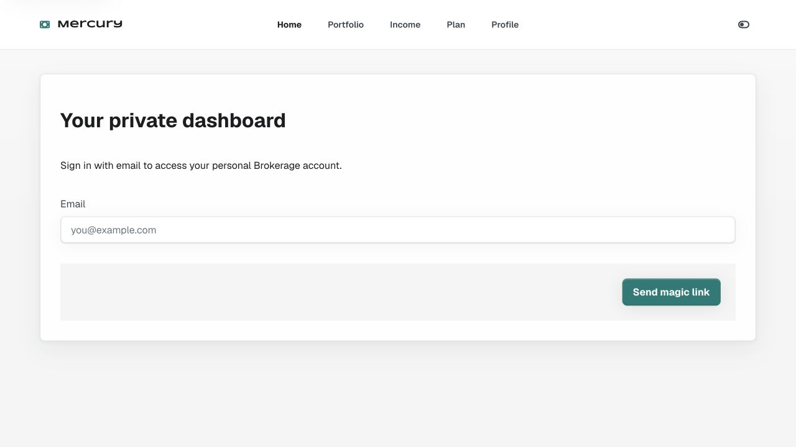

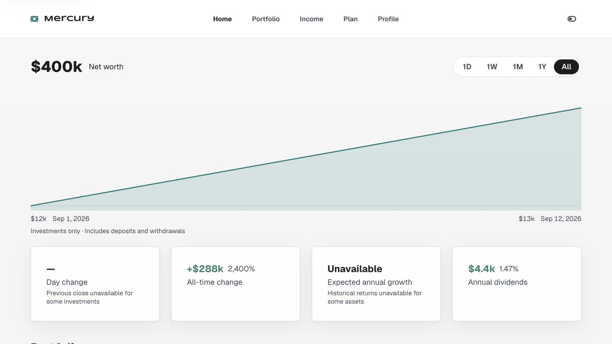

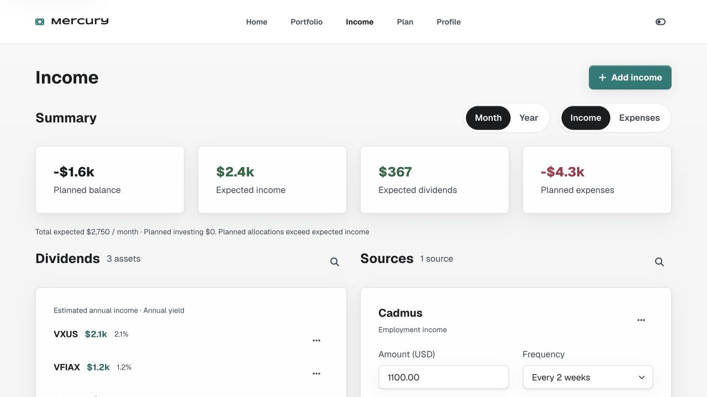

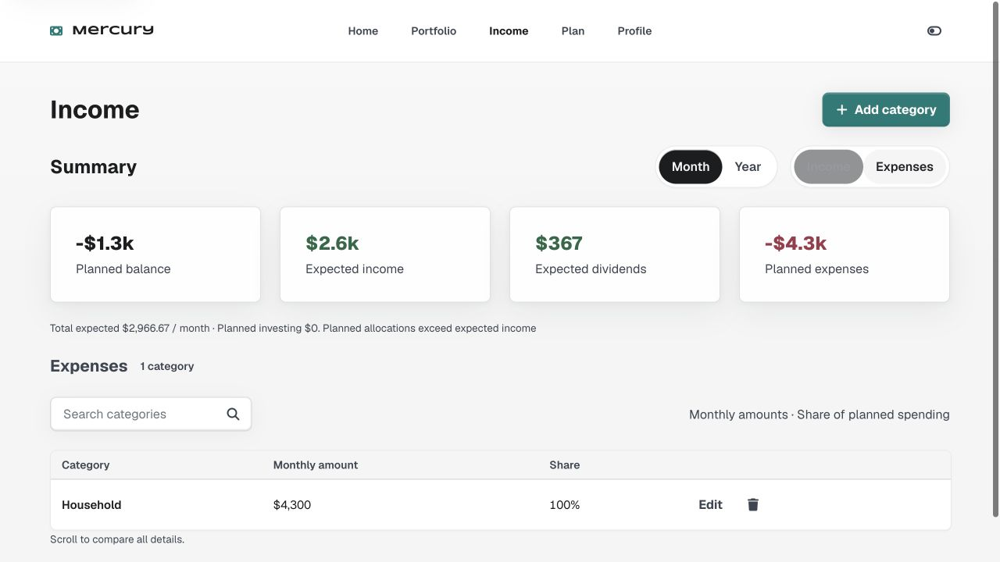

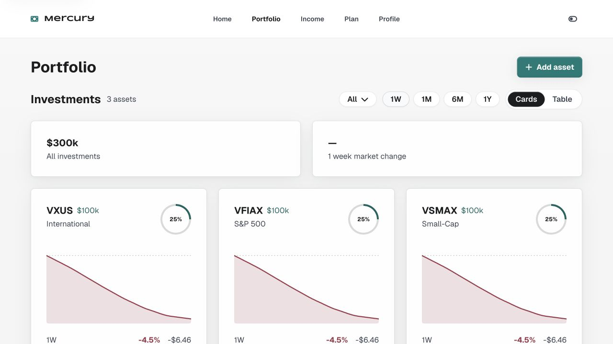

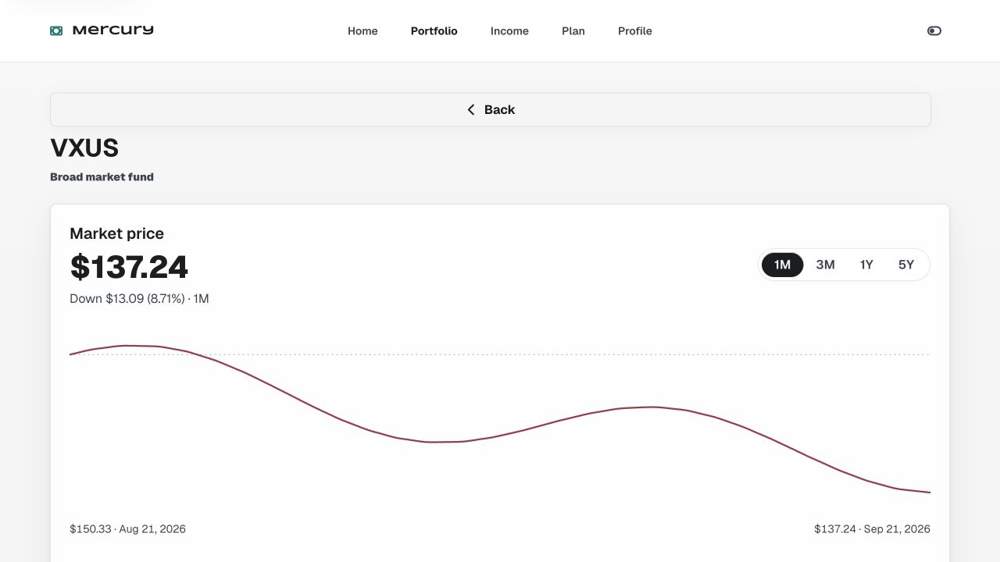

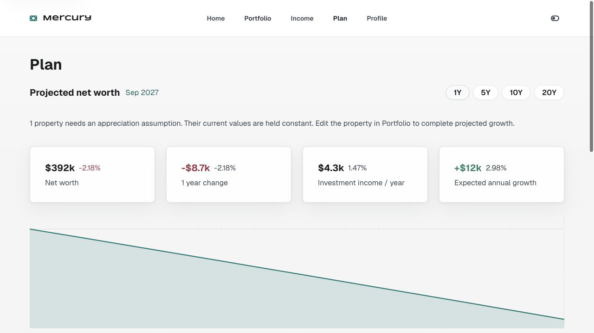

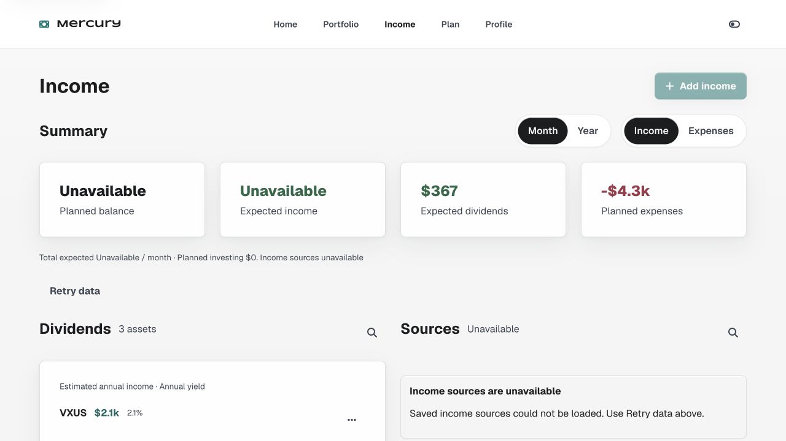

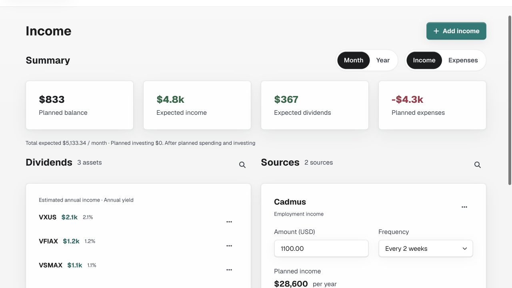

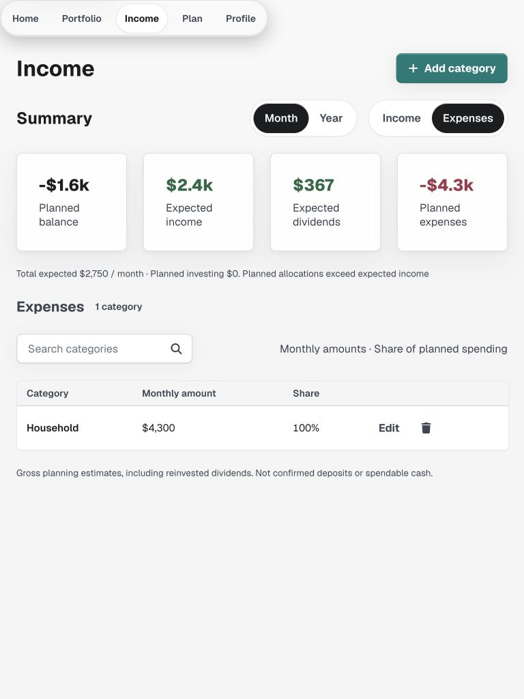

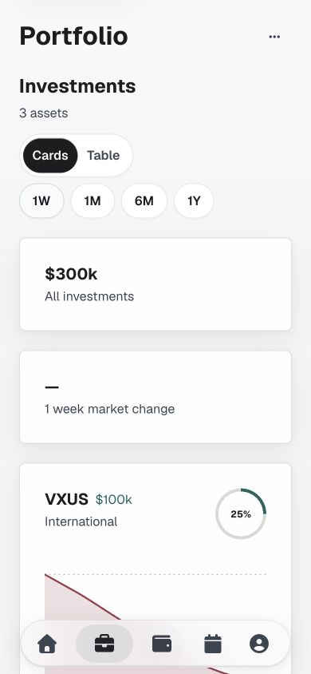

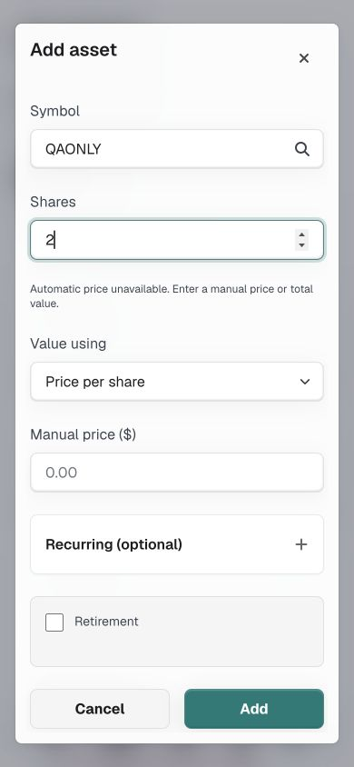

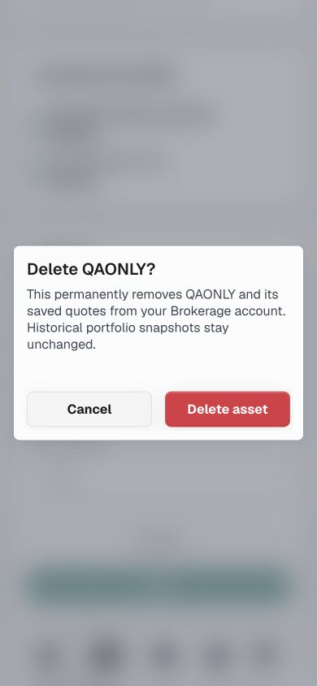

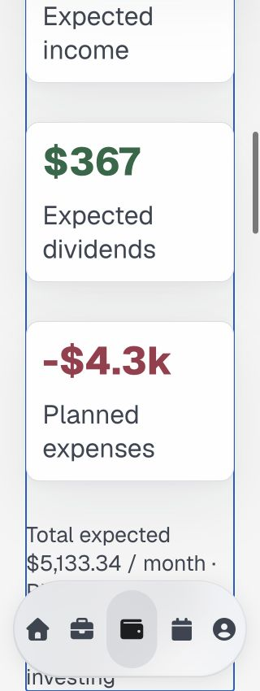

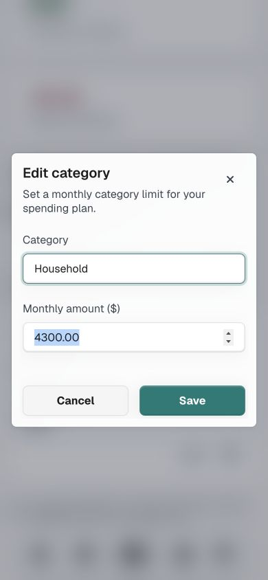

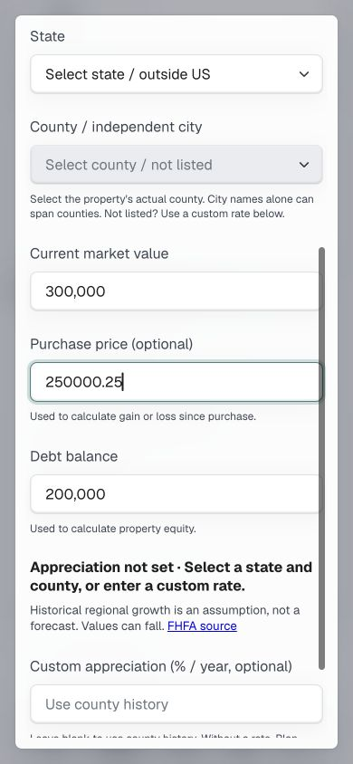

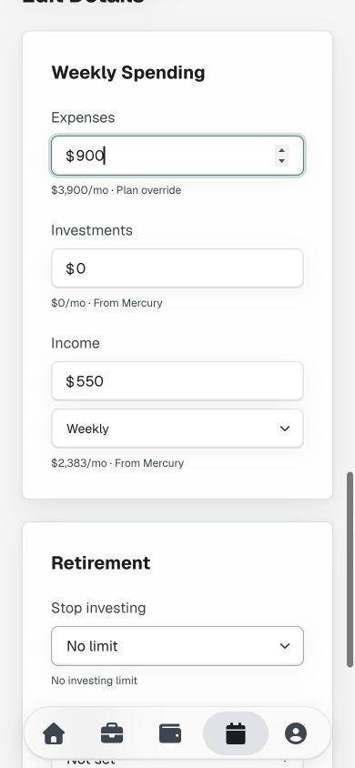

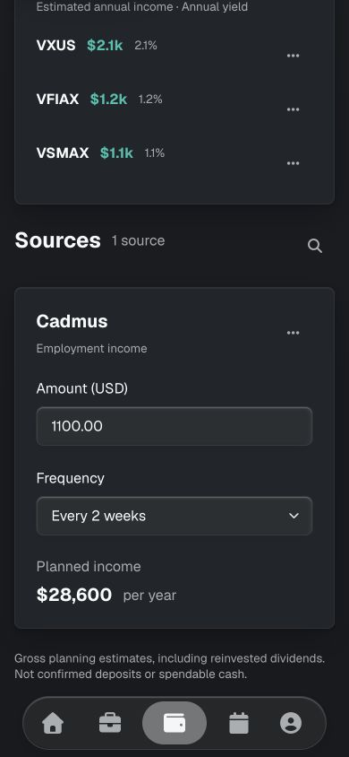
